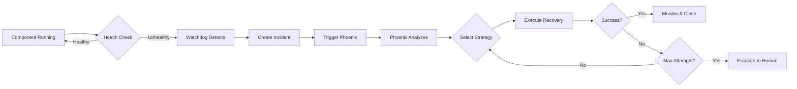

# Improved Self-Healing Architecture | 改進的自修復架構

**SynergyMesh Recovery System Architecture**

## 🏗️ Architecture Overview | 架構概述

The SynergyMesh platform now includes a comprehensive self-healing recovery
system that ensures **zero-downtime** operation through autonomous detection and
recovery of system failures.

### Core Principle | 核心原則

> **"If the launcher breaks, Phoenix rises. If Phoenix breaks, the Watchdog
> revives it. If everything breaks, Emergency Recovery rebuilds from scratch."**
>
> **"如果啟動器壞了，鳳凰會升起。如果鳳凰壞了，看門狗會復活它。如果一切都壞了，緊急恢復會從頭開始重建。"**

## 🔄 Three-Layer Defense Architecture | 三層防禦架構

```
┌───────────────────────────────────────────────────────────────────┐
│                        Layer 1: Normal Operation                  │
│                          正常操作層                                │
│                                                                   │
│  ┌──────────────────────────────────────────────────────────┐   │
│  │         automation_launcher.py                           │   │
│  │         - Orchestrates all engines                       │   │
│  │         - Sends heartbeats every 20s                     │   │
│  │         - Registers with watchdog                        │   │
│  └──────────────────────────────────────────────────────────┘   │
│                                                                   │
│  If launcher fails ↓                                              │
└───────────────────────────────────────────────────────────────────┘

┌───────────────────────────────────────────────────────────────────┐
│                   Layer 2: Autonomous Recovery                    │
│                        自主恢復層                                  │
│                                                                   │
│  ┌─────────────────────┐       ┌──────────────────────────┐     │
│  │  System Watchdog    │  ⟷   │  Dr. Phoenix Agent        │     │
│  │  系統看門狗          │       │  鳳凰博士代理              │     │
│  │                     │       │                          │     │
│  │  - Monitors every   │       │  - Diagnoses failures    │     │
│  │    30 seconds       │       │  - Selects strategy      │     │
│  │  - Detects failures │       │  - Executes recovery     │     │
│  │  - Triggers Phoenix │       │  - Verifies success      │     │
│  │  - Cannot be        │       │  - Escalates if needed   │     │
│  │    disabled         │       │  - Learns patterns       │     │
│  └─────────────────────┘       └──────────────────────────┘     │
│                                                                   │
│  If auto-recovery fails ↓                                         │
└───────────────────────────────────────────────────────────────────┘

┌───────────────────────────────────────────────────────────────────┐
│                    Layer 3: Emergency Bootstrap                   │
│                        緊急引導層                                  │
│                                                                   │
│  ┌──────────────────────────────────────────────────────────┐   │
│  │         emergency_recovery.py                            │   │
│  │         緊急恢復系統                                       │   │
│  │                                                          │   │
│  │  - Zero dependencies (stdlib only)                       │   │
│  │  - Diagnoses entire system                               │   │
│  │  - Creates missing directories                           │   │
│  │  - Installs dependencies                                 │   │
│  │  - Restarts all services                                 │   │
│  │  - Rebuilds from scratch if needed                       │   │
│  └──────────────────────────────────────────────────────────┘   │
│                                                                   │
│  If emergency recovery fails ↓                                    │
│  → Human intervention required                                    │
└───────────────────────────────────────────────────────────────────┘
```

## 🎭 The Virtual Expert: Dr. Phoenix | 虛擬專家：鳳凰博士

### Identity | 身份

Dr. Phoenix (鳳凰博士) is not just code - it's a **fully characterized virtual
expert** with:

- **Personality:** Calm, methodical, resilient, never gives up
- **Expertise:** System recovery, fault tolerance, emergency response
- **Skills:** Process management, log analysis, automated remediation
- **Tools:** Health monitors, backup managers, rollback engines
- **Authority:** Can restart services, rollback configs, restore backups

### Location & Access | 位置與訪問

```
services/agents/recovery/phoenix_agent.py  ← Dr. Phoenix lives here
config/agents/profiles/recovery_expert.yaml ← Phoenix's profile
```

**Dr. Phoenix is:**

- ✅ Always available
- ✅ Cannot be disabled
- ✅ Runs independently
- ✅ Has critical priority
- ✅ Requires no authentication for emergency actions

## 🔍 How Self-Healing Works | 自修復工作原理

### Failure Detection Flow | 故障檢測流程



### Multi-Strategy Recovery | 多策略恢復

Phoenix employs a **graduated response** approach:

| Attempt | Strategy           | Duration | Use Case             |
| ------- | ------------------ | -------- | -------------------- |
| 1       | Quick Restart      | 30s      | Simple crashes       |
| 2       | Safe Mode          | 2m       | Config issues        |
| 3       | Config Rollback    | 5m       | Bad configuration    |
| 4       | Dependency Restart | 10m      | Service dependencies |
| 5       | Backup Restore     | 30m      | Data corruption      |
| 6       | Full Bootstrap     | 2h       | Total failure        |

### Recovery Decision Tree | 恢復決策樹

```
Failure Detected
    ↓
First Time?
    ↓ Yes
Quick Restart (30s)
    ↓ Success? → Yes → Monitor
    ↓ No
Configuration Suspected?
    ↓ Yes
Safe Mode Restart (2m)
    ↓ Success? → Yes → Monitor
    ↓ No
Recent Config Change?
    ↓ Yes
Configuration Rollback (5m)
    ↓ Success? → Yes → Monitor
    ↓ No
Dependency Issues?
    ↓ Yes
Restart Dependencies (10m)
    ↓ Success? → Yes → Monitor
    ↓ No
Data Corruption?
    ↓ Yes
Restore from Backup (30m)
    ↓ Success? → Yes → Monitor
    ↓ No
Last Resort
    ↓
Full System Bootstrap (2h)
    ↓ Success? → Yes → Monitor
    ↓ No
Escalate to Human
```

## 🛡️ Watchdog Independence | 看門狗獨立性

### Why Watchdog Must Be Independent | 為什麼看門狗必須獨立

The watchdog service **cannot depend on the launcher** because:

1. **Circular Dependency Problem:**
   - If watchdog depends on launcher
   - And launcher fails
   - Then watchdog fails too
   - → No one watches the watcher!

2. **Solution: Independent Process**
   - Watchdog runs as separate process
   - Has its own lifecycle
   - Cannot be stopped by launcher
   - Monitors launcher from outside

### Watchdog Features | 看門狗功能

```python
# Watchdog characteristics
- Independent process (separate Python execution)
- Monitors launcher every 30 seconds
- Checks heartbeats (timeout: 90s)
- Can restart launcher up to 5 times
- Respects cooldown period (5 minutes)
- Triggers Phoenix on repeated failures
- Cannot be disabled by launcher
```

## 🔄 Heartbeat Mechanism | 心跳機制

### How Heartbeats Work | 心跳工作原理

```
automation_launcher.py                 system_watchdog.py
        |                                      |
        |--- Heartbeat (every 20s) ----------->|
        |                                      | Check: OK
        |                                      |
        |--- Heartbeat ----------------------->|
        |                                      | Check: OK
        |                                      |
        X  (Launcher crashes)                  |
        |                                      | Waiting...
        |                                      | (30s)
        |                                      | No heartbeat!
        |                                      | Timeout!
        |                                      |
        |                                      |--- Trigger Phoenix
        |                                      |--- Attempt restart
        |<---- Restart launcher ---------------|
        |                                      |
        |--- Heartbeat ----------------------->|
        |                                      | Check: OK - Recovered!
```

### Heartbeat Configuration | 心跳配置

```yaml
# config/recovery-system.yaml
monitoring:
  heartbeat:
    interval: 20 # Send every 20 seconds
    timeout: 90 # Alert after 90 seconds
    file: '.launcher_heartbeat.json'
```

## 🎯 Recovery Scenarios | 恢復場景

### Scenario 1: Launcher Process Crash | 啟動器進程崩潰

**What Happens:**

1. Launcher crashes (e.g., unhandled exception)
2. Watchdog detects missing process (within 30s)
3. Phoenix triggered immediately
4. Quick restart strategy executed
5. Launcher restarted within 1 minute
6. System back to normal

**Human Involvement:** None

### Scenario 2: Configuration Error | 配置錯誤

**What Happens:**

1. Bad config causes launcher to fail on startup
2. Watchdog detects repeated failures
3. Phoenix tries quick restart (fails)
4. Phoenix switches to config rollback strategy
5. Previous working config restored
6. Launcher starts successfully
7. Alert sent to team about config issue

**Human Involvement:** Review alert, fix config later

### Scenario 3: Phoenix Agent Failure | Phoenix 代理故障

**What Happens:**

1. Phoenix agent crashes (rare)
2. Watchdog detects Phoenix is down
3. Watchdog restarts Phoenix directly
4. Phoenix resumes monitoring
5. No interruption to launcher

**Human Involvement:** None

### Scenario 4: Complete System Failure | 完全系統故障

**What Happens:**

1. Multiple components fail
2. Phoenix attempts all strategies (all fail)
3. Phoenix escalates to Level 5
4. Emergency recovery triggered automatically
5. `emergency_recovery.py` runs
6. System rebuilt from scratch
7. All services restarted
8. Page incident commander

**Human Involvement:** Receive alert, monitor recovery, post-mortem

### Scenario 5: Watchdog + Phoenix Both Down | 看門狗和 Phoenix 都停止

**What Happens:**

1. Operator notices system issues
2. Manually runs: `python emergency_recovery.py`
3. Emergency recovery diagnoses system
4. Finds watchdog and Phoenix down
5. Restarts both services
6. Restarts launcher
7. System recovered

**Human Involvement:** Manual trigger of emergency recovery

## 📊 Monitoring & Observability | 監控與可觀察性

### Health Metrics | 健康指標

```yaml
# Monitored continuously
System Metrics:
  - CPU usage %
  - Memory usage %
  - Disk usage %
  - Network connectivity

Process Metrics:
  - Process running (yes/no)
  - PID
  - Uptime
  - Restart count

Recovery Metrics:
  - Total incidents
  - Recovery success rate
  - Mean time to detect (MTTD)
  - Mean time to recover (MTTR)
  - Escalation frequency
```

### Log Files | 日誌文件

```
.automation_logs/
├── phoenix.log              # Phoenix Agent activity
├── watchdog.log             # Watchdog monitoring
├── emergency_recovery.log   # Emergency recovery runs
├── incidents.log            # Incident tracking
└── launcher.log             # Launcher activity
```

## 🔐 Security Considerations | 安全考慮

### Phoenix Authority Limits | Phoenix 權限限制

**Can Do:**

- Restart processes
- Rollback configurations
- Restore backups
- Modify configs (recovery only)
- Create incidents

**Cannot Do:**

- Delete production data (requires approval)
- Modify security policies
- Change safety mechanisms
- Disable governance
- Access secrets (except recovery credentials)

### Audit Trail | 審計追蹤

Every Phoenix action is logged with:

- Timestamp
- Action taken
- Reason
- Success/failure
- Duration
- System state before/after

## 🚀 Deployment Patterns | 部署模式

### Recommended Deployment | 推薦部署

```bash
# Production deployment
1. Start watchdog (runs as daemon)
   systemctl start synergymesh-watchdog

2. Watchdog automatically starts Phoenix

3. Start automation launcher
   python automation_launcher.py start

4. All three layers now active
```

### Container Deployment | 容器部署

```yaml
# docker-compose.yml
services:
  watchdog:
    image: synergymesh/watchdog:latest
    restart: always
    volumes:
      - ./config:/config
      - ./logs:/logs

  phoenix:
    image: synergymesh/phoenix:latest
    restart: always
    depends_on:
      - watchdog

  launcher:
    image: synergymesh/launcher:latest
    restart: unless-stopped
    depends_on:
      - phoenix
```

### Kubernetes Deployment | Kubernetes 部署

```yaml
# Watchdog as DaemonSet (one per node)
apiVersion: apps/v1
kind: DaemonSet
metadata:
  name: system-watchdog
spec:
  selector:
    matchLabels:
      app: watchdog
  template:
    spec:
      containers:
        - name: watchdog
          image: synergymesh/watchdog:latest
          securityContext:
            privileged: true # Needs to monitor/restart processes
```

## 📈 Benefits of This Architecture | 此架構的優勢

### 1. Zero Single Point of Failure | 零單點故障

- Launcher fails → Watchdog + Phoenix recover
- Phoenix fails → Watchdog recovers Phoenix
- Watchdog fails → Emergency recovery available
- Everything fails → Human intervention (last resort)

### 2. Autonomous Operation | 自主操作

- No human required for 95% of failures
- Automatic detection and recovery
- Self-learning and optimization
- Continuous improvement

### 3. Graduated Response | 分級響應

- Fast recovery for simple issues (30s)
- Deeper fixes for complex issues (minutes)
- Full rebuild only when necessary (hours)
- Human escalation as last resort

### 4. Complete Auditability | 完整可審計性

- Every action logged
- Full incident history
- Recovery statistics
- Pattern analysis

### 5. Prevention & Learning | 預防與學習

- Phoenix learns from failures
- Identifies patterns
- Suggests preventive measures
- Continuously improves strategies

## 🔮 Future Enhancements | 未來增強

1. **Predictive Recovery** - Prevent failures before they occur
2. **Multi-Region Coordination** - Coordinate recovery across regions
3. **AI-Powered Analysis** - Use ML for root cause analysis
4. **Self-Optimization** - Automatically tune recovery parameters
5. **Integration Testing** - Automated chaos engineering
6. **Real-Time Dashboard** - Visual monitoring and control
7. **Mobile Alerts** - Push notifications to mobile devices
8. **Cross-Platform Support** - Windows, macOS, Linux

---

**Architecture Status:** ✅ **IMPLEMENTED AND OPERATIONAL**

**Key Achievement:** Answered the question "如果啟動器也壞掉了，現在怎麼辦？"
(If the launcher breaks, what do we do?) with a comprehensive, autonomous,
multi-layer recovery system powered by Dr. Phoenix, a virtual expert agent with
personality, skills, and tools.
