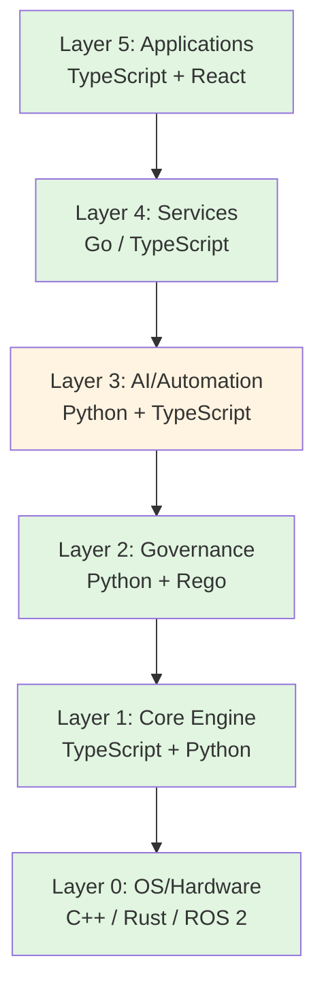
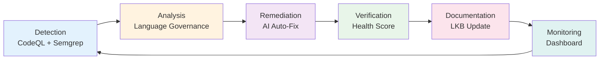

# 🏝️ Unmanned Island System

# 📊 Language Governance Dashboard v1.0

> **Last Updated:** {{ TIMESTAMP }}  
> **Generated by:** Living Knowledge Base + AI Auto-Fix Bot + Language Policy Pipeline

---

## 🎯 Executive Summary

| Metric | Value | Status |
|--------|-------|--------|
| **Language Health Score** | {{ LANGUAGE_HEALTH_SCORE }}/100 | {{ HEALTH_GRADE }} {{ HEALTH_STATUS }} |
| **Total Violations** | {{ TOTAL_VIOLATIONS }} | {{ VIOLATION_TREND }} |
| **Security Findings** | {{ SECURITY_FINDINGS }} | {{ SECURITY_STATUS }} |
| **Architecture Compliance** | {{ ARCHITECTURE_COMPLIANCE }}% | {{ COMPLIANCE_STATUS }} |
| **Fix Success Rate** | {{ FIX_SUCCESS_RATE }}% | {{ FIX_STATUS }} |

---

## 🔎 1. Language Health Score Breakdown

**Overall Score: {{ LANGUAGE_HEALTH_SCORE }}/100** (Grade: {{ HEALTH_GRADE }})

| Dimension | Weight | Score | Status |
|-----------|--------|-------|--------|
| **Governance Violations** | 40% | {{ GOVERNANCE_SCORE }}/40 | {{ GOVERNANCE_STATUS }} |
| **Security Issues** | 30% | {{ SECURITY_SCORE }}/30 | {{ SECURITY_STATUS_DETAIL }} |
| **Architecture Alignment** | 20% | {{ ARCHITECTURE_SCORE }}/20 | {{ ARCHITECTURE_STATUS }} |
| **Improvement Trend** | 10% | {{ TREND_SCORE }}/10 | {{ TREND_STATUS }} |

**Score Definition:**
- **90-100 (A)**: Excellent - Full compliance, production-ready
- **80-89 (B)**: Good - Minor issues, acceptable for deployment
- **70-79 (C)**: Fair - Moderate issues, needs attention
- **60-69 (D)**: Poor - Significant issues, deployment risky
- **0-59 (F)**: Critical - Major violations, do not deploy

---

## 🗺️ 2. Violations Map

### 2.1 By Type

| Type | Count | Critical | Error | Warning |
|------|-------|----------|-------|---------|
| **Cross-Layer Violations** | {{ CROSS_LAYER_COUNT }} | {{ CROSS_LAYER_CRITICAL }} | {{ CROSS_LAYER_ERROR }} | {{ CROSS_LAYER_WARNING }} |
| **Forbidden Language** | {{ FORBIDDEN_COUNT }} | {{ FORBIDDEN_CRITICAL }} | {{ FORBIDDEN_ERROR }} | {{ FORBIDDEN_WARNING }} |
| **Security Vulnerabilities** | {{ SECURITY_COUNT }} | {{ SECURITY_CRITICAL }} | {{ SECURITY_ERROR }} | {{ SECURITY_WARNING }} |
| **Architecture Misalignment** | {{ ARCHITECTURE_COUNT }} | {{ ARCHITECTURE_CRITICAL }} | {{ ARCHITECTURE_ERROR }} | {{ ARCHITECTURE_WARNING }} |

### 2.2 Detailed Violations

{{ VIOLATIONS_TABLE }}

---

## 📊 3. Language Distribution

### 3.1 By Directory

```
{{ LANGUAGE_DISTRIBUTION_CHART }}
```

### 3.2 By Layer

| Layer | Allowed Languages | Actual Languages | Compliance |
|-------|-------------------|------------------|------------|
| **L0: OS/Hardware** | C++, Rust, C | {{ L0_ACTUAL }} | {{ L0_COMPLIANCE }}% |
| **L1: Core Engine** | TypeScript, Python | {{ L1_ACTUAL }} | {{ L1_COMPLIANCE }}% |
| **L2: Governance** | Python, Rego | {{ L2_ACTUAL }} | {{ L2_COMPLIANCE }}% |
| **L3: AI/Automation** | Python, TypeScript | {{ L3_ACTUAL }} | {{ L3_COMPLIANCE }}% |
| **L4: Services** | Go, TypeScript | {{ L4_ACTUAL }} | {{ L4_COMPLIANCE }}% |
| **L5: Applications** | TypeScript, React | {{ L5_ACTUAL }} | {{ L5_COMPLIANCE }}% |

---

## 📈 4. Trend Analysis (30 Days)

### 4.1 Health Score Trend

```
{{ HEALTH_SCORE_TREND_CHART }}
```

### 4.2 Violation Trend

```
{{ VIOLATION_TREND_CHART }}
```

### 4.3 Fix Velocity

- **Fixes Applied**: {{ FIXES_LAST_30_DAYS }}
- **Average Fix Time**: {{ AVG_FIX_TIME }} hours
- **Success Rate**: {{ FIX_SUCCESS_RATE }}%
- **AI-Generated Fixes**: {{ AI_FIX_COUNT }} ({{ AI_FIX_PERCENTAGE }}%)
- **Manual Fixes**: {{ MANUAL_FIX_COUNT }} ({{ MANUAL_FIX_PERCENTAGE }}%)

---

## 🔧 5. Recent Fixes

{{ FIX_HISTORY_TABLE }}

---

## 🏗️ 6. Architecture Compliance

### 6.1 Layer Alignment



### 6.2 Violation Hotspots

{{ HOTSPOT_TABLE }}

---

## 🔐 7. Security Status

### 7.1 OWASP Top 10 Coverage

{{ OWASP_TABLE }}

### 7.2 CodeQL Findings

| Severity | Count | Status |
|----------|-------|--------|
| **Critical** | {{ CODEQL_CRITICAL }} | {{ CODEQL_CRITICAL_STATUS }} |
| **High** | {{ CODEQL_HIGH }} | {{ CODEQL_HIGH_STATUS }} |
| **Medium** | {{ CODEQL_MEDIUM }} | {{ CODEQL_MEDIUM_STATUS }} |
| **Low** | {{ CODEQL_LOW }} | {{ CODEQL_LOW_STATUS }} |

### 7.3 Semgrep Findings

| Severity | Count | Status |
|----------|-------|--------|
| **Critical** | {{ SEMGREP_CRITICAL }} | {{ SEMGREP_CRITICAL_STATUS }} |
| **High** | {{ SEMGREP_HIGH }} | {{ SEMGREP_HIGH_STATUS }} |
| **Medium** | {{ SEMGREP_MEDIUM }} | {{ SEMGREP_MEDIUM_STATUS }} |
| **Low** | {{ SEMGREP_LOW }} | {{ SEMGREP_LOW_STATUS }} |

---

## 🔄 8. Knowledge Cycle Integration



### Knowledge Base Events

{{ KNOWLEDGE_EVENTS_TABLE }}

---

## 📋 9. Action Items

### 9.1 Critical (Fix Immediately)

{{ CRITICAL_ACTIONS }}

### 9.2 High Priority (Fix Within 7 Days)

{{ HIGH_PRIORITY_ACTIONS }}

### 9.3 Medium Priority (Fix Within 30 Days)

{{ MEDIUM_PRIORITY_ACTIONS }}

---

## 📚 10. Resources

### Documentation
- [Language Stack Guide](./architecture/language-stack.md)
- [Governance Policy](../config/language-policy.yaml)
- [Exception Process](./architecture/language-governance.md#exceptions)
- [Living Knowledge Base](../knowledge/README.md)
- [Refactor Playbooks System](./refactor_playbooks/README.md) ⭐ **NEW**
- [Refactor Playbook Next Steps](./REFACTOR_PLAYBOOK_NEXT_STEPS.md) ⭐ **NEW**

### Tools
- **Analyzer**: `tools/governance/language-governance-analyzer.py`
- **Health Score**: `tools/language-health-score.py`
- **AI Review**: `tools/ai-refactor-review.py`
- **Auto-Fix**: `tools/ai-auto-fix.py`
- **Dashboard**: `tools/generate-language-dashboard.py`
- **Refactor Playbook Generator**: `tools/generate-refactor-playbook.py` ⭐ **NEW**

### Refactor Playbooks ⭐ **NEW**

**AI-Driven Refactor Plans for Each Cluster:**

| Cluster | Playbook | Health Score | Status |
|---------|----------|--------------|--------|
| `services/` | [View Playbook](./refactor_playbooks/services__playbook.md) | 82/100 | 🔴 Critical - Low Score |
| `core/` | [View Playbook](./refactor_playbooks/core__playbook.md) | 75/100 | 🔴 High Priority |
| `apps/` | [View Playbook](./refactor_playbooks/apps__playbook.md) | 68/100 | 🟡 Moderate Issues |
| `automation/` | [View Playbook](./refactor_playbooks/automation__playbook.md) | 60/100 | 🟡 Needs Attention |
| `governance/` | [View Playbook](./refactor_playbooks/governance__playbook.md) | 55/100 | 🟡 Needs Refactoring |
| `tools/` | [View Playbook](./refactor_playbooks/tools__playbook.md) | 50/100 | 🟢 Acceptable |
| `autonomous/` | [View Playbook](./refactor_playbooks/autonomous__playbook.md) | 45/100 | 🟢 Good |
| `infrastructure/` | [View Playbook](./refactor_playbooks/infrastructure__playbook.md) | 40/100 | 🟢 Excellent |

**注意：** Health Score 越低代表該 cluster 狀態越健康。高分數表示有較多治理問題需要處理。

**Playbook Features:**
- Automated cluster analysis with governance data integration
- P0/P1/P2 prioritized refactoring plans
- File & directory structure delivery views
- Auto-Fix Bot integration markers
- Success criteria and acceptance metrics

### CI/CD
- **Workflow**: `.github/workflows/language-governance.yml`
- **Auto-Fix**: `.github/workflows/ai-auto-fix-pr.yml`
- **Playbook Updates**: `.github/workflows/update-refactor-playbooks.yml` ⭐ **NEW**

---

## 🔔 11. Alerts & Notifications

{{ ALERTS_TABLE }}

---

## 📊 12. Statistics

| Metric | Value |
|--------|-------|
| **Total Files Scanned** | {{ TOTAL_FILES }} |
| **Total Lines of Code** | {{ TOTAL_LOC }} |
| **Languages Detected** | {{ LANGUAGES_COUNT }} |
| **Directories Analyzed** | {{ DIRECTORIES_COUNT }} |
| **Last Scan Duration** | {{ SCAN_DURATION }} seconds |
| **Coverage** | {{ COVERAGE }}% |

---

## 📝 13. Change Log

{{ CHANGELOG_TABLE }}

---

**Dashboard Generated At:** {{ GENERATION_TIMESTAMP }}  
**Data Sources:**
- Language Governance Report: `governance/language-governance-report.json`
- CodeQL Results: `governance/codeql-results-*.sarif`
- Semgrep Results: `governance/semgrep-results.sarif`
- Fix History: `knowledge/language-history.yaml`
- Health Metrics: `knowledge/language-health-score.yaml`

---

**Unmanned Island System** | Language Governance Dashboard v1.0  
© 2025 SynergyMesh | [Repository](https://github.com/SynergyMesh-admin/Unmanned-Island)
