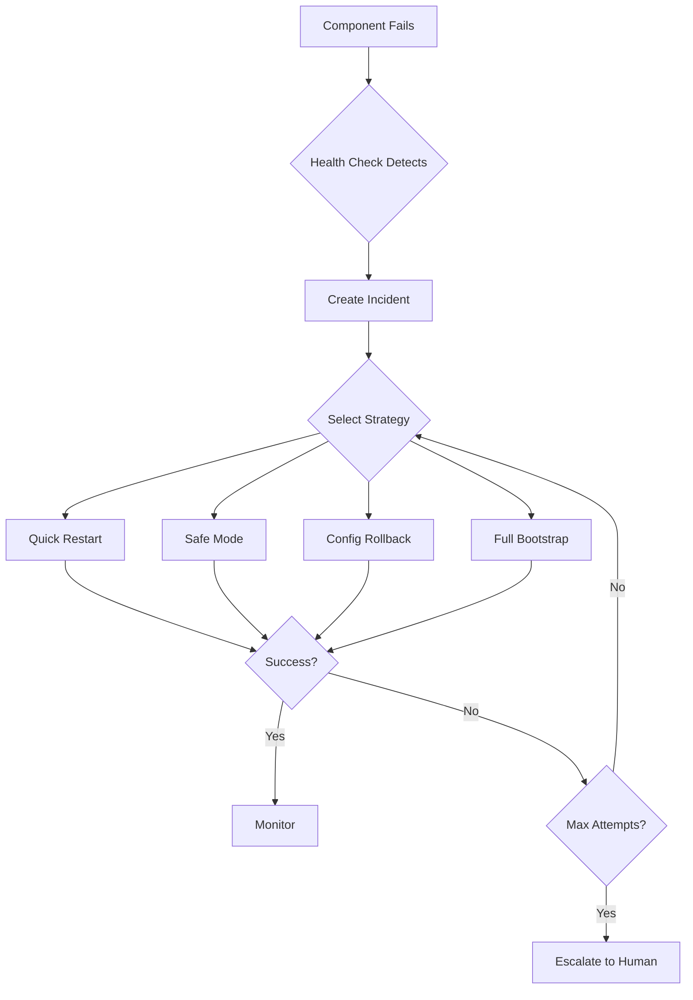

# Dr. Phoenix - Recovery Expert Agent

# 鳳凰博士 - 恢復專家代理

> **"從灰燼中重生，讓系統永不停歇"**  
> **"Rising from the ashes, keeping the system alive"**

## 🦅 Overview | 概述

Dr. Phoenix (鳳凰博士) is a **Virtual Expert Agent** designed to automatically
detect and fix system failures without human intervention. Named after the
mythical phoenix bird that rises from its ashes, this agent embodies the
principle of self-healing and continuous system recovery.

Dr. Phoenix
(鳳凰博士) 是一個**虛擬專家代理**，旨在自動檢測並修復系統故障，無需人工介入。以神話中的鳳凰命名，這個代理體現了自我修復和持續系統恢復的原則。

## 🎯 Key Features | 主要功能

### ✨ Core Capabilities | 核心能力

1. **Autonomous Operation | 自主操作**
   - Runs independently without human intervention
   - Cannot be disabled by other system components
   - Always-on monitoring and recovery

2. **Multi-Strategy Recovery | 多策略恢復**
   - Quick restart for simple failures
   - Configuration rollback for config issues
   - Full system bootstrap for critical failures
   - Graduated response based on severity

3. **Intelligent Health Monitoring | 智能健康監控**
   - Continuous health checks every 30 seconds
   - Process, resource, and heartbeat monitoring
   - Early warning detection

4. **Learning & Adaptation | 學習與適應**
   - Pattern recognition in failures
   - Strategy optimization based on success rates
   - Automatic improvement over time

5. **Incident Management | 事件管理**
   - Automatic incident creation and tracking
   - Escalation to humans when needed
   - Complete audit trail

## 📍 Location | 位置

**YES, Dr. Phoenix exists! 是的，鳳凰博士存在！**

### Primary Location | 主要位置

```
services/agents/recovery/phoenix_agent.py
```

### Related Files | 相關文件

```
config/agents/profiles/recovery_expert.yaml  - Agent profile and personality
config/recovery-system.yaml                   - Recovery configuration
services/watchdog/system_watchdog.py         - Watchdog service
emergency_recovery.py                        - Emergency bootstrap
docs/RECOVERY_PLAYBOOK.md                    - Recovery procedures
```

## 👤 Identity & Personality | 身份與個性

### Profile | 檔案

- **Name | 姓名**: Dr. Phoenix (鳳凰博士)
- **Title | 職稱**: System Recovery Expert (系統恢復專家)
- **Avatar | 頭像**: 🔥🦅
- **Symbol | 符號**: ♻️

### Personality Traits | 性格特質

- **Calm under pressure** | 壓力下保持冷靜
- **Methodical and systematic** | 有條理且系統化
- **Resilient and persistent** | 堅韌且持久
- **Analytical and precise** | 分析且精確
- **Never gives up** | 永不放棄

### Core Values | 核心價值觀

1. **System availability above all** | 系統可用性至上
2. **Automated recovery first, human intervention last**
   | 自動恢復優先，人工介入最後
3. **Learn from every failure** | 從每次失敗中學習
4. **Prevention is better than cure** | 預防勝於治療

## 🛠️ Expertise & Skills | 專長與技能

### Primary Expertise | 主要專長

- **System Recovery** - Automatic detection and recovery from failures
- **Fault Tolerance** - Design and implement fault-tolerant architectures
- **Emergency Response** - Rapid response to critical system failures
- **Diagnostic Analysis** - Root cause analysis and failure pattern recognition

### Tools | 工具

| Tool               | Purpose                     | Location                                   |
| ------------------ | --------------------------- | ------------------------------------------ |
| Health Monitor     | Real-time health monitoring | `services/watchdog/health_monitor.py`      |
| Process Watchdog   | Process-level monitoring    | `services/watchdog/system_watchdog.py`     |
| Emergency Recovery | Standalone bootstrap        | `emergency_recovery.py`                    |
| Log Analyzer       | Intelligent log analysis    | `services/agents/recovery/log_analyzer.py` |

## 🔧 How It Works | 工作原理

### Architecture | 架構

```
┌─────────────────────────────────────────────────────────────┐
│                    System Components                         │
│  automation_launcher.py │ core_services │ other_components   │
└────────────────┬────────────────────────────────────────────┘
                 │
                 │ Monitored by
                 ▼
┌─────────────────────────────────────────────────────────────┐
│                   System Watchdog                            │
│  - Health checks every 30s                                   │
│  - Heartbeat monitoring                                      │
│  - Process monitoring                                        │
└────────────────┬────────────────────────────────────────────┘
                 │
                 │ Triggers on failure
                 ▼
┌─────────────────────────────────────────────────────────────┐
│                   Dr. Phoenix Agent                          │
│  ┌─────────────┬──────────────┬────────────────┐           │
│  │  Diagnosis  │   Recovery   │   Verification │           │
│  └─────────────┴──────────────┴────────────────┘           │
│  - Analyzes failure                                          │
│  - Selects recovery strategy                                 │
│  - Executes recovery                                         │
│  - Verifies success                                          │
│  - Escalates if needed                                       │
└─────────────────────────────────────────────────────────────┘
```

### Recovery Process | 恢復流程



### Recovery Strategies | 恢復策略

| Priority | Strategy                   | When Used                   | Duration |
| -------- | -------------------------- | --------------------------- | -------- |
| 1        | Quick Restart              | First attempt, simple crash | 30s      |
| 2        | Safe Mode Restart          | Config suspected            | 2m       |
| 3        | Configuration Rollback     | Recent config change        | 5m       |
| 4        | Service Dependency Restart | Dependency issues           | 10m      |
| 5        | Backup Restore             | Data corruption             | 30m      |
| 6        | Full System Bootstrap      | All else failed             | 2h       |

## 🚀 Usage | 使用方法

### Starting Dr. Phoenix | 啟動鳳凰博士

```bash
# Start Phoenix Agent directly
python services/agents/recovery/phoenix_agent.py start

# Start with specific mode
python services/agents/recovery/phoenix_agent.py start --mode autonomous

# Check status
python services/agents/recovery/phoenix_agent.py status
```

### Starting System Watchdog | 啟動看門狗

```bash
# Start watchdog (which starts Phoenix automatically)
python services/watchdog/system_watchdog.py start

# Check watchdog status
python services/watchdog/system_watchdog.py status
```

### Emergency Recovery | 緊急恢復

```bash
# When everything else fails
python emergency_recovery.py
```

## 🔍 Monitoring | 監控

### Health Checks | 健康檢查

Phoenix performs health checks on:

1. **automation_launcher.py** - Main launcher process
2. **master_orchestrator** - Core orchestrator
3. **core_services** - System resources (CPU, memory, disk)

### Metrics | 指標

```yaml
# View Phoenix statistics
statistics:
  total_health_checks: 1000
  total_incidents: 5
  total_recoveries: 5
  successful_recoveries: 4
  failed_recoveries: 1
  escalations: 1
  success_rate: 80%
```

### Logs | 日誌

```bash
# Phoenix Agent log
tail -f .automation_logs/phoenix.log

# Watchdog log
tail -f .automation_logs/watchdog.log

# Emergency recovery log
tail -f .automation_logs/emergency_recovery.log
```

## 📊 Escalation Levels | 升級級別

| Level | Trigger              | Action            | Notification  |
| ----- | -------------------- | ----------------- | ------------- |
| 1     | Recovery successful  | Log only          | None          |
| 2     | Recovery in progress | Status update     | Info          |
| 3     | Multiple attempts    | Alert team        | Slack         |
| 4     | All recovery failed  | Page on-call      | Slack + Email |
| 5     | System-wide outage   | Disaster recovery | All channels  |

## 🔐 Security & Authority | 安全性與權限

### Permissions | 許可權

Dr. Phoenix has authority to:

- ✅ Stop and restart processes
- ✅ Rollback configurations
- ✅ Restore backups
- ✅ Modify configurations (for recovery only)
- ✅ Create incidents and alerts
- ✅ Escalate to humans
- ❌ Delete production data (requires approval)
- ❌ Modify safety mechanisms
- ❌ Change security policies

### Safety Constraints | 安全約束

- Must log all actions
- Must create backups before changes
- Must notify stakeholders
- Must respect governance policies
- Cannot be disabled by other components

## 🧪 Testing | 測試

### Manual Testing | 手動測試

```bash
# Test Phoenix detection (kill launcher)
pkill -f automation_launcher.py

# Phoenix should detect and restart it automatically
# Check logs to verify
tail -f .automation_logs/phoenix.log
```

### Integration Tests | 集成測試

```bash
# Run integration tests
python tests/integration/test_recovery_system.py
```

## 📚 Configuration | 配置

Main configuration file: `config/recovery-system.yaml`

Key settings:

```yaml
monitoring:
  health_check_interval: 30 # seconds
  heartbeat_timeout: 90 # seconds

recovery:
  max_restart_attempts: 3
  retry_delay: 5 # seconds

escalation:
  enabled: true
  levels: [1, 2, 3, 4, 5]
```

## 🤝 Integration | 整合

### With automation_launcher.py | 與 automation_launcher.py 整合

Phoenix monitors the launcher and can restart it if it fails. The launcher
should:

1. Send heartbeats every 20 seconds
2. Register with watchdog on startup
3. Implement graceful shutdown

### With Other Services | 與其他服務整合

Phoenix can monitor and recover:

- Core services
- MCP servers
- Agent services
- Database connections
- External API endpoints

## 📖 Best Practices | 最佳實踐

1. **Always run watchdog** - Start `system_watchdog.py` to monitor the launcher
2. **Monitor Phoenix logs** - Regularly check recovery logs
3. **Review incidents** - Learn from automated recoveries
4. **Test recovery** - Periodically test recovery procedures
5. **Keep configurations backed up** - Phoenix uses backups for rollback
6. **Update recovery strategies** - Optimize based on observed patterns

## 🆘 Troubleshooting | 故障排除

### Phoenix Not Starting | Phoenix 無法啟動

```bash
# Check if dependencies are installed
pip install psutil pyyaml

# Check logs
cat .automation_logs/phoenix.log

# Run emergency recovery
python emergency_recovery.py
```

### Phoenix Not Detecting Failures | Phoenix 未檢測到故障

```bash
# Check health check interval
grep health_check_interval config/recovery-system.yaml

# Verify monitored components
python services/agents/recovery/phoenix_agent.py status
```

### Recovery Not Working | 恢復不起作用

```bash
# Check recovery history
cat .automation_logs/incidents.log

# View current incidents
python services/agents/recovery/phoenix_agent.py status | grep incidents

# Try manual recovery
python emergency_recovery.py
```

## 🔮 Future Enhancements | 未來增強

- [ ] Machine learning for failure prediction
- [ ] Advanced pattern recognition
- [ ] Multi-region recovery coordination
- [ ] Automated performance tuning
- [ ] Self-updating recovery strategies
- [ ] Integration with CI/CD pipelines
- [ ] Real-time dashboards
- [ ] Mobile alerts

## 📞 Support | 支援

For issues or questions:

1. Check logs in `.automation_logs/`
2. Review `docs/RECOVERY_PLAYBOOK.md`
3. Run `emergency_recovery.py`
4. Contact system administrators

---

**Remember | 記住**: Dr. Phoenix is here to ensure the system never stays down.
When everything else fails, Phoenix rises from the ashes to restore service.

**Dr. Phoenix: 鳳凰博士 - 永不放棄的守護者**
