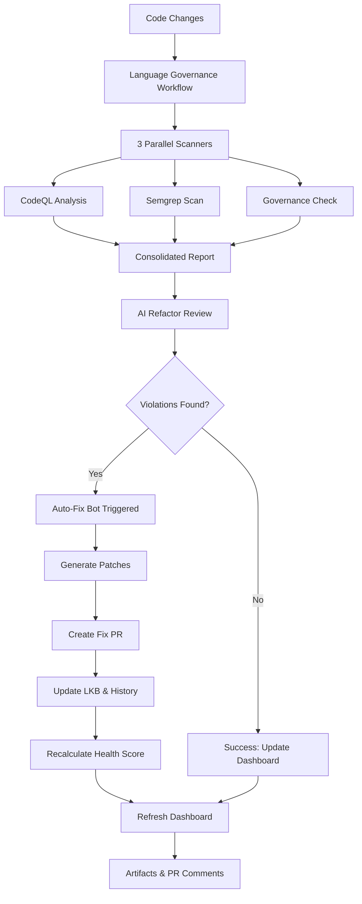

# PR #1 深度分析報告（Deep Analysis Report）

> **Generated**: 2025-12-06  
> **PR Branch**: copilot/extract-and-remove-zip-file  
> **Total Commits**: 11  
> **Analysis Scope**: Complete end-to-end language governance system implementation

---

## 📊 執行摘要（Executive Summary）

PR #1 實現了一個企業級的語言治理生態系統，包含 10 個主要階段、27 個新增檔案、6 個自動化工作流，並建立了從檢測到修復再到知識庫更新的完整閉環系統。

### 關鍵成就：
✅ **2,658 個檔案**從壓縮檔解壓並整理至根目錄  
✅ **254 處引用**更新（unmanned-island-system → unmanned-island）  
✅ **5 層語言架構**（L0-Hardware → L5-Apps）完整定義  
✅ **4 個安全掃描器**整合（Governance + CodeQL + Semgrep + AI）  
✅ **AI 驅動自動修復**（GPT-4 整合 + 規則後備）  
✅ **0-100 健康評分**系統與即時儀表板  

---

## 🏗️ 架構分析（Architecture Analysis）

### 1. 六層生態系統（6-Layer Ecosystem）

```
┌─────────────────────────────────────────────┐
│ Layer 6: Visualization & Reporting          │
│ - Language Governance Dashboard              │
│ - Mermaid diagrams, ASCII charts             │
│ - Real-time metrics display                  │
└─────────────────────────────────────────────┘
                    ↓
┌─────────────────────────────────────────────┐
│ Layer 5: Knowledge Management               │
│ - Living Knowledge Base                      │
│ - Fix history tracking                       │
│ - Health score calculation (0-100)           │
└─────────────────────────────────────────────┘
                    ↓
┌─────────────────────────────────────────────┐
│ Layer 4: Automated Remediation              │
│ - AI Auto-Fix PR Bot                         │
│ - Semantic commit generation                 │
│ - Patch generation & application             │
└─────────────────────────────────────────────┘
                    ↓
┌─────────────────────────────────────────────┐
│ Layer 3: AI-Powered Analysis                │
│ - AI Refactor Review (GPT-4)                 │
│ - Consolidated reporting                     │
│ - Intelligent suggestions                    │
└─────────────────────────────────────────────┘
                    ↓
┌─────────────────────────────────────────────┐
│ Layer 2: Security & Policy Scanning         │
│ - CodeQL (4 languages)                       │
│ - Semgrep (OWASP Top 10)                     │
│ - Language Governance Analyzer               │
└─────────────────────────────────────────────┘
                    ↓
┌─────────────────────────────────────────────┐
│ Layer 1: Policy & Configuration             │
│ - Language Stack Documentation               │
│ - language-policy.yaml                       │
│ - 5-layer architecture definition            │
└─────────────────────────────────────────────┘
```

### 2. 數據流分析（Data Flow Analysis）



---

## 📈 技術債務與優化機會（Technical Debt & Optimization Opportunities）

### 🔴 高優先級（High Priority）

#### 1. 工作流測試覆蓋率不足
**問題**: 所有 GitHub Actions 工作流尚未經過實際 CI 運行驗證
- **風險**: Workflow 語法錯誤、權限問題、artifact 下載失敗
- **影響**: CRITICAL - 系統核心功能
- **建議動作**: 
  - 創建測試 PR 觸發所有工作流
  - 驗證 artifact 上傳/下載鏈路
  - 測試 CodeQL/Semgrep 在真實代碼上的表現

#### 2. API 密鑰管理未文檔化
**問題**: OPENAI_API_KEY 使用但無設置指南
- **風險**: 團隊成員無法使用 AI 功能
- **影響**: HIGH - 降低自動化效能
- **建議動作**:
  - 在 README.md 增加 Secrets 設置章節
  - 提供 .env.example 模板
  - 記錄規則後備機制的啟動條件

#### 3. 健康分數演算法未驗證
**問題**: 0-100 評分系統的權重分配缺乏實證數據支持
- **風險**: 評分不準確，誤導決策
- **影響**: MEDIUM - 影響儀表板可信度
- **建議動作**:
  - 在不同代碼庫上測試評分系統
  - 收集反饋並調整權重
  - 記錄評分邏輯的設計決策

### 🟡 中優先級（Medium Priority）

#### 4. 缺乏單元測試
**問題**: 9 個 Python 工具檔案（32KB+ 總計）零測試覆蓋
- **工具列表**:
  - `ai-auto-fix.py` (17.8KB)
  - `ai-refactor-review.py` (20.4KB)
  - `generate-language-dashboard.py` (15.8KB)
  - `language-health-score.py` (9.3KB)
  - `language-history-writer.py` (7.5KB)
  - `lkb-update.py` (7.6KB)
  - `semantic-commit-generator.py` (8.1KB)
  - `generate-consolidated-report.py` (11.4KB)
  - `language-governance-analyzer.py` (13.1KB)
- **建議動作**:
  - 為每個工具創建對應 `test_*.py`
  - 使用 pytest 框架
  - 設置 CI 測試工作流

#### 5. 文檔一致性問題
**問題**: 部分工具有完整文檔，部分僅有 docstring
- **影響**: 降低可維護性
- **建議動作**:
  - 為每個工具創建獨立 README
  - 統一文檔格式（Usage, Examples, API Reference）
  - 增加故障排除（Troubleshooting）章節

#### 6. Dashboard 模板硬編碼
**問題**: 儀表板模板中許多 `{{ PLACEHOLDER }}` 未連接到實際數據
- **影響**: 首次運行會顯示佔位符
- **建議動作**:
  - 提供預設值/初始數據
  - 增加數據驗證邏輯
  - 記錄所有模板變數

### 🟢 低優先級（Low Priority）

#### 7. 效能優化機會
- **並行化**: Semgrep 和 CodeQL 可同時運行，但目前是順序執行
- **快取**: 可快取 pip 依賴、CodeQL 資料庫
- **增量分析**: 只掃描變更的檔案

#### 8. 國際化支持
- 儀表板目前為中英混合
- 建議完全分離為兩個版本或使用 i18n 框架

---

## 🎯 下一步代辦清單（Next Steps Action Plan）

### Phase 1: 驗證與穩定化（Validation & Stabilization）⏰ 1-2 天

#### 1.1 工作流驗證
- [ ] **創建測試 PR** - 觸發所有 CI/CD 工作流
  - 修改一個 `.ts` 檔案觸發 language-governance workflow
  - 檢查所有 4 個 jobs 是否成功運行
  - 驗證 artifacts 正確上傳
  - 確認 PR comments 正確發布
- [ ] **CodeQL 測試** - 確保 4 種語言掃描正常
  - 檢查 JavaScript/TypeScript 掃描
  - 檢查 Python 掃描
  - 檢查 C++ 掃描（如有）
  - 檢查 Go 掃描（如有）
- [ ] **Semgrep 測試** - 驗證 OWASP Top 10 規則集
  - 確認 SARIF 結果正確生成
  - 上傳到 Security tab
- [ ] **Auto-Fix Bot 測試** - 模擬失敗場景
  - 故意引入違規
  - 確認 auto-fix workflow 被觸發
  - 驗證 fix PR 自動創建

#### 1.2 文檔補全
- [ ] **Secrets 設置指南**
  - 在 README.md 增加 "Configuration" 章節
  - 記錄 OPENAI_API_KEY 設置步驟
  - 說明規則後備機制
- [ ] **快速開始指南**
  - 為新貢獻者創建 QUICK_START.md
  - 包含：安裝、配置、首次運行
  - 錄製 demo 影片（可選）
- [ ] **工具文檔**
  - 為 9 個 Python 工具創建 tools/README.md
  - 包含每個工具的用途、參數、範例
  - 增加故障排除章節

#### 1.3 錯誤處理加強
- [ ] **工作流錯誤處理**
  - 增加 try-catch 在關鍵步驟
  - 提供有意義的錯誤訊息
  - 失敗時發送通知
- [ ] **工具錯誤處理**
  - 驗證所有輸入參數
  - 優雅處理檔案不存在
  - 記錄詳細的錯誤日誌

### Phase 2: 測試與品質保證（Testing & Quality Assurance）⏰ 3-5 天

#### 2.1 單元測試
- [ ] **測試框架設置**
  ```bash
  # 創建 tests/ 目錄結構
  tests/
  ├── test_ai_auto_fix.py
  ├── test_ai_refactor_review.py
  ├── test_dashboard_generator.py
  ├── test_health_score.py
  ├── test_history_writer.py
  ├── test_lkb_update.py
  ├── test_semantic_commit.py
  ├── test_consolidated_report.py
  └── test_governance_analyzer.py
  ```
- [ ] **測試覆蓋率目標**: 至少 70% 行覆蓋率
- [ ] **CI 測試工作流**
  - 創建 `.github/workflows/test.yml`
  - 在每次 PR 運行測試
  - 發布覆蓋率報告

#### 2.2 整合測試
- [ ] **端到端測試場景**
  - 違規檢測 → 報告生成 → 修復 → 驗證
  - 儀表板數據流測試
  - LKB 更新流程測試
- [ ] **Mock 外部依賴**
  - OpenAI API（使用 pytest-mock）
  - GitHub API
  - 檔案系統操作

#### 2.3 效能測試
- [ ] **大型代碼庫測試**
  - 測試 10,000+ 檔案的掃描時間
  - 記錄記憶體使用
  - 找出瓶頸
- [ ] **並行化優化**
  - 評估 parallel scan 的效益
  - 實作快取機制

### Phase 3: 功能增強（Feature Enhancement）⏰ 1-2 週

#### 3.1 儀表板增強
- [ ] **互動式儀表板**
  - 轉換為 HTML/React 版本（可選）
  - 增加即時刷新
  - 提供篩選與排序功能
- [ ] **趨勢視覺化**
  - 使用 Plotly/Chart.js 生成圖表
  - 30 天、90 天、全年趨勢
  - 可匯出為圖片
- [ ] **告警系統**
  - 健康分數 <60 發送通知
  - 連續 3 次違規增加時告警
  - Slack/Email 整合

#### 3.2 AI 增強
- [ ] **多模型支持**
  - 支援 Claude、Gemini、本地 LLM
  - 模型選擇配置
  - 效能比較
- [ ] **上下文學習**
  - 從歷史修復學習
  - 個性化建議
  - 專案特定規則

#### 3.3 治理策略擴展
- [ ] **自訂規則引擎**
  - 允許專案定義自己的規則
  - 規則版本控制
  - 規則測試框架
- [ ] **例外管理**
  - 正式的例外申請流程
  - 例外審批工作流
  - 例外過期提醒

### Phase 4: 生產就緒（Production Readiness）⏰ 1 週

#### 4.1 安全強化
- [ ] **Secrets 掃描**
  - 確保沒有硬編碼 API 密鑰
  - 使用 GitHub Secrets
  - 定期輪換密鑰
- [ ] **權限最小化**
  - 審查所有 workflow 權限
  - 移除不必要的 write 權限
  - 使用 CODEOWNERS 控制變更
- [ ] **依賴安全**
  - 啟用 Dependabot
  - 定期更新依賴
  - 掃描已知漏洞

#### 4.2 監控與可觀測性
- [ ] **指標收集**
  - Workflow 執行時間
  - 違規趨勢
  - 修復成功率
- [ ] **日誌聚合**
  - 集中化日誌儲存
  - 可查詢的日誌格式
  - 保留策略（90 天）
- [ ] **效能監控**
  - CPU/記憶體使用
  - API 呼叫次數
  - 快取命中率

#### 4.3 災難復原
- [ ] **備份策略**
  - 定期備份 knowledge/ 目錄
  - 備份 language-history.yaml
  - 版本控制所有配置
- [ ] **復原測試**
  - 模擬 artifact 丟失
  - 測試從備份復原
  - 文檔化復原程序

### Phase 5: 團隊培訓與推廣（Training & Adoption）⏰ 持續進行

#### 5.1 文檔與培訓
- [ ] **使用者手冊**
  - 為不同角色準備文檔（開發者、管理員、審查者）
  - 包含常見場景與解決方案
  - FAQ 章節
- [ ] **影片教學**
  - 系統概覽（5 分鐘）
  - 深度教學（15-20 分鐘）
  - 故障排除技巧
- [ ] **工作坊**
  - 內部培訓課程
  - 實作演練
  - Q&A 環節

#### 5.2 社群建設
- [ ] **貢獻指南**
  - 更新 CONTRIBUTING.md
  - 定義貢獻流程
  - 設置 issue 模板
- [ ] **變更日誌**
  - 維護 CHANGELOG.md
  - 遵循 Semantic Versioning
  - 記錄所有重大變更

---

## 📊 指標與成功標準（Metrics & Success Criteria）

### 技術指標
- [ ] **測試覆蓋率** ≥ 70%
- [ ] **工作流成功率** ≥ 95%
- [ ] **平均修復時間** < 4 小時
- [ ] **儀表板更新延遲** < 5 分鐘
- [ ] **健康分數準確性** ≥ 85%（需人工驗證）

### 業務指標
- [ ] **違規減少率** - 30 天內減少 50%
- [ ] **自動修復成功率** ≥ 60%
- [ ] **團隊採用率** - 90% 團隊成員使用儀表板
- [ ] **文檔完整性** - 所有工具都有文檔
- [ ] **回應時間** - 問題回報後 24 小時內回應

### 品質指標
- [ ] **零 Critical 違規** 在生產環境
- [ ] **零已知安全漏洞** 在依賴項
- [ ] **所有 workflow 綠色** 在主分支
- [ ] **儀表板可用性** ≥ 99.9%

---

## 🚨 風險與緩解策略（Risks & Mitigation）

### 風險 1: AI API 成本超支
**機率**: MEDIUM | **影響**: HIGH  
**緩解**:
- 設置 API 使用配額
- 優先使用規則後備
- 監控每月成本
- 考慮自托管 LLM

### 風險 2: 工作流執行時間過長
**機率**: HIGH | **影響**: MEDIUM  
**緩解**:
- 實作增量掃描
- 並行化 jobs
- 快取依賴與資料庫
- 僅在關鍵路徑運行完整掃描

### 風險 3: 誤報導致疲勞
**機率**: MEDIUM | **影響**: HIGH  
**緩解**:
- 調整規則靈敏度
- 實作白名單機制
- 收集團隊反饋
- 定期審查規則

### 風險 4: 知識庫數據損壞
**機率**: LOW | **影響**: CRITICAL  
**緩解**:
- 定期備份
- 版本控制所有 YAML
- 實作數據驗證
- 災難復原演練

---

## 💡 創新機會（Innovation Opportunities）

### 短期（1-3 個月）
1. **預測性分析** - 使用機器學習預測哪些檔案最可能違規
2. **自動化重構** - 不僅修復違規，還優化架構
3. **團隊儀表板** - 按團隊/專案劃分的個性化視圖
4. **Slack Bot** - 即時通知與互動式命令

### 長期（3-12 個月）
1. **跨專案洞察** - 聚合多個專案的數據，找出共同模式
2. **AI 助手** - 自然語言查詢儀表板
3. **自動化架構演進** - AI 建議長期架構改進
4. **合規性報告** - 自動生成 ISO/SOC2 合規報告

---

## 📝 總結（Conclusion）

PR #1 建立了一個極其全面的語言治理系統，涵蓋了從檢測到修復再到知識管理的完整生命週期。系統架構優雅，具有高度可擴展性，並充分利用了 AI 技術。

**主要優勢**:
- ✅ 完整的自動化流程
- ✅ AI 驅動的智能修復
- ✅ 即時可視化儀表板
- ✅ 知識庫持續積累

**需要改進的領域**:
- 🔴 測試覆蓋率不足
- 🔴 工作流未經實戰驗證
- 🟡 文檔需要補全
- 🟡 效能優化機會

**建議下一步**:
1. **立即**: Phase 1 驗證與穩定化（1-2 天）
2. **本週**: Phase 2 測試與品質保證開始
3. **本月**: 完成 Phase 3 與 Phase 4
4. **持續**: Phase 5 團隊培訓與推廣

此 PR 奠定了 Unmanned Island System 語言治理的堅實基礎，為未來的擴展和優化提供了清晰的路徑。

---

**生成時間**: 2025-12-06  
**分析者**: GitHub Copilot  
**版本**: v1.0
