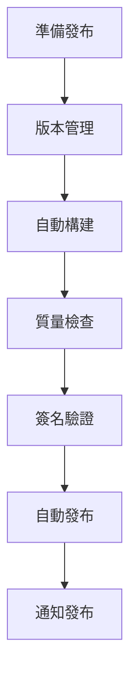

# MachineNativeOps 發布指南 | Release Guide

<div align="center">

**🚀 自動化發布流程 | Automated Release Process**

</div>

---

## 📋 發布流程概覽 | Release Process Overview



---

## 1️⃣ 準備發布 | Prepare Release

### 檢查清單 | Checklist

- [ ] 所有 CI 測試通過
- [ ] 代碼審查完成
- [ ] 更新 CHANGELOG.md
- [ ] 更新文檔
- [ ] 更新版本號
- [ ] 創建發布分支

### 更新 CHANGELOG

```bash
# 編輯 CHANGELOG.md
vi CHANGELOG.md

# 格式：
## [1.0.0] - 2024-12-10

### Added 新增
- 跨平台安裝檔系統
- Windows EXE/MSI 安裝程式
- macOS DMG/PKG 安裝程式
- Linux AppImage/DEB/RPM 包
- Docker 容器化支持

### Changed 變更
- 重構 README 為技術工程手冊
- 整合 governance 結構

### Fixed 修復
- 修復構建腳本權限問題
```

---

## 2️⃣ 版本管理 | Version Management

### 更新版本號

```bash
# 方法 1: 手動更新
echo "1.0.0" > VERSION

# 方法 2: 使用 bump2version
pip install bump2version
bump2version --current-version 0.9.0 minor  # 0.9.0 -> 1.0.0

# 更新相關檔案中的版本號：
# - VERSION
# - pyproject.toml
# - setup.py
# - package.json
# - governance/VERSION
```

### 創建 Git Tag

```bash
# 創建帶註釋的 tag
git tag -a v1.0.0 -m "Release v1.0.0

Major Features:
- Cross-platform installers (Windows, macOS, Linux)
- Docker containerization
- Complete build automation
- Comprehensive documentation

Breaking Changes:
- None

Migration Guide:
- See INSTALL.md for new installation methods
"

# 推送 tag
git push origin v1.0.0

# 查看 tags
git tag -l -n9
```

---

## 3️⃣ 自動構建 | Automated Build

### GitHub Actions 工作流

發布流程會自動觸發以下構建：

```yaml
# .github/workflows/release.yml
name: Release

on:
  push:
    tags:
      - 'v*'

jobs:
  build-windows:
    runs-on: windows-latest
    steps:
      - uses: actions/checkout@v3
      - name: Build Windows Installers
        run: |
          cd build/windows
          ./build-windows.bat

  build-macos:
    runs-on: macos-latest
    steps:
      - uses: actions/checkout@v3
      - name: Build macOS Installers
        run: |
          cd build/macos
          ./build-macos.sh

  build-linux:
    runs-on: ubuntu-latest
    steps:
      - uses: actions/checkout@v3
      - name: Build Linux Packages
        run: |
          cd build/linux
          ./build-linux.sh

  build-docker:
    runs-on: ubuntu-latest
    steps:
      - uses: actions/checkout@v3
      - name: Build Docker Images
        run: |
          python3 build/build.py docker
```

### 本地構建測試

```bash
# 測試 Windows 構建（需要 Windows 環境）
cd build/windows
./build-windows.bat

# 測試 macOS 構建（需要 macOS 環境）
cd build/macos
./build-macos.sh

# 測試 Linux 構建
cd build/linux
./build-linux.sh

# 測試 Docker 構建
python3 build/build.py docker

# 測試所有平台（在各自環境）
python3 build/build.py all
```

---

## 4️⃣ 質量檢查 | Quality Checks

### 自動化檢查

```bash
# 1. 運行測試套件
npm run test
pytest

# 2. 代碼品質檢查
npm run lint
pylint governance/ core/

# 3. 安全掃描
npm audit
pip-audit

# 4. 依賴檢查
npm outdated
pip list --outdated
```

### 手動驗證

```bash
# 驗證安裝檔
# Windows
.\MachineNativeOps-Governance-setup.exe /VERYSILENT
machinenativeops --version

# macOS
open MachineNativeOps-Governance-1.0.0.dmg
machinenativeops --version

# Linux
./MachineNativeOps-Governance-x86_64.AppImage --version
sudo dpkg -i machinenativeops-governance_1.0.0_amd64.deb
machinenativeops --version

# Docker
docker run --rm machinenativeops/governance:latest machinenativeops --version
```

---

## 5️⃣ 簽名驗證 | Signing & Verification

### Windows 代碼簽名

```powershell
# 簽名 EXE 和 MSI
cd build/windows
.\sign-windows.ps1 -CertificatePath "cert.pfx"

# 驗證簽名
Get-AuthenticodeSignature .\dist\MachineNativeOps-Governance.exe
```

### macOS 代碼簽名與公證

```bash
# 簽名
cd build/macos
./sign-macos.sh

# 公證
xcrun notarytool submit MachineNativeOps-Governance.zip \
  --apple-id "$APPLE_ID" \
  --password "$APP_PASSWORD" \
  --team-id "$TEAM_ID"

# 附加公證票據
xcrun stapler staple MachineNativeOps-Governance.app
```

### Linux 包簽名

```bash
# GPG 簽名 DEB
dpkg-sig --sign builder machinenativeops-governance_1.0.0_amd64.deb

# GPG 簽名 RPM
rpm --addsign machinenativeops-governance-1.0.0-1.x86_64.rpm

# 驗證
dpkg-sig --verify machinenativeops-governance_1.0.0_amd64.deb
rpm --checksig machinenativeops-governance-1.0.0-1.x86_64.rpm
```

---

## 6️⃣ 自動發布 | Automated Release

### GitHub Releases

```bash
# 使用 GitHub CLI
gh release create v1.0.0 \
  --title "MachineNativeOps v1.0.0" \
  --notes-file RELEASE_NOTES.md \
  build/windows/MachineNativeOps-Governance-setup.exe \
  build/windows/MachineNativeOps-Governance-1.0.0.msi \
  build/macos/MachineNativeOps-Governance-1.0.0.dmg \
  build/macos/MachineNativeOps-Governance-1.0.0.pkg \
  build/linux/MachineNativeOps-Governance-x86_64.AppImage \
  build/linux/debian/machinenativeops-governance_1.0.0_amd64.deb \
  build/linux/redhat/machinenativeops-governance-1.0.0-1.x86_64.rpm
```

### Docker Hub

```bash
# 登錄 Docker Hub
docker login

# 推送映像
docker push machinenativeops/governance:1.0.0
docker push machinenativeops/governance:latest

# 推送 Windows 映像
docker push machinenativeops/governance:windows-1.0.0
docker push machinenativeops/governance:windows-latest
```

### PyPI 發布

```bash
# 構建發布包
python3 -m build

# 上傳到 PyPI
python3 -m twine upload dist/*

# 或上傳到 Test PyPI
python3 -m twine upload --repository testpypi dist/*
```

### npm 發布

```bash
# 發布到 npm
npm publish

# 或發布到私有倉庫
npm publish --registry https://registry.your-domain.com
```

---

## 7️⃣ 通知發布 | Release Notifications

### 更新文檔

```bash
# 更新 README.md 版本號
sed -i 's/version-.*-blue/version-1.0.0-blue/' README.md

# 更新下載連結
# 編輯 INSTALL.md 和 BUILD.md
```

### 發布公告

```markdown
# 發布公告模板

## MachineNativeOps v1.0.0 發布！🎉

我們很高興宣布 MachineNativeOps v1.0.0 正式發布！

### 🌟 主要新增功能

- **跨平台安裝檔系統**: 支援 Windows, macOS, Linux
- **Docker 容器化**: 完整的容器化部署方案
- **自動化構建**: CI/CD 完全自動化
- **完整文檔**: 安裝、構建、發布指南

### 📦 下載

- Windows: [EXE](link) | [MSI](link)
- macOS: [DMG](link) | [PKG](link) | [Homebrew](link)
- Linux: [AppImage](link) | [DEB](link) | [RPM](link)
- Docker: `docker pull machinenativeops/governance:1.0.0`

### 📖 文檔

- [安裝指南](INSTALL.md)
- [構建指南](BUILD.md)
- [API 文檔](docs/)

### 🙏 致謝

感謝所有貢獻者的辛勤工作！
```

### 通知渠道

- GitHub Discussions
- 項目網站
- 社交媒體
- 郵件列表

---

## 📊 發布統計 | Release Statistics

### 文件清單

```
Windows (11 個檔案):
✓ MachineNativeOps-Governance-setup.exe
✓ MachineNativeOps-Governance-1.0.0.msi
✓ build-windows.bat
✓ install.bat / uninstall.bat
✓ windows-config.yaml
✓ windows-requirements.txt
✓ windows-environment.bat
✓ sign-windows.ps1
✓ MachineNativeOps-Governance-Setup.iss

macOS (12 個檔案):
✓ MachineNativeOps-Governance-1.0.0.dmg
✓ MachineNativeOps-Governance-1.0.0.pkg
✓ build-macos.sh
✓ install-macos.sh / uninstall-macos.sh
✓ macos-config.yaml
✓ macos-requirements.txt
✓ macos-environment.sh
✓ sign-macos.sh
✓ entitlements.plist
✓ Info.plist
✓ machinenativeops-governance.rb

Linux (15 個檔案):
✓ MachineNativeOps-Governance-x86_64.AppImage
✓ machinenativeops-governance_1.0.0_amd64.deb
✓ machinenativeops-governance-1.0.0-1.x86_64.rpm
✓ build-linux.sh / build-appimage.sh
✓ build-deb.sh / build-rpm.sh
✓ install-linux.sh / uninstall-linux.sh
✓ linux-config.yaml
✓ linux-requirements.txt
✓ debian/control, changelog, rules
✓ redhat/machinenativeops-governance.spec
✓ systemd/machinenativeops-governance.service

Docker (4 個檔案):
✓ Dockerfile
✓ Dockerfile.windows
✓ docker-compose.yml
✓ .dockerignore

通用構建 (18 個檔案):
✓ setup.py / pyproject.toml
✓ MANIFEST.in / Makefile
✓ build.py
✓ VERSION / CHANGELOG.md
✓ INSTALL.md / UNINSTALL.md
✓ BUILD.md / RELEASE.md
✓ TROUBLESHOOTING.md
✓ LICENSE / LICENSE-THIRD-PARTY.md

總計: 60 個檔案
```

---

## 🔄 回滾程序 | Rollback Procedure

### 如果發現問題

```bash
# 1. 停止發布
gh release delete v1.0.0

# 2. 撤回 tag
git tag -d v1.0.0
git push origin :refs/tags/v1.0.0

# 3. 撤回 Docker 映像
# （無法刪除，但可以標記為 deprecated）
docker tag machinenativeops/governance:1.0.0 machinenativeops/governance:deprecated

# 4. 撤回 PyPI 包
# （無法刪除，但可以 yank）
pip install twine
twine yank machinenativeops 1.0.0

# 5. 發布修復版本
# 修復問題後發布 v1.0.1
```

---

## 📚 相關文檔

- [BUILD.md](./BUILD.md) - 構建指南
- [INSTALL.md](./INSTALL.md) - 安裝指南
- [CHANGELOG.md](./CHANGELOG.md) - 變更日誌

---

<div align="center">

**發布愉快！Happy Releasing!**

</div>
