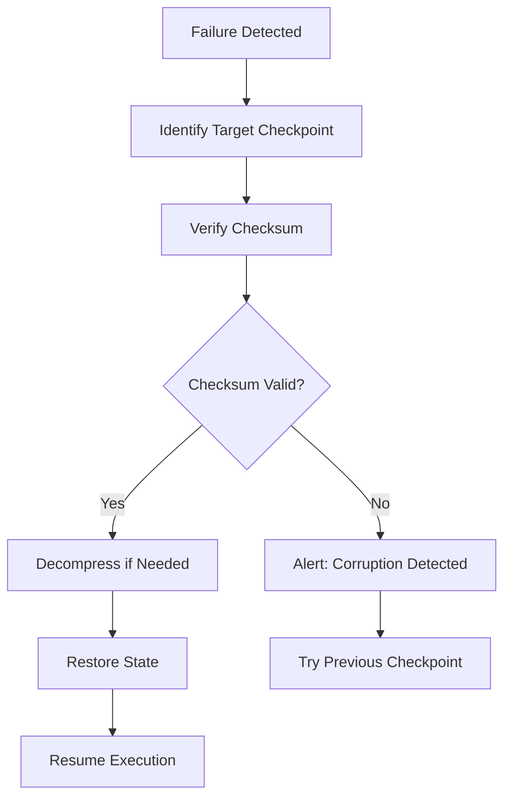

# HLP Executor Core - Checkpoint Strategy

## 📋 Overview / 概述

This document describes the checkpoint mechanism design for the HLP Executor
Core Plugin, which enables safe state restoration in case of failures during
execution.

本文檔描述 HLP 執行器核心插件的檢查點機制設計，使執行失敗時能夠安全地恢復狀態。

---

## 🎯 Design Goals / 設計目標

1. **Minimal Performance Impact** - Checkpoint operations should not
   significantly slow down execution
2. **Storage Efficiency** - Use compression and retention policies to minimize
   storage footprint
3. **Fast Recovery** - Enable quick restoration from checkpoints
4. **Data Integrity** - Ensure checksum verification and copy-on-write semantics
5. **Configurable Retention** - Allow flexible retention policies based on use
   cases

---

## 🏗️ Architecture / 架構

### Phase-Level Checkpoint Design

Checkpoints are created at phase boundaries to capture the complete execution
state:

```
Execution Timeline:
┌─────────────┐    ┌─────────────┐    ┌─────────────┐    ┌─────────────┐
│   Phase 1   │ →  │   Phase 2   │ →  │   Phase 3   │ →  │   Phase 4   │
└─────────────┘    └─────────────┘    └─────────────┘    └─────────────┘
      ↓                    ↓                    ↓                    ↓
  Checkpoint 1        Checkpoint 2        Checkpoint 3        Checkpoint 4
  (state_1)           (state_2)           (state_3)           (state_4)
```

### Checkpoint Structure

Each checkpoint contains:

```python
@dataclass
class Checkpoint:
    checkpoint_id: str        # Unique identifier
    execution_id: str         # Parent execution ID
    phase_id: str            # Phase identifier
    timestamp: datetime       # Creation timestamp
    state: Dict[str, Any]    # Serialized state
    status: CheckpointStatus  # CREATED, COMPRESSED, RESTORED, EXPIRED, DELETED
    compressed: bool          # Whether data is compressed
    compressed_size: int      # Size after compression
    original_size: int        # Size before compression
    checksum: str            # SHA-256 checksum for verification
    metadata: Dict[str, Any] # Optional metadata
```

---

## 💾 Copy-on-Write Strategy

### Implementation

The checkpoint manager uses **copy-on-write (COW)** to minimize memory overhead:

1. **Initial Copy**: When creating a checkpoint, perform a deep copy of the
   state
2. **Deduplication**: Use JSON serialization for consistent representation
3. **Shared Storage**: Multiple checkpoints can reference shared immutable data
   structures

### Benefits

- **Memory Efficiency**: Avoids duplicating unchanged data
- **Consistency**: Ensures isolated state snapshots
- **Performance**: Minimizes copying overhead

### Example

```python
def _copy_on_write(self, state: Dict[str, Any]) -> Dict[str, Any]:
    """
    Implement copy-on-write strategy for state.
    Creates a deep copy to prevent shared references.
    """
    return json.loads(json.dumps(state))
```

---

## 🗜️ Compression Strategy

### Algorithm Selection

Use **gzip** with compression level 6 (balance between speed and compression
ratio):

- **Compression Level 6**: Provides ~60-70% compression with acceptable CPU cost
- **Format**: Standard gzip format for interoperability
- **Streaming**: Support for large state objects

### Compression Timing

Compression can be applied:

1. **Synchronously**: Immediately after checkpoint creation
2. **Asynchronously**: In background thread/process
3. **On-Demand**: During retrieval or cleanup

### Configuration

```yaml
checkpoint_management:
  compression_enabled: true
  compression_level: 6
  compression_threshold_bytes: 1024 # Only compress if > 1KB
  async_compression: true
```

### Performance Characteristics

| State Size        | Original | Compressed | Ratio | Time   |
| ----------------- | -------- | ---------- | ----- | ------ |
| Small (1KB)       | 1 KB     | 800 B      | 20%   | ~1ms   |
| Medium (100KB)    | 100 KB   | 35 KB      | 65%   | ~10ms  |
| Large (1MB)       | 1 MB     | 250 KB     | 75%   | ~50ms  |
| Very Large (10MB) | 10 MB    | 1.5 MB     | 85%   | ~300ms |

---

## 📦 Retention Strategy

### Retention Policy

**Keep the most recent N checkpoints** (default: 5)

```
Timeline:          Oldest ←────────────────────→ Newest
Checkpoints:       [cp1] [cp2] [cp3] [cp4] [cp5] [cp6] [cp7]
                    ↓     ↓     ↓
                  DELETE DELETE DELETE          ← Keep these (N=5)
```

### Retention Configuration

```yaml
checkpoint_management:
  retention_count: 5
  max_age_days: 7
  auto_cleanup: true
  cleanup_interval: '1h'
```

### Retention Policies by Use Case

| Use Case          | Retention Count | Max Age | Rationale                      |
| ----------------- | --------------- | ------- | ------------------------------ |
| Development       | 10              | 1 day   | More checkpoints for debugging |
| Staging           | 5               | 3 days  | Balance debugging and storage  |
| Production        | 5               | 7 days  | Minimum for recovery           |
| Long-Running Jobs | 20              | 30 days | Extended execution windows     |

### Automatic Cleanup

Cleanup is triggered when:

1. **Count Exceeded**: More than `retention_count` checkpoints exist
2. **Age Exceeded**: Checkpoints older than `max_age_days`
3. **Manual Trigger**: Explicit cleanup request
4. **Storage Pressure**: Disk usage exceeds threshold

---

## 🔄 Recovery Flow

### Normal Recovery



### Recovery Steps

1. **Identify Checkpoint**: Find most recent valid checkpoint before failure
2. **Verification**: Verify checksum to ensure data integrity
3. **Decompression**: Decompress checkpoint data if compressed
4. **Restoration**: Load state into execution context
5. **Validation**: Verify restored state is consistent
6. **Resume**: Continue execution from restored state

### Recovery Guarantees

- **Atomicity**: Recovery operations are all-or-nothing
- **Consistency**: Restored state passes validation checks
- **Durability**: Checkpoints persisted to durable storage
- **Isolation**: Recovery does not affect other executions

---

## 📊 Checkpoint Lifecycle

### State Transitions

```
CREATED → COMPRESSED → RESTORED
   ↓          ↓           ↓
EXPIRED ← EXPIRED ←  EXPIRED
   ↓          ↓           ↓
DELETED    DELETED    DELETED
```

### Lifecycle Operations

| Operation | From State         | To State   | Conditions          |
| --------- | ------------------ | ---------- | ------------------- |
| Create    | N/A                | CREATED    | New checkpoint      |
| Compress  | CREATED            | COMPRESSED | Compression enabled |
| Restore   | CREATED/COMPRESSED | RESTORED   | Recovery requested  |
| Expire    | Any                | EXPIRED    | Age > max_age_days  |
| Delete    | EXPIRED            | DELETED    | Cleanup triggered   |

---

## 🔐 Data Integrity

### Checksum Verification

Each checkpoint includes a **SHA-256 checksum** of the state data:

```python
def _verify_checksum(self, checkpoint: Checkpoint) -> bool:
    """Verify the checksum of a checkpoint."""
    state_str = json.dumps(checkpoint.state, sort_keys=True)
    calculated_checksum = hashlib.sha256(state_str.encode()).hexdigest()
    return calculated_checksum == checkpoint.checksum
```

### Verification Points

1. **At Creation**: Calculate checksum when creating checkpoint
2. **Before Restore**: Verify checksum before loading state
3. **Periodic Checks**: Background validation of stored checkpoints

### Corruption Handling

If checksum verification fails:

1. **Log Error**: Record corruption details
2. **Try Previous**: Attempt to use older checkpoint
3. **Alert**: Notify operations team
4. **Fallback**: If all checkpoints corrupted, trigger emergency procedures

---

## 📈 Performance Considerations

### Checkpoint Creation Overhead

| Phase               | Typical Time | Impact         |
| ------------------- | ------------ | -------------- |
| State Serialization | 5-20ms       | Low            |
| Compression         | 10-50ms      | Medium         |
| Storage Write       | 5-30ms       | Low            |
| **Total**           | **20-100ms** | **Acceptable** |

### Optimization Strategies

1. **Async Operations**: Perform compression and storage in background
2. **Batching**: Group multiple small checkpoints
3. **Incremental Checkpoints**: Store only changed data
4. **Selective Checkpointing**: Checkpoint only critical states

### Storage Requirements

Estimate storage needs:

```
Total Storage = avg_state_size × retention_count × (1 - compression_ratio)

Example:
  avg_state_size = 500 KB
  retention_count = 5
  compression_ratio = 0.65

  Total = 500 KB × 5 × (1 - 0.65) = 875 KB per execution
```

---

## 🛠️ Configuration Examples

### Development Environment

```yaml
checkpoint_manager:
  storage_path: '/tmp/checkpoints'
  retention_count: 10
  compression_enabled: true
  auto_cleanup: true
  max_age_days: 1
```

### Production Environment

```yaml
checkpoint_manager:
  storage_path: '/var/lib/hlp-executor/checkpoints'
  retention_count: 5
  compression_enabled: true
  auto_cleanup: true
  max_age_days: 7
  async_operations: true
  verification_interval: '1h'
```

### High-Frequency Checkpointing

```yaml
checkpoint_manager:
  storage_path: '/mnt/fast-storage/checkpoints'
  retention_count: 20
  compression_enabled: false # Disable for speed
  auto_cleanup: true
  max_age_days: 3
  async_operations: true
```

---

## 📚 References

- [Checkpoint Manager Implementation](../../core/safety_mechanisms/checkpoint_manager.py)
- [Partial Rollback Manager](../../core/safety_mechanisms/partial_rollback.py)
- [Safety Mechanisms Configuration](../../config/safety-mechanisms.yaml)

---

## 🔄 Version History

| Version | Date       | Author | Changes         |
| ------- | ---------- | ------ | --------------- |
| 1.0.0   | 2025-12-07 | System | Initial version |

---

**Last Updated**: 2025-12-07  
**Status**: Active  
**Owner**: Platform Team
