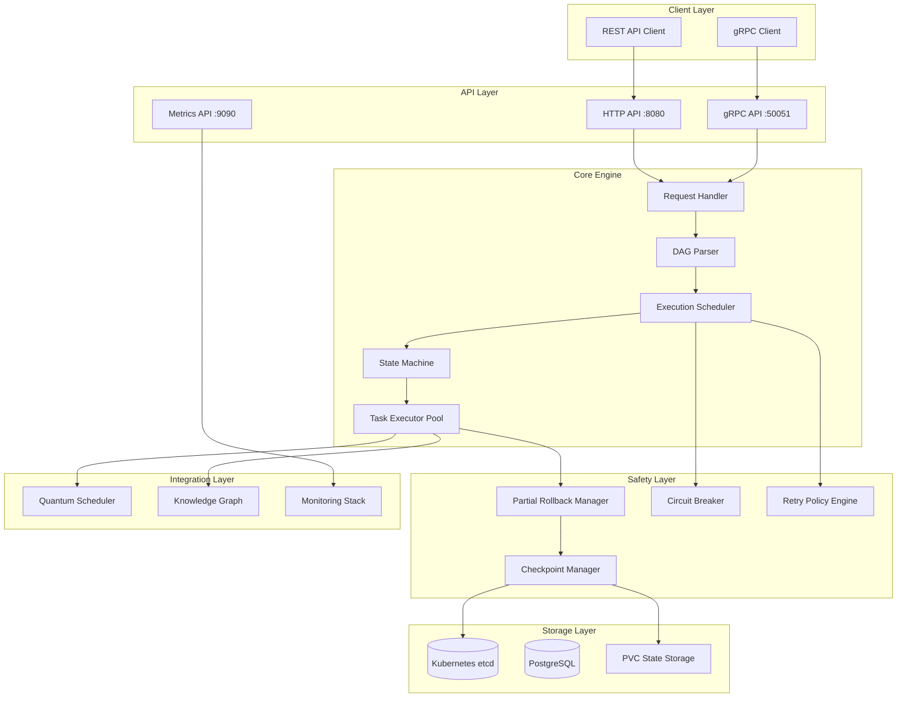
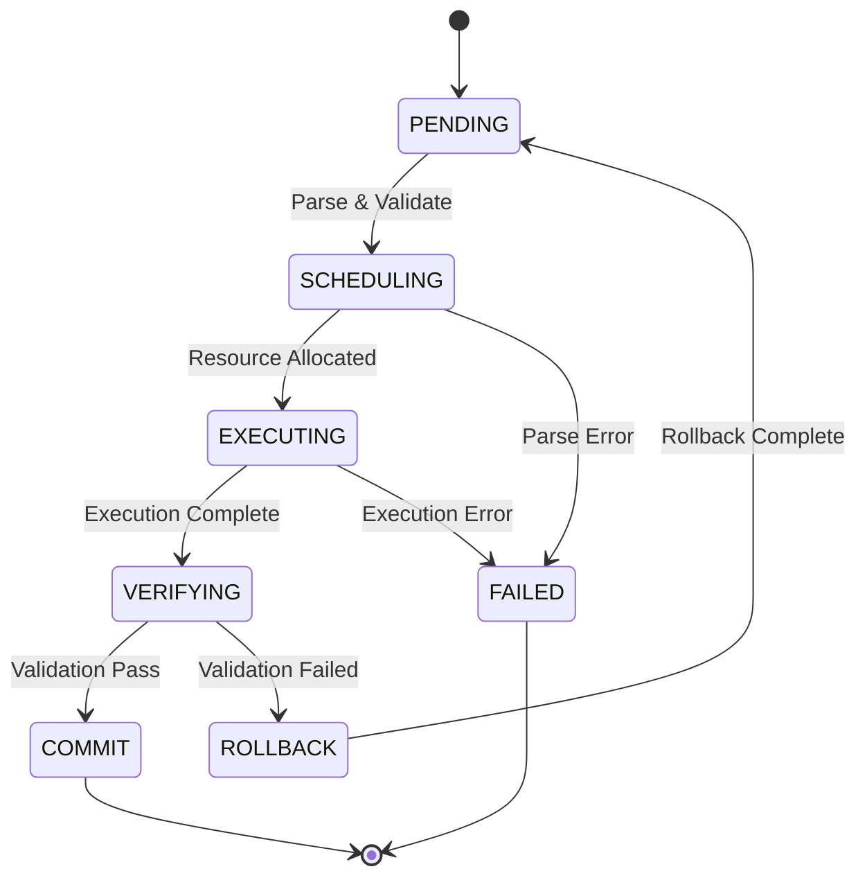
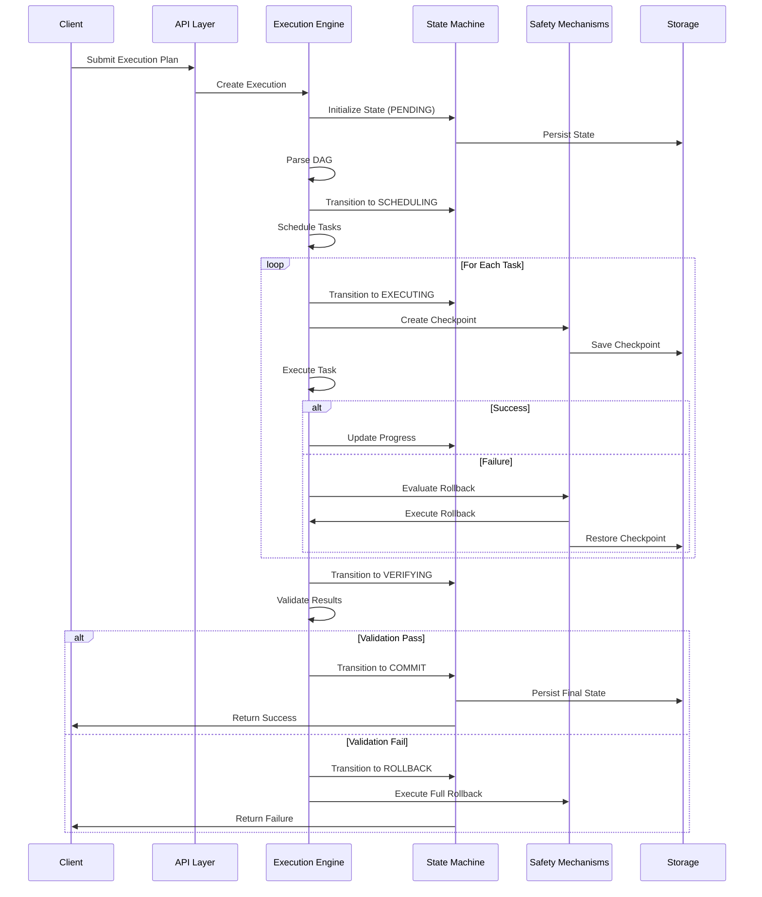

# HLP Executor Core - Execution Model Architecture

## 概述 (Overview)

HLP (Hard Logic Plugin) Executor Core 是一個高性能的非同步 DAG (Directed Acyclic Graph) 編排引擎，專為複雜的執行流程管理而設計。本文檔描述其核心執行模型、架構決策和實現細節。

The HLP Executor Core is a high-performance asynchronous DAG orchestration engine designed for complex execution flow management. This document describes its core execution model, architectural decisions, and implementation details.

---

## 1. 執行模型概述 (Execution Model Overview)

### 1.1 核心特性

- **Async DAG Orchestrator**: 非同步有向無環圖編排
- **Multi-level Rollback**: 多層級回滾能力（Phase/Plan-unit/Artifact）
- **State Machine Driven**: 狀態機驅動的執行流程
- **Risk-Aware Scheduling**: 風險感知的調度策略
- **Checkpoint-based Recovery**: 基於檢查點的恢復機制

### 1.2 執行流程

```
輸入 (Input) → 解析 (Parse) → 調度 (Schedule) → 執行 (Execute) → 驗證 (Verify) → 提交 (Commit)
                                                        ↓ (失敗)
                                                   回滾 (Rollback)
```

---

## 2. 執行圖構建算法 (Execution Graph Construction)

### 2.1 拓撲排序 (Topological Sort)

執行器使用改良的 Kahn 算法進行拓撲排序，確保依賴關係正確處理。

**算法流程**:

1. 構建入度表 (In-degree table)
2. 將入度為 0 的節點加入隊列
3. 處理隊列中的節點，並更新相鄰節點的入度
4. 重複直到所有節點處理完畢

**偽代碼**:

```python
def topological_sort(graph):
    in_degree = calculate_in_degree(graph)
    queue = [node for node in graph if in_degree[node] == 0]
    sorted_nodes = []
    
    while queue:
        node = queue.pop(0)
        sorted_nodes.append(node)
        
        for neighbor in graph[node]:
            in_degree[neighbor] -= 1
            if in_degree[neighbor] == 0:
                queue.append(neighbor)
    
    return sorted_nodes
```

### 2.2 風險權重分析 (Risk-Weighted Analysis)

每個執行節點都有關聯的風險評分，影響調度優先級和資源分配。

**風險評分因素**:

- **複雜度** (Complexity): 執行單元的複雜程度
- **歷史失敗率** (Historical Failure Rate): 過去執行的失敗比率
- **資源需求** (Resource Requirements): 所需的系統資源
- **影響範圍** (Impact Scope): 失敗時的影響範圍

**風險計算公式**:

```
Risk Score = (Complexity × 0.3) + (Failure Rate × 0.4) + 
             (Resource Demand × 0.2) + (Impact Scope × 0.1)
```

### 2.3 關鍵路徑分析 (Critical Path Analysis)

識別 DAG 中的關鍵路徑，優先分配資源給關鍵任務。

**關鍵路徑定義**:

- 從起點到終點的最長路徑
- 決定整體執行時間的路徑
- 無鬆弛時間 (slack time) 的任務序列

**應用**:

- 優先調度關鍵路徑上的任務
- 為關鍵任務預留資源
- 監控關鍵任務的執行狀態

---

## 3. 並行化策略 (Parallelization Strategy)

### 3.1 最大寬度調度 (Max-Width Scheduling)

執行器採用最大寬度調度算法，在每個階段最大化並行執行的任務數量。

**調度規則**:

1. **依賴滿足** (Dependency Satisfaction): 只調度所有依賴已完成的任務
2. **資源限制** (Resource Constraints): 尊重資源限制（CPU、內存、GPU）
3. **公平性** (Fairness): 確保所有任務最終都能執行
4. **優先級** (Priority): 考慮任務優先級和風險評分

**最大並行度**:

```yaml
parallelization:
  max_concurrent_tasks: 100
  max_concurrent_per_phase: 50
  resource_pool:
    cpu: "100 cores"
    memory: "500Gi"
    gpu: "10 GPUs"  # Optional
```

### 3.2 動態負載平衡 (Dynamic Load Balancing)

根據實際執行情況動態調整任務分配。

**負載平衡策略**:

- **輪詢** (Round-robin): 平均分配任務
- **最少連接** (Least connections): 分配給負載最輕的執行器
- **加權** (Weighted): 根據執行器能力分配
- **一致性哈希** (Consistent hashing): 保證任務親和性

---

## 4. 狀態持久化機制 (State Persistence)

### 4.1 存儲後端 (Storage Backend)

**主要選項: Kubernetes etcd**

- 高可用性
- 強一致性
- 原生支援 watch 機制
- 與 K8s 集群整合

**替代選項: PostgreSQL**

- 關係型數據模型
- 豐富的查詢能力
- 成熟的備份和恢復機制
- 更大的存儲容量

### 4.2 狀態模型 (State Model)

```yaml
ExecutionState:
  execution_id: "exec-12345"
  status: "EXECUTING"
  phase: "phase-2"
  created_at: "2025-12-07T09:00:00Z"
  updated_at: "2025-12-07T09:05:00Z"
  
  plan_units:
    - id: "unit-1"
      status: "COMPLETED"
      result: "success"
    - id: "unit-2"
      status: "EXECUTING"
      started_at: "2025-12-07T09:04:00Z"
  
  checkpoints:
    - checkpoint_id: "cp-phase-1"
      phase_id: "phase-1"
      timestamp: "2025-12-07T09:02:00Z"
      state_snapshot: {...}
  
  metrics:
    tasks_total: 50
    tasks_completed: 25
    tasks_failed: 2
    execution_duration_seconds: 300
```

### 4.3 檢查點策略 (Checkpoint Strategy)

**頻率**: Per-phase (每個階段一次)

**內容**:

- 當前階段的完整狀態
- 已完成的 plan units
- 中間結果和元數據
- 依賴關係圖

**保留策略**:

- 保留最近 5 個檢查點
- 壓縮舊檢查點 (gzip)
- 過期檢查點自動清理（7 天）

**恢復策略**:

- Last-known-good-state: 恢復到最後一個成功的檢查點
- Forward recovery: 從檢查點重新執行後續步驟
- Partial rollback: 只回滾失敗的部分

---

## 5. 架構圖 (Architecture Diagrams)

### 5.1 整體架構 (Overall Architecture)



### 5.2 狀態轉換圖 (State Transition Diagram)



### 5.3 執行流程 (Execution Flow)



---

## 6. 性能考量 (Performance Considerations)

### 6.1 SLO 目標

| 指標 | 目標值 | 測量方法 |
|------|--------|---------|
| DAG 解析延遲 (P95) | < 120ms | Prometheus histogram |
| 狀態轉換延遲 (P90) | < 50ms | Prometheus histogram |
| 恢復時間目標 (RTO) | < 30s | 手動測試 |
| 可用性 | > 99.9% | Uptime monitoring |
| 最大並發執行 | 1000 | 配置限制 |

### 6.2 優化策略

**解析優化**:

- 使用緩存減少重複解析
- 並行化依賴分析
- 增量更新執行圖

**調度優化**:

- 預測性調度（基於歷史數據）
- 批量調度減少開銷
- 智能資源預留

**存儲優化**:

- 連接池管理
- 批量寫入
- 異步持久化
- 壓縮大型狀態

---

## 7. 擴展性 (Scalability)

### 7.1 水平擴展

**HPA 配置**:

```yaml
minReplicas: 3
maxReplicas: 20
metrics:
  - type: Resource
    resource:
      name: cpu
      target:
        type: Utilization
        averageUtilization: 70
  - type: Resource
    resource:
      name: memory
      target:
        type: Utilization
        averageUtilization: 80
```

**分片策略**:

- 按執行 ID 哈希分片
- 保證同一執行的請求路由到同一實例
- 利用 Kubernetes StatefulSet 提供穩定標識

### 7.2 垂直擴展

**資源配置**:

```yaml
resources:
  requests:
    cpu: "500m"
    memory: "1Gi"
  limits:
    cpu: "2000m"
    memory: "4Gi"
```

**擴展限制**:

- 單個執行最多 500 個 plan units
- 狀態大小限制 100MB
- 檢查點大小限制 50MB

---

## 8. 安全考量 (Security Considerations)

### 8.1 執行隔離

- 每個執行在獨立的命名空間中運行
- 使用 RBAC 限制權限
- 網絡策略隔離流量

### 8.2 數據保護

- 狀態數據加密（at-rest）
- 傳輸加密（TLS）
- 敏感數據脫敏

### 8.3 供應鏈安全

- SLSA Level 3 證明
- 鏡像簽名驗證（Cosign）
- SBOM 追蹤

---

## 9. 監控與可觀測性 (Monitoring & Observability)

### 9.1 關鍵指標

**執行指標**:

- `hlp_executor_tasks_total`: 總任務數（按狀態）
- `hlp_executor_execution_duration_seconds`: 執行時長
- `hlp_executor_rollback_operations_total`: 回滾操作數

**性能指標**:

- `hlp_executor_dag_parse_duration_seconds`: DAG 解析時長
- `hlp_executor_state_transition_duration_seconds`: 狀態轉換時長
- `hlp_executor_checkpoint_size_bytes`: 檢查點大小

**資源指標**:

- CPU 使用率
- 內存使用率
- 存儲使用率

### 9.2 日誌結構

```json
{
  "timestamp": "2025-12-07T09:00:00Z",
  "level": "INFO",
  "execution_id": "exec-12345",
  "phase_id": "phase-2",
  "event": "task_completed",
  "task_id": "task-5",
  "duration_ms": 1500,
  "trace_id": "trace-abc123",
  "span_id": "span-def456"
}
```

### 9.3 分散式追蹤

- OpenTelemetry 集成
- Jaeger 後端
- 10% 採樣率（可配置）
- 完整的跨服務追蹤

---

## 10. 未來發展 (Future Enhancements)

### 10.1 短期（3-6 個月）

- [ ] 實現 DAG 可視化界面
- [ ] 增加更多的調度策略（優先級、公平性）
- [ ] 支持條件執行（if-then-else）
- [ ] 實現執行模板和重用機制

### 10.2 中期（6-12 個月）

- [ ] 支持跨集群執行
- [ ] 實現成本優化調度
- [ ] 增加機器學習驅動的預測性調度
- [ ] 支持更複雜的回滾策略

### 10.3 長期（12+ 個月）

- [ ] 完整的量子計算集成
- [ ] 聯邦學習支持
- [ ] 自適應執行優化
- [ ] 多雲執行支持

---

## 11. 參考資料 (References)

### 11.1 內部文檔

- [HLP Executor Core Action Plan](../refactor_playbooks/03_refactor/HLP_EXECUTOR_CORE_ACTION_PLAN.md)
- [Integration Mapping](../refactor_playbooks/02_integration/HLP_EXECUTOR_CORE_INTEGRATION_MAPPING.md)
- [Partial Rollback Implementation](../../core/safety_mechanisms/partial_rollback.py)

### 11.2 外部資源

- [Kubernetes Documentation](https://kubernetes.io/docs/)
- [DAG Scheduling Algorithms](https://en.wikipedia.org/wiki/Directed_acyclic_graph)
- [SLSA Framework](https://slsa.dev/)
- [OpenTelemetry](https://opentelemetry.io/)

---

**Last Updated**: 2025-12-07  
**Version**: 1.0.0  
**Status**: Active Development  
**Maintainers**: Platform Team (@platform-team)
