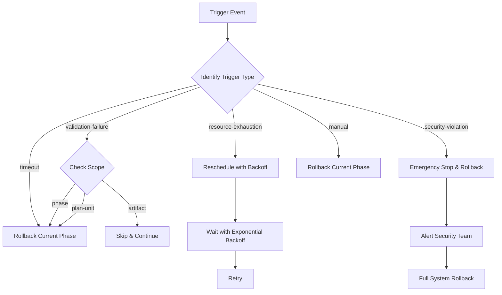
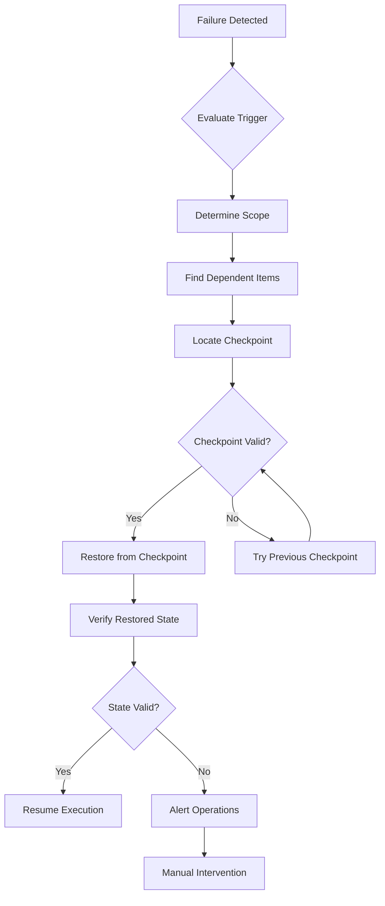

# HLP Executor Core - Recovery Mode

## 📋 Overview / 概述

This document describes the partial rollback and recovery logic for the HLP Executor Core Plugin, which enables granular recovery from failures at multiple levels of execution.

本文檔描述 HLP 執行器核心插件的部分回滾與恢復邏輯，實現多層次執行失敗的細粒度恢復。

---

## 🎯 Design Principles / 設計原則

1. **Granular Recovery** - Support rollback at different granularity levels
2. **Dependency Awareness** - Track and respect dependencies during rollback
3. **Last Known Good State** - Always maintain a valid recovery point
4. **Minimal Impact** - Roll back only what's necessary
5. **Safe Defaults** - Conservative recovery strategies by default

---

## 📊 Rollback Granularity / 回滾粒度

### Three Levels of Rollback

The system supports rollback at three granularity levels:

```
┌─────────────────────────────────────────────────────────────┐
│                      Entire Execution                        │  Scope: ENTIRE_EXECUTION
│  ┌───────────────────────────────────────────────────────┐  │
│  │                    Phase 1                             │  │  Scope: PHASE
│  │  ┌─────────────┐  ┌─────────────┐  ┌─────────────┐   │  │
│  │  │  Plan Unit  │  │  Plan Unit  │  │  Plan Unit  │   │  │  Scope: PLAN_UNIT
│  │  │  ┌────┐     │  │  ┌────┐     │  │  ┌────┐     │   │  │
│  │  │  │Art1│     │  │  │Art2│     │  │  │Art3│     │   │  │  Scope: ARTIFACT
│  │  │  └────┘     │  │  └────┘     │  │  └────┘     │   │  │
│  │  └─────────────┘  └─────────────┘  └─────────────┘   │  │
│  └───────────────────────────────────────────────────────┘  │
└─────────────────────────────────────────────────────────────┘
```

### 1. Phase-Level Rollback

**Definition**: Roll back an entire execution phase

**Use Cases**:

- Phase validation failure
- Critical error within phase
- Phase timeout exceeded

**Impact**: All work within the phase is rolled back

**Example**:

```python
result = rollback_manager.execute_rollback(
    scope="phase",
    target="deployment-phase",
    execution_id="exec-123"
)
```

### 2. Plan-Unit-Level Rollback

**Definition**: Roll back a specific plan unit within a phase

**Use Cases**:

- Single task failure
- Resource exhaustion for specific unit
- Unit-specific validation failure

**Impact**: Only the failing plan unit and its dependents are rolled back

**Example**:

```python
result = rollback_manager.execute_rollback(
    scope="plan-unit",
    target="database-migration",
    execution_id="exec-123"
)
```

### 3. Artifact-Level Rollback

**Definition**: Roll back a specific artifact or resource

**Use Cases**:

- Single file corruption
- Specific resource creation failure
- Artifact validation failure

**Impact**: Only the specific artifact is rolled back

**Example**:

```python
result = rollback_manager.execute_rollback(
    scope="artifact",
    target="config-file-123",
    execution_id="exec-123"
)
```

---

## 🔀 Trigger Conditions & Action Mapping / 觸發條件與動作映射

### Rollback Triggers

The system defines five primary rollback triggers:

```python
class RollbackTrigger(Enum):
    VALIDATION_FAILURE = "validation-failure"
    RESOURCE_EXHAUSTION = "resource-exhaustion"
    SECURITY_VIOLATION = "security-violation"
    TIMEOUT = "timeout"
    MANUAL = "manual"
```

### Action Mapping Table

| Trigger | Scope | Action | Rationale |
|---------|-------|--------|-----------|
| validation-failure | phase | rollback-current-phase | Validation failure indicates phase-level issue |
| validation-failure | plan-unit | rollback-current-phase | Roll back to last valid state |
| validation-failure | artifact | skip-and-continue | Single artifact failure shouldn't block entire phase |
| resource-exhaustion | phase | reschedule-with-backoff | Resource may become available later |
| resource-exhaustion | plan-unit | reschedule-with-backoff | Retry with exponential backoff |
| resource-exhaustion | artifact | reschedule-with-backoff | Temporary resource constraint |
| security-violation | any | emergency-stop-and-rollback | Security issues require immediate halt |
| timeout | phase | rollback-current-phase | Phase exceeded time budget |
| timeout | plan-unit | rollback-current-phase | Unit exceeded time budget |
| manual | any | rollback-current-phase | Operator-initiated rollback |

### Decision Flow



---

## 🎲 Last-Known-Good-State Strategy

### Checkpoint-Based Recovery

The system maintains checkpoints at phase boundaries:

```
Phase 1 ──→ Phase 2 ──→ Phase 3 ──→ Phase 4
  ↓            ↓            ↓            ↓
 CP1          CP2          CP3          CP4
 ✓            ✓            ✗            
              ↑
         Last Known
         Good State
```

### Recovery Process

1. **Identify Failure**: Detect failure in Phase 3
2. **Find Last Good**: Locate most recent valid checkpoint (CP2)
3. **Verify Integrity**: Confirm checkpoint data is valid
4. **Restore State**: Load state from CP2
5. **Resume or Retry**: Continue execution from CP2

### State Validation

Before declaring a state as "good":

```python
def validate_state(state: Dict[str, Any]) -> bool:
    """Validate that state is consistent and complete."""
    checks = [
        state.get("phase_id") is not None,
        state.get("execution_id") is not None,
        state.get("status") in ["completed", "validated"],
        all_dependencies_satisfied(state),
        checksum_valid(state)
    ]
    return all(checks)
```

---

## 🔗 Dependency Tracking / 依賴追蹤

### Dependency Graph

The rollback manager maintains both forward and backward dependency graphs:

```
Forward Dependencies (A → B means B depends on A):
    A ──→ B ──→ C
    │     │
    └──→  D ──→ E

Backward Dependencies (reverse of above):
    A ←── B ←── C
    │     │
    └───  D ←── E
```

### Forward Dependency Tracking

**Definition**: Track what depends on the current item

**Use Case**: Rolling back A requires rolling back all items that depend on A (B, C, D, E)

**Implementation**:

```python
self._execution_graph: Dict[str, Set[str]] = {}  # target -> dependents

# Example: B depends on A
self._execution_graph["A"] = {"B"}
self._execution_graph["B"] = {"C", "D"}
```

### Backward Dependency Tracking

**Definition**: Track what the current item depends on

**Use Case**: Validating dependencies before execution

**Implementation**:

```python
self._reverse_graph: Dict[str, Set[str]] = {}  # source -> dependencies

# Example: B depends on A
self._reverse_graph["B"] = {"A"}
self._reverse_graph["C"] = {"B"}
```

### Dependency Resolution During Rollback

When rolling back a target:

1. **Find Dependents**: Query forward dependency graph
2. **Sort Topologically**: Order by dependency levels
3. **Roll Back in Order**: Roll back from leaves to root

```python
def _find_dependent_items(self, target: str) -> Set[str]:
    """Find all items that depend on the target."""
    dependents = set()
    to_visit = [target]
    visited = set()
    
    while to_visit:
        current = to_visit.pop()
        if current in visited:
            continue
        visited.add(current)
        
        if current in self._execution_graph:
            for dependent in self._execution_graph[current]:
                dependents.add(dependent)
                to_visit.append(dependent)
    
    return dependents
```

---

## 🔄 Recovery Flow Diagram / 恢復流程圖

### Complete Recovery Flow



### Recovery Scenarios

#### Scenario 1: Validation Failure in Phase

```
Initial State:
Phase 1 [✓] → Phase 2 [✓] → Phase 3 [✗ validation failure]
                          ↓
                         CP2 (last good)

Recovery:
1. Detect validation failure in Phase 3
2. Evaluate trigger: validation-failure, scope: phase
3. Action: rollback-current-phase
4. Find checkpoint: CP2
5. Restore state from CP2
6. Resume: Retry Phase 3 or skip if max retries exceeded
```

#### Scenario 2: Resource Exhaustion

```
Initial State:
Task A [✓] → Task B [✗ out of memory]

Recovery:
1. Detect resource exhaustion in Task B
2. Evaluate trigger: resource-exhaustion, scope: plan-unit
3. Action: reschedule-with-backoff
4. Calculate delay: 2s → 4s → 8s → 16s
5. Retry Task B after delay
6. If still fails: escalate to phase-level rollback
```

#### Scenario 3: Security Violation

```
Initial State:
Phase 1 [✓] → Phase 2 [running] → Unauthorized access detected

Recovery:
1. Detect security violation
2. Evaluate trigger: security-violation, scope: entire-execution
3. Action: emergency-stop-and-rollback
4. Stop all phases immediately
5. Roll back to last known secure state
6. Alert security team
7. Require manual approval to resume
```

---

## ⚙️ Configuration / 配置

### Rollback Configuration

```yaml
rollback_configuration:
  hlp_executor:
    partial_phase_rollback:
      enabled: true
      scope_levels:
        - phase
        - plan-unit
        - artifact
      
      triggers:
        - condition: "validation-failure"
          scope: "phase"
          action: "rollback-current-phase"
        
        - condition: "resource-exhaustion"
          scope: "plan-unit"
          action: "reschedule-with-backoff"
        
        - condition: "security-violation"
          scope: "entire-execution"
          action: "emergency-stop-and-rollback"
    
    checkpoint_management:
      enabled: true
      retention_count: 5
      compression_enabled: true
      auto_cleanup: true
    
    dependency_tracking:
      enabled: true
      forward_dependencies: true
      backward_dependencies: true
```

---

## 📈 Recovery Metrics

### Key Metrics

| Metric | Description | Target |
|--------|-------------|--------|
| Recovery Time Objective (RTO) | Time to restore service | < 30s |
| Recovery Point Objective (RPO) | Maximum data loss | < 5 min |
| Rollback Success Rate | % of successful rollbacks | > 99% |
| False Positive Rate | Unnecessary rollbacks | < 1% |
| Mean Time to Recover (MTTR) | Average recovery time | < 2 min |

### Monitoring

```prometheus
# Recovery time histogram
hlp_executor_recovery_time_seconds_bucket{scope="phase"} 
hlp_executor_recovery_time_seconds_bucket{scope="plan-unit"}
hlp_executor_recovery_time_seconds_bucket{scope="artifact"}

# Rollback counts by trigger
hlp_executor_rollbacks_total{trigger="validation-failure"}
hlp_executor_rollbacks_total{trigger="resource-exhaustion"}
hlp_executor_rollbacks_total{trigger="security-violation"}

# Recovery success rate
rate(hlp_executor_recovery_success_total[5m]) 
  / rate(hlp_executor_recovery_attempts_total[5m])
```

---

## 🛡️ Safety Guarantees

### Atomicity

- Rollback operations are all-or-nothing
- Either complete rollback succeeds or system remains in current state
- No partial rollbacks that leave system in inconsistent state

### Consistency

- All dependencies are respected during rollback
- State validation ensures consistency before resuming
- Dependency graphs are maintained correctly

### Isolation

- Rollback of one execution doesn't affect others
- Checkpoint storage is per-execution
- Dependencies tracked separately per execution

### Durability

- Checkpoints persisted to durable storage
- Recovery procedures survive system restarts
- Rollback decisions logged for audit

---

## 📚 References

- [Partial Rollback Manager Implementation](../../core/safety_mechanisms/partial_rollback.py)
- [Checkpoint Strategy](./CHECKPOINT_STRATEGY.md)
- [Safety Mechanisms Configuration](../../config/safety-mechanisms.yaml)
- [Error Handling Runbook](../operations/runbooks/HLP_EXECUTOR_ERROR_HANDLING.md)

---

## 🔄 Version History

| Version | Date | Author | Changes |
|---------|------|--------|---------|
| 1.0.0 | 2025-12-07 | System | Initial version |

---

**Last Updated**: 2025-12-07  
**Status**: Active  
**Owner**: Platform Team
