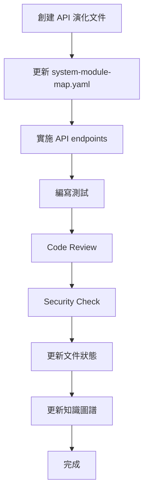

# API 演化文件 / API Evolution Documentation

## 📋 目錄概覽 / Directory Overview

本目錄包含 SynergyMesh 系統的 API 演化計畫與標準化文件。  
This directory contains API evolution plans and standardized documentation for the SynergyMesh system.

## 📄 文件列表 / Document List

### 標準模板 / Standard Template

- **[TEMPLATE.md](./TEMPLATE.md)** - API 演化標準模板
  - 每輪 API 演化的可複用模板
  - 包含完整的結構與檢查清單
  - 確保文件一致性與完整性

### 實施計畫 / Implementation Plans

- **[L1_core_and_automation_tasks.md](./L1_core_and_automation_tasks.md)** - L1 Core + Automation 增強計畫
  - 定義 18 個新 API endpoints
  - 覆蓋 6 個核心模組
  - 包含詳細的驗證與測試要求

## 🎯 使用指南 / Usage Guide

### 創建新的 API 演化文件

1. **複製模板**

   ```bash
   cp TEMPLATE.md Phase_X_api_evolution.md
   ```

2. **填寫必要資訊**
   - 更新版本資訊（階段、版本、日期、負責人）
   - 確認對齊檢查清單項目
   - 按模組填寫 API 定義

3. **同步更新 system-module-map.yaml**
   - 在對應模組添加 `api_endpoints` 區塊
   - 標記 `implemented: false`（開發前）
   - 添加 `integration_references` 連結

4. **完成後更新狀態**
   - 將 `implemented: false` 改為 `true`
   - 在變更歷史中記錄
   - 執行知識圖譜更新：`make all-kg`

## 🔗 與系統配置的整合 / Integration with System Configuration

### system-module-map.yaml 整合

每個定義在 API 演化文件中的 endpoint 都應該在 `config/system-module-map.yaml` 中註冊：

```yaml
modules:
  [module_name]:
    path: "[module_path]"
    description: "[description]"
    
    # API Evolution: [Phase Name]
    api_endpoints:
      - method: "POST"
        path: "/endpoint/path"
        description: "endpoint 功能描述"
        implemented: false  # 或 true
    
    preferred_languages:
      - "typescript"
      - "python"
    
    integration_references:
      - "docs/architecture/api-evolution/[document_name].md"
```

## 📊 當前狀態 / Current Status

### L1 Core + Automation Enhancement

| 模組 / Module | Endpoints | 狀態 / Status |
|--------------|-----------|--------------|
| automation.hyperautomation | 7 | ⏳ 規劃中 |
| core.unified_integration | 3 | ⏳ 規劃中 |
| core.mind_matrix | 3 | ⏳ 規劃中 |
| automation.autonomous | 2 | ⏳ 規劃中 |
| services.mcp | 1 | ⏳ 規劃中 |
| apps.web.ui | 1 | ⏳ 規劃中 |
| **總計 / Total** | **18** | - |

## ✅ 驗證清單 / Validation Checklist

在完成 API 演化實施後，必須確保：

- [ ] 所有 endpoint 都有對應的實作
- [ ] 所有實作都有單元測試（至少 3 個測試案例）
- [ ] 通過 `code_review` 工具審查
- [ ] 通過 `codeql_checker` 安全檢查
- [ ] 更新 `system-module-map.yaml` 將 `implemented` 設為 `true`
- [ ] 更新 API 參考文件
- [ ] 執行 `make all-kg` 更新知識圖譜

## 🏗️ 架構原則 / Architecture Principles

### 語言策略 / Language Strategy

- **Core 模組**: TypeScript (控制) + Python (認知) + C++ (必要時)
- **Automation 模組**: TypeScript / Python 為主
- **Services 模組**: 依服務類型選擇最適語言

### 依賴規則 / Dependency Rules

- `core.*` 不直接依賴 `apps.*`
- `automation.*` 透過 `core.unified_integration` 協作
- 所有跨服務呼叫通過統一的 orchestrator

### 架構骨架 / Architecture Skeletons

所有 API 演化必須遵守以下架構骨架規則：

- **architecture-stability**: 架構穩定性規則
- **api-governance**: API 治理規則
- **security-observability**: 安全與可觀測性規則

## 📚 相關文件 / Related Documents

- [System Module Map](../../../config/system-module-map.yaml) - 系統模組映射配置
- [System Manifest](../../../config/system-manifest.yaml) - 系統宣告清單
- [Language Governance](../language-governance.md) - 語言治理策略
- [Language Stack](../language-stack.md) - 技術堆疊定義
- [Architecture Layers](../layers.md) - 架構分層視圖

## 🔄 更新流程 / Update Process



## 📞 支援 / Support

如有任何問題或需要協助，請聯繫：

- **Platform Team**: [@core-owners](https://github.com/orgs/SynergyMesh-admin/teams/core-owners)
- **Automation Team**: [@automation-team](https://github.com/orgs/SynergyMesh-admin/teams/automation-team)

---

**維護團隊 / Maintenance Team**: SynergyMesh Platform Team  
**文件版本 / Document Version**: 1.0.0  
**最後更新 / Last Updated**: 2025-12-07
