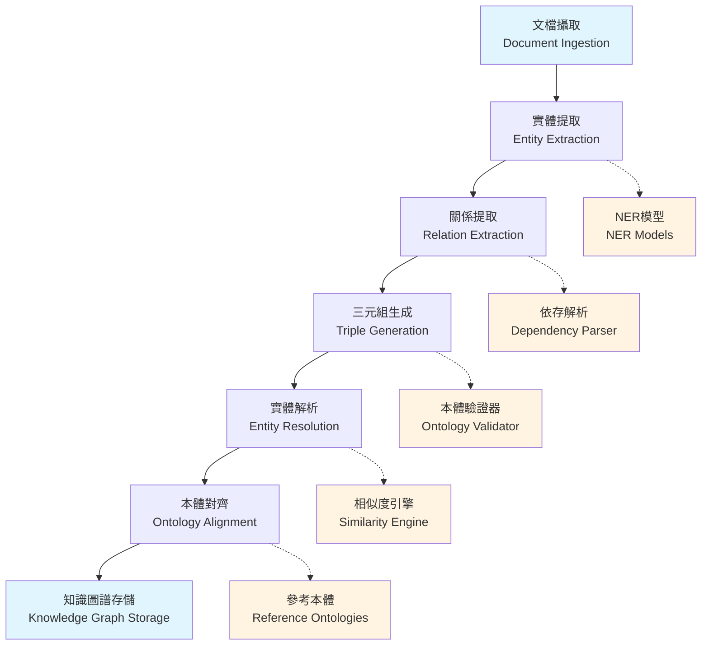

# Knowledge Graph Processing Pipeline
# 知識圖譜處理流水線

**創建日期 (Created Date)**: 2025-12-07  
**作者 (Author)**: Unmanned Island Knowledge Processing Team  
**狀態 (Status)**: Approved  
**來源 (Source)**: Extracted from kg-builder legacy specification

---

## 1. 概述 (Overview)

本文檔定義了 Unmanned Island System 的知識圖譜處理流水線架構。該流水線負責從非結構化文檔中提取結構化知識，構建語義化的知識圖譜，並提供本體對齊與實體解析能力。

This document defines the knowledge graph processing pipeline architecture for the Unmanned Island System. The pipeline extracts structured knowledge from unstructured documents, constructs semantic knowledge graphs, and provides ontology alignment and entity resolution capabilities.

### 關鍵能力 (Key Capabilities)

- **多格式文檔攝取 (Multi-format Document Ingestion)**: 支持 PDF, DOCX, TXT, HTML, Markdown, JSON
- **實體提取 (Entity Extraction)**: 命名實體識別與分類
- **關係提取 (Relation Extraction)**: 實體間關係識別與分類
- **三元組生成 (Triple Generation)**: 結構化知識表示 (Subject-Predicate-Object)
- **實體解析 (Entity Resolution)**: 實體去重與合併
- **本體對齊 (Ontology Alignment)**: 與標準本體的對齊映射

---

## 2. 架構設計 (Architecture Design)

### 2.1 處理流水線概覽 (Processing Pipeline Overview)



### 2.2 階段詳細設計 (Stage Detailed Design)

#### Stage 1: 文檔攝取 (Document Ingestion)

**功能 (Function)**: 解析多種格式的文檔，提取純文本內容與元數據。

**支持格式 (Supported Formats)**:
- PDF (使用 PyPDF2 / pdfplumber)
- DOCX (使用 python-docx)
- HTML (使用 BeautifulSoup)
- Markdown (使用 markdown-it-py)
- JSON / JSONL (結構化數據)
- 純文本 (TXT)

**處理器配置 (Processor Configuration)**:
```yaml
document_ingestion:
  processor: "multi-format-parser"
  supported_formats: ["pdf", "docx", "txt", "html", "markdown", "json"]
  output_format: "structured_document"
  metadata_extraction:
    - "title"
    - "author"
    - "creation_date"
    - "language"
```

**輸出 (Output)**:
```json
{
  "document_id": "doc-12345",
  "content": "Document plain text content...",
  "metadata": {
    "title": "Example Document",
    "format": "pdf",
    "language": "zh-TW"
  },
  "sections": [...]
}
```

#### Stage 2: 實體提取 (Entity Extraction)

**功能 (Function)**: 識別文本中的命名實體（人名、地名、組織、產品等）。

**處理器配置 (Processor Configuration)**:
```yaml
entity_extraction:
  processor: "named-entity-recognizer"
  models:
    # 模型名稱應從 config/ai-models/vector-alignment-config.yaml 讀取
    - name: "{general-ner-model}"     # 通用 NER 模型（配置引用）
      confidence_threshold: 0.8
    - name: "{domain-ner-model}"      # 領域特定模型（配置引用）
      confidence_threshold: 0.85
    # 注意：避免硬編碼模型名稱，使用配置文件管理
  entity_types:
    - "PERSON"
    - "ORGANIZATION"
    - "LOCATION"
    - "PRODUCT"
    - "DATE"
    - "MONEY"
```

**範例 (Example)**:
```
輸入: "馬斯克在2024年訪問了台灣的台北市。"
輸出:
  - Entity: "馬斯克" (PERSON, confidence: 0.95)
  - Entity: "2024年" (DATE, confidence: 0.98)
  - Entity: "台灣" (LOCATION, confidence: 0.92)
  - Entity: "台北市" (LOCATION, confidence: 0.93)
```

#### Stage 3: 關係提取 (Relation Extraction)

**功能 (Function)**: 識別實體間的語義關係。

**處理器配置 (Processor Configuration)**:
```yaml
relation_extraction:
  processor: "dependency-parser-enhanced"
  patterns_path: "knowledge/semantic-patterns/relation-patterns.json"
  post_processing: "relation-classifier"
  confidence_threshold: 0.7
```

**關係模式範例 (Relation Pattern Examples)**:
```yaml
patterns:
  - pattern: "(PERSON) (VERB:訪問) (LOCATION)"
    relation_type: "visited"
    confidence: 0.85
  
  - pattern: "(ORGANIZATION) (VERB:位於) (LOCATION)"
    relation_type: "headquartered_at"
    confidence: 0.90
  
  - pattern: "(PERSON) (VERB:創立) (ORGANIZATION)"
    relation_type: "founded_by"
    confidence: 0.88
```

#### Stage 4: 三元組生成 (Triple Generation)

**功能 (Function)**: 將提取的實體與關係轉換為 RDF 三元組格式。

**處理器配置 (Processor Configuration)**:
```yaml
triple_generation:
  processor: "subject-predicate-object-extractor"
  validation: "ontology-consistency-checker"
  output_format: "ndjson"
```

**範例 (Example)**:
```json
{
  "subject": "ent:馬斯克",
  "subject_type": "PERSON",
  "predicate": "rel:visited",
  "object": "ent:台北市",
  "object_type": "LOCATION",
  "confidence": 0.87,
  "provenance": {
    "document_id": "doc-12345",
    "sentence_offset": 42
  }
}
```

#### Stage 5: 實體解析 (Entity Resolution)

**功能 (Function)**: 去重與合併指向同一實體的不同提及。

**處理器配置 (Processor Configuration)**:
```yaml
entity_resolution:
  processor: "fuzzy-matching-engine"
  similarity_algorithm: "weighted-jaccard-levenshtein"
  merge_threshold: 0.85
  metrics:
    - metric: "jaccard_similarity"
      weight: 0.4
    - metric: "levenshtein_distance"
      weight: 0.3
    - metric: "semantic_embedding_cosine"
      weight: 0.3
```

**解析策略 (Resolution Strategy)**:
1. **字符串相似度**: Jaccard, Levenshtein
2. **語義相似度**: 嵌入向量 Cosine 距離
3. **上下文相似度**: 實體周圍詞彙比對
4. **聚類**: 使用層次聚類 (Hierarchical Agglomerative Clustering)

**範例 (Example)**:
```
原始實體:
  - "馬斯克" (PERSON)
  - "Elon Musk" (PERSON)
  - "伊隆·馬斯克" (PERSON)

解析後:
  - Canonical Entity: "伊隆·馬斯克 (Elon Musk)"
  - Aliases: ["馬斯克", "Elon Musk"]
  - Confidence: 0.92
```

#### Stage 6: 本體對齊 (Ontology Alignment)

**功能 (Function)**: 將提取的實體與關係對齊到標準本體。

**處理器配置 (Processor Configuration)**:
```yaml
ontology_alignment:
  processor: "schema-mapper"
  reference_ontologies:
    - "schema.org"
    - "dbpedia"
    - "wikidata"
  alignment_confidence: 0.75
  output_format: "owl"
```

**對齊範例 (Alignment Example)**:
```turtle
# 本地實體
:馬斯克 a :Person ;
    :name "伊隆·馬斯克" .

# 對齊到 schema.org
:馬斯克 owl:sameAs schema:Person ;
    schema:name "Elon Musk" .

# 對齊到 Wikidata
:馬斯克 owl:sameAs wd:Q317521 .
```

---

## 3. 關鍵決策 (Key Decisions)

### 3.1 混合式提取策略 (Hybrid Extraction Strategy)

**決策**: 結合規則式 (Rule-based) 與機器學習 (ML-based) 方法。

**理由**:
- 規則式方法處理高精度場景（如日期、貨幣格式）
- ML 方法處理複雜語義場景（如隱含關係）
- 混合策略提供更高的召回率與精確率

### 3.2 增量處理模式 (Incremental Processing Mode)

**決策**: 支持批處理與流處理兩種模式。

**理由**:
- 批處理模式用於歷史數據回填
- 流處理模式用於實時知識更新
- 配置化切換，無需修改代碼

**配置範例**:
```yaml
processing_mode: "batch"  # 或 "streaming" 或 "hybrid"

batch_processing:
  chunk_size: 1000
  parallel_workers: 8
  memory_limit_per_worker: "4Gi"

streaming_processing:
  kafka_topic: "documents-stream"
  consumer_group: "kg-builder"
  batch_timeout_ms: 5000
  max_batch_size: 100
```

### 3.3 質量控制機制 (Quality Control Mechanism)

**決策**: 所有輸出三元組需通過置信度與本體一致性檢查。

**理由**:
- 防止低質量數據污染知識圖譜
- 提供可解釋的質量指標
- 支持人工審核工作流

**質量控制配置**:
```yaml
quality_control:
  triple_validation:
    subject_entity_required: true
    predicate_vocabulary_check: true
    object_type_consistency: true
    min_confidence_score: 0.6
  
  confidence_scoring:
    extraction_confidence: "model-based"
    resolution_confidence: "similarity-based"
    overall_score_method: "weighted-average"
  
  human_review:
    enabled: true
    confidence_threshold: 0.75
    review_queue: "kg-review-queue"
```

---

## 4. 權衡與限制 (Trade-offs & Constraints)

### 4.1 權衡

| 權衡項 | 選擇 | 代價 |
|--------|------|------|
| **精確率 vs 召回率** | 平衡（F1-Score 優化） | 需調整置信度閾值 |
| **處理速度 vs 質量** | 優先質量 | 較長的處理時間 |
| **自動化 vs 人工審核** | 高置信度自動化 | 低置信度需人工介入 |

### 4.2 限制

- **語言支持**: 當前主要支持中文與英文，其他語言需額外 NER 模型
- **領域泛化**: 領域特定實體需自定義 NER 模型
- **關係複雜度**: 複雜的多跳關係（A→B→C→D）需多輪處理
- **實時性**: 批處理模式無法滿足毫秒級實時需求

---

## 5. 替代方案 (Alternatives Considered)

### 5.1 端到端深度學習 vs 流水線架構

**考慮但未採用**: 端到端神經網絡模型（如 BERT + Graph Neural Network）

**原因**:
- 可解釋性差，難以調試
- 模型訓練成本高
- 難以適應新領域

**當前方案**: 模組化流水線，每個階段可獨立優化

### 5.2 完全自動化 vs 人機協同

**考慮但未採用**: 100% 自動化處理

**原因**:
- 低置信度結果質量不可控
- 無法處理特殊場景
- 缺乏知識積累機制

**當前方案**: 高置信度自動化 + 低置信度人工審核

---

## 6. 安全考量 (Security Considerations)

### 6.1 數據隱私 (Data Privacy)

- **PII 檢測**: 自動檢測並標記個人識別信息（姓名、身份證、電話等）
- **敏感數據處理**: 敏感數據經過 K-匿名化處理後存儲
- **GDPR 合規**: 支持數據刪除、導出請求

**配置範例**:
```yaml
data_privacy:
  pii_detection: true
  pii_types: ["name", "email", "phone", "id_card"]
  anonymization_method: "k-anonymity"
  k_value: 5
  gdpr_compliance:
    data_minimization: true
    purpose_limitation: true
    consent_management: "external-service"
```

### 6.2 數據來源驗證 (Data Source Verification)

- 所有文檔需提供來源溯源信息
- 使用數字簽名驗證文檔完整性
- 記錄文檔處理鏈路（Document Processing Lineage）

---

## 7. 性能考量 (Performance Considerations)

### 7.1 性能目標 (Performance Targets)

| 指標 | 目標 | 測量方法 |
|------|------|---------|
| **三元組提取速率** | >= 1000 triples/min | 批處理吞吐量 |
| **實體解析準確率** | > 0.85 | F1-Score |
| **本體一致性分數** | > 0.90 | OWL Reasoner 驗證 |
| **處理延遲 (P95)** | < 30s per document batch | 端到端延遲 |

### 7.2 優化策略 (Optimization Strategies)

1. **模型量化**: 使用 ONNX Runtime 加速推理
2. **批量處理**: 將多個文檔合併為單個批次處理
3. **緩存機制**: 緩存實體嵌入向量與本體映射結果
4. **並行化**: 無依賴的文檔並行處理
5. **索引優化**: 使用 Elasticsearch 加速實體檢索

---

## 8. 運維考量 (Operational Considerations)

### 8.1 監控指標 (Monitoring Metrics)

```yaml
metrics:
  - name: "kg_triples_extracted_total"
    type: "counter"
    help: "Total number of triples extracted"
    labels: ["source_type", "confidence_level"]
  
  - name: "kg_entity_resolution_accuracy"
    type: "gauge"
    help: "Entity resolution accuracy score"
  
  - name: "kg_processing_duration_seconds"
    type: "histogram"
    help: "Document processing duration"
    buckets: [1, 5, 10, 30, 60, 300]
```

### 8.2 錯誤處理 (Error Handling)

- **格式錯誤**: 跳過並記錄，通知管理員
- **模型推理失敗**: 回退到規則式方法
- **本體不一致**: 標記為待審核，不阻止流程

---

## 9. 未來工作 (Future Work)

### 9.1 短期計畫 (3-6 個月)

- [ ] 支持多模態知識提取（圖像、視頻）
- [ ] 增加時序知識處理（事件時間線）
- [ ] 實現增量式本體學習

### 9.2 中期計畫 (6-12 個月)

- [ ] 聯邦學習支持（跨組織知識圖譜構建）
- [ ] 自動化關係模式發現
- [ ] 知識圖譜問答系統

### 9.3 長期願景 (12+ 個月)

- [ ] 因果推理引擎集成
- [ ] 知識圖譜自動演化
- [ ] 多語言統一知識表示

---

## 10. 參考資料 (References)

### 內部文檔
- `config/processing/pipeline-config.yaml` - 處理管線配置
- `knowledge/processing-workflows/kg-construction-workflow.yaml` - 工作流定義
- `knowledge/semantic-patterns/relation-patterns.json` - 關係模式庫
- `governance/policies/plugin-quality-gates.yaml` - 質量門檻

### 外部標準
- [RDF 1.1 Specification](https://www.w3.org/TR/rdf11-primer/)
- [OWL 2 Web Ontology Language](https://www.w3.org/TR/owl2-overview/)
- [Schema.org](https://schema.org/)
- [DBpedia Ontology](https://www.dbpedia.org/resources/ontology/)

### 學術論文
- Dong, X. et al. (2014). "Knowledge Vault: A Web-Scale Approach to Probabilistic Knowledge Fusion"
- Suchanek, F. et al. (2007). "YAGO: A Core of Semantic Knowledge"

### 相關架構文檔
- `docs/ARCHITECTURE/plugin-architecture-pattern.md` - 插件架構
- `docs/ARCHITECTURE/storage-architecture.md` - 存儲架構
- `docs/ARCHITECTURE/batch-stream-processing.md` - 批流處理

---

**文檔版本 (Document Version)**: 1.0.0  
**最後更新 (Last Updated)**: 2025-12-07  
**維護者 (Maintainer)**: @knowledge-processing-team
