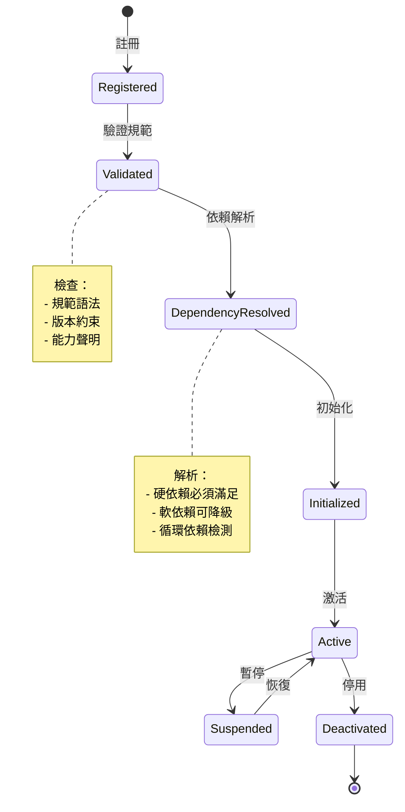

# Plugin Architecture Pattern
# 插件架構模式

**創建日期 (Created Date)**: 2025-12-07  
**作者 (Author)**: Unmanned Island Architecture Team  
**狀態 (Status)**: Approved  
**來源 (Source)**: Extracted from kg-builder legacy specification

---

## 1. 概述 (Overview)

本文檔定義了 Unmanned Island System 的通用插件架構模式。插件架構是系統擴展性的基礎，允許動態註冊、依賴管理和能力擴展，同時保持系統核心的穩定性和安全性。

This document defines the generic plugin architecture pattern for the Unmanned Island System. The plugin architecture is the foundation of system extensibility, enabling dynamic registration, dependency management, and capability extension while maintaining core system stability and security.

### 關鍵特性 (Key Features)

- **動態註冊 (Dynamic Registration)**: 運行時插件發現與註冊
- **依賴管理 (Dependency Management)**: 嚴格的語義化版本控制與依賴解析
- **能力聲明 (Capability Declaration)**: 顯式聲明提供與需求的能力
- **治理整合 (Governance Integration)**: 內建質量門檻與安全檢查
- **向量對齊 (Vector Alignment)**: 語義向量嵌入策略支援

---

## 2. 架構設計 (Architecture Design)

### 2.1 插件規範結構 (Plugin Specification Structure)

```yaml
plugin_specification:
  id: "plugin-identifier"                    # 唯一識別符
  name: "Plugin Display Name"                # 顯示名稱
  version: "1.0.0"                           # 語義化版本
  kind: ["category1", "category2"]           # 插件類別
  priority: 80                               # 優先級 (0-100)
  author: "Team Name"                        # 作者
  license: "License Type"                    # 授權類型
  
  provides:                                  # 提供的能力
    - "capability-1"
    - "capability-2"
  
  requires:                                  # 依賴的能力
    - "required-capability-1"
    - "required-capability-2"
  
  dependencies:                              # 依賴插件
    hard_dependencies:                       # 硬依賴（必須）
      - plugin_id: "core-plugin"
        version_constraint: ">= 1.0.0"
    
    soft_dependencies:                       # 軟依賴（可選）
      - plugin_id: "optional-plugin"
        version_constraint: ">= 0.9.0"
        graceful_degradation: true
```

### 2.2 插件生命週期 (Plugin Lifecycle)



### 2.3 依賴解析策略 (Dependency Resolution Strategy)

#### 硬依賴 (Hard Dependencies)

硬依賴必須在插件激活前完全滿足，否則插件註冊失敗。

- **版本約束語法**: 使用標準語義化版本範圍表達式
  - `>= 1.0.0`: 大於等於 1.0.0
  - `^1.2.3`: 兼容 1.x.x 版本
  - `~1.2.3`: 兼容 1.2.x 版本
  - `>= 1.0.0, < 2.0.0`: 範圍約束

- **解析順序**: 使用拓撲排序 (Topological Sort) 確定插件加載順序

#### 軟依賴 (Soft Dependencies)

軟依賴提供優雅降級機制，允許插件在可選依賴缺失時仍能運行。

- **降級策略 (Graceful Degradation)**:
  - 禁用依賴該能力的功能
  - 回退到基礎實現
  - 記錄警告但不阻止啟動

### 2.4 向量對齊策略 (Vector Alignment Strategy)

向量對齊用於語義理解任務，每個插件可聲明其使用的嵌入模型與相似度閾值。

```yaml
vector_alignment_map:
  semantic_vectors:
    - intent: "entity-extraction"           # 意圖類型
      embedding_model: "system-embed-v2"    # 嵌入模型引用
      dimension: 1024                       # 向量維度
      similarity_threshold: 0.75            # 相似度閾值
    
    - intent: "relation-classification"
      embedding_model: "relation-embed"
      dimension: 768
      similarity_threshold: 0.70
```

**配置化原則**:
- 嵌入模型名稱引用 `config/ai-models/` 中定義的模型
- 維度與閾值可根據任務類型調整
- 系統提供默認嵌入模型，插件可覆蓋

---

## 3. 關鍵決策 (Key Decisions)

### 3.1 插件隔離 (Plugin Isolation)

**決策**: 每個插件運行在獨立的命名空間，使用明確的 API 邊界。

**理由**:
- 防止插件間的非預期交互
- 限制插件故障影響範圍
- 簡化安全審計與權限管理

### 3.2 依賴版本策略 (Dependency Version Strategy)

**決策**: 強制使用語義化版本 (Semantic Versioning) 並嚴格檢查。

**理由**:
- 避免 "依賴地獄" (Dependency Hell)
- 明確向後兼容性保證
- 支持自動化依賴更新

### 3.3 能力註冊表 (Capability Registry)

**決策**: 使用中央能力註冊表管理所有系統能力。

**理由**:
- 防止能力命名衝突
- 提供能力發現機制
- 支持能力版本演進

**實現**:
- 能力註冊表位於 `core/unified_integration/service_registry.py`
- 映射定義在 `config/system-module-map.yaml` 的 `capability_matrix` 區塊

---

## 4. 權衡與限制 (Trade-offs & Constraints)

### 4.1 權衡

| 權衡項 | 選擇 | 代價 |
|--------|------|------|
| **性能 vs 隔離性** | 優先隔離性 | 插件間通信開銷 |
| **靈活性 vs 穩定性** | 優先穩定性 | 需嚴格版本管理 |
| **易用性 vs 安全性** | 優先安全性 | 插件開發門檻較高 |

### 4.2 限制

- **循環依賴**: 系統禁止循環依賴，檢測到時註冊失敗
- **版本衝突**: 多個插件依賴同一插件的不兼容版本時，優先滿足 `priority` 較高者
- **資源配額**: 每個插件受資源配額限制（CPU、內存、存儲）

---

## 5. 替代方案 (Alternatives Considered)

### 5.1 微內核架構 vs 插件架構

**考慮但未採用**: 純微內核架構（所有功能作為外部模組）

**原因**:
- 通信開銷過大
- 系統啟動時間延長
- 調試複雜度增加

**當前方案**: 混合架構 - 核心功能內建，擴展功能插件化

### 5.2 靜態連結 vs 動態加載

**考慮但未採用**: 靜態連結所有插件

**原因**:
- 失去動態擴展能力
- 增加核心系統體積
- 無法在運行時更新插件

---

## 6. 安全考量 (Security Considerations)

### 6.1 插件驗證 (Plugin Validation)

所有插件必須通過以下驗證：

1. **規範驗證**: 符合 `governance/schemas/plugin-specification.schema.json`
2. **簽名驗證**: 使用 Sigstore 驗證插件來源
3. **權限審查**: 檢查插件聲明的權限範圍
4. **依賴掃描**: 掃描依賴中的已知漏洞

### 6.2 運行時隔離 (Runtime Isolation)

- **進程隔離**: 高風險插件運行在獨立進程
- **資源限制**: 使用 cgroups 限制資源使用
- **網絡隔離**: 預設禁止外部網絡訪問，需顯式聲明

### 6.3 審計日誌 (Audit Logging)

所有插件操作記錄在審計日誌：
- 插件註冊/停用事件
- 能力調用記錄
- 異常與錯誤事件

---

## 7. 性能考量 (Performance Considerations)

### 7.1 加載時間優化

- **延遲加載 (Lazy Loading)**: 插件在首次使用時才加載
- **並行初始化**: 無依賴關係的插件並行初始化
- **緩存機制**: 插件元數據緩存在 Redis

### 7.2 通信開銷

- **本地調用優化**: 同進程插件使用直接函數調用
- **批量操作**: 支持批量能力調用以減少 RPC 開銷
- **異步模式**: 預設使用異步通信模式

---

## 8. 運維考量 (Operational Considerations)

### 8.1 插件管理工具

系統提供 CLI 工具管理插件：

```bash
# 註冊插件
plugin-registry register <spec-file>

# 列出所有插件
plugin-registry list

# 查看插件詳情
plugin-registry show <plugin-id>

# 更新插件
plugin-registry update <plugin-id> <spec-file>

# 停用插件
plugin-registry disable <plugin-id>
```

### 8.2 監控與告警

- **健康檢查**: 每個插件提供 `/health` 端點
- **性能指標**: 自動收集插件級別的 Prometheus 指標
- **告警規則**: 插件故障/性能降級自動告警

### 8.3 版本升級策略

- **灰度發布**: 支持插件版本的灰度升級
- **回滾機制**: 自動檢測升級失敗並回滾
- **兼容性測試**: 升級前自動運行兼容性測試套件

---

## 9. 未來工作 (Future Work)

### 9.1 短期計畫 (3-6 個月)

- [ ] 實現插件市場 (Plugin Marketplace)
- [ ] 增加插件沙箱執行環境
- [ ] 支持 WebAssembly 插件

### 9.2 中期計畫 (6-12 個月)

- [ ] 自動化依賴更新系統
- [ ] 插件性能分析工具
- [ ] 跨系統插件共享機制

### 9.3 長期願景 (12+ 個月)

- [ ] AI 驅動的插件推薦系統
- [ ] 插件行為學習與優化
- [ ] 去中心化插件註冊表

---

## 10. 參考資料 (References)

### 內部文檔
- `config/templates/plugin-specification-template.yaml` - 插件規範模板
- `governance/schemas/plugin-specification.schema.json` - JSON Schema 定義
- `governance/policies/plugin-quality-gates.yaml` - 插件質量門檻
- `config/system-module-map.yaml` - 系統模組映射

### 外部標準
- [Semantic Versioning 2.0.0](https://semver.org/)
- [JSON Schema Draft 7](https://json-schema.org/draft-07/schema)
- [OpenAPI 3.0 Specification](https://swagger.io/specification/)

### 相關架構文檔
- `docs/ARCHITECTURE/knowledge-graph-processing.md` - 知識圖譜處理
- `docs/ARCHITECTURE/storage-architecture.md` - 存儲架構
- `docs/ARCHITECTURE/vector-alignment-strategy.md` - 向量對齊策略

---

**文檔版本 (Document Version)**: 1.0.0  
**最後更新 (Last Updated)**: 2025-12-07  
**維護者 (Maintainer)**: @core-platform-team
