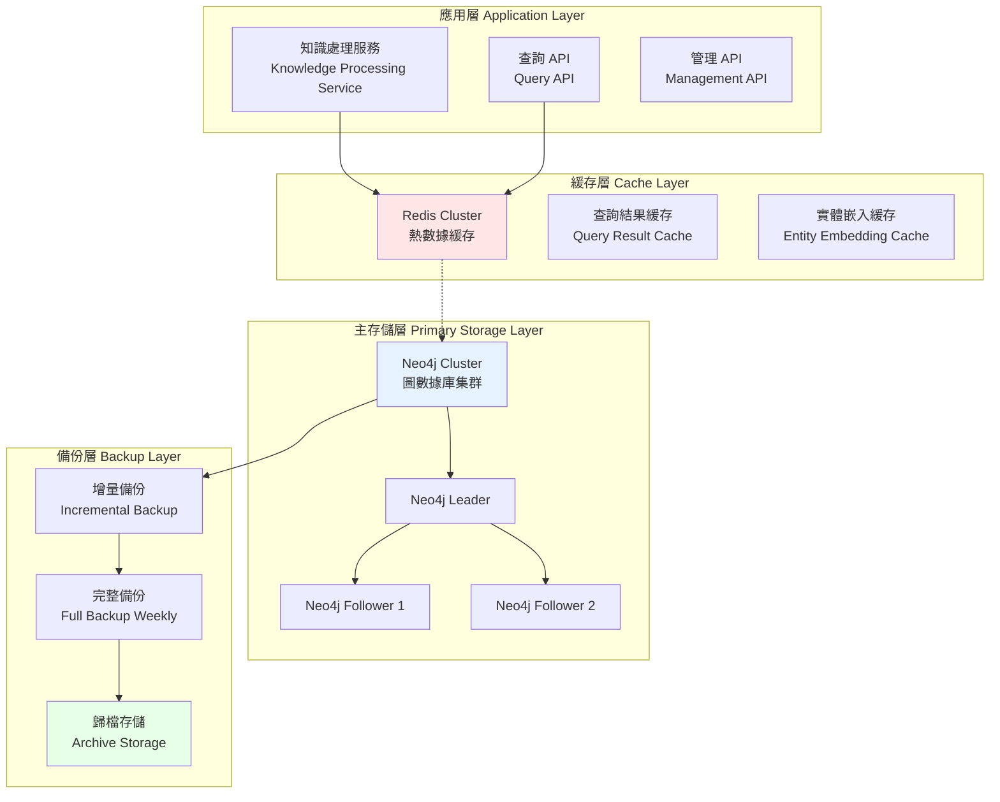
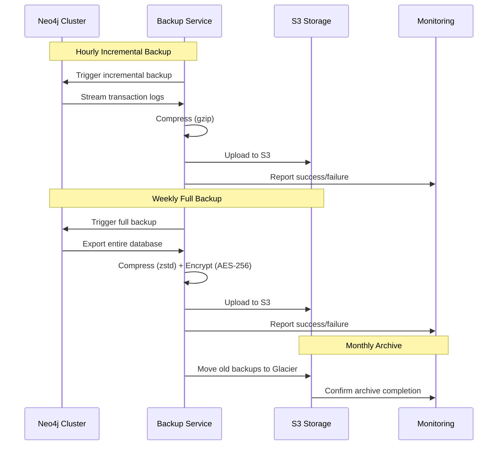

# Storage Architecture for Knowledge Processing
# 知識處理存儲架構

**創建日期 (Created Date)**: 2025-12-07  
**作者 (Author)**: Unmanned Island Infrastructure Team  
**狀態 (Status)**: Approved  
**來源 (Source)**: Extracted from kg-builder legacy specification

---

## 1. 概述 (Overview)

本文檔定義了 Unmanned Island System 知識處理模組的三層存儲架構。該架構設計兼顧性能、可靠性與可擴展性，支持大規模知識圖譜的存儲、查詢與備份。

This document defines the three-tier storage architecture for the Unmanned Island System's knowledge processing module. The architecture balances performance, reliability, and scalability, supporting large-scale knowledge graph storage, querying, and backup.

### 設計目標 (Design Goals)

- **高性能查詢 (High-Performance Queries)**: 毫秒級圖遍歷查詢
- **高可用性 (High Availability)**: 99.9% 可用性保證
- **數據持久化 (Data Persistence)**: 零數據丟失
- **水平擴展 (Horizontal Scalability)**: 支持節點動態擴展
- **多租戶隔離 (Multi-tenancy Isolation)**: 資源與數據隔離

---

## 2. 架構設計 (Architecture Design)

### 2.1 三層架構概覽 (Three-Tier Architecture Overview)



### 2.2 主存儲層 - Neo4j 圖數據庫 (Primary Storage - Neo4j Graph Database)

#### 2.2.1 集群配置 (Cluster Configuration)

```yaml
primary_store:
  type: "neo4j"
  version_constraint: ">= 5.0, < 6.0"
  deployment_mode: "cluster"
  
  cluster_config:
    mode: "core-read-replica"
    replication_factor: 3  # Configurable via config/kubernetes/resource-quota-template.yaml
    minimum_core_servers: 3
    read_replicas: 2
    
  nodes:
    - role: "leader"
      cpu: "8 cores"
      memory: "32Gi"
      storage: "500Gi SSD"
    
    - role: "follower"
      cpu: "6 cores"
      memory: "24Gi"
      storage: "500Gi SSD"
      count: 2
    
    - role: "read-replica"
      cpu: "4 cores"
      memory: "16Gi"
      storage: "250Gi SSD"
      count: 2
```

#### 2.2.2 數據模型 (Data Model)

Neo4j 存儲知識圖譜的核心結構：

**節點類型 (Node Types)**:
```cypher
// 實體節點
CREATE (:Entity {
  id: "ent-12345",
  label: "伊隆·馬斯克",
  type: "PERSON",
  aliases: ["馬斯克", "Elon Musk"],
  confidence: 0.92,
  created_at: datetime(),
  updated_at: datetime()
})

// 本體類別節點
CREATE (:Class {
  id: "class-person",
  label: "Person",
  namespace: "schema.org",
  parent_class: "Thing"
})
```

**關係類型 (Relationship Types)**:
```cypher
// 實體間關係
MATCH (s:Entity {id: "ent-12345"}), (o:Entity {id: "ent-67890"})
CREATE (s)-[:VISITED {
  confidence: 0.87,
  provenance: "doc-12345",
  timestamp: datetime()
}]->(o)

// 本體關係
MATCH (e:Entity), (c:Class)
CREATE (e)-[:INSTANCE_OF]->(c)
```

#### 2.2.3 索引策略 (Indexing Strategy)

```cypher
-- 實體 ID 唯一索引
CREATE CONSTRAINT entity_id_unique
FOR (e:Entity) REQUIRE e.id IS UNIQUE

-- 實體標籤全文索引
CREATE FULLTEXT INDEX entity_label_fulltext
FOR (e:Entity) ON EACH [e.label, e.aliases]

-- 關係類型索引
CREATE INDEX relationship_type_index
FOR ()-[r:VISITED]-() ON (r.confidence)

-- 時間戳複合索引
CREATE INDEX entity_timestamp_index
FOR (e:Entity) ON (e.created_at, e.updated_at)
```

#### 2.2.4 分片策略 (Sharding Strategy)

當數據量超過單機容量時，使用 Neo4j Fabric 進行邏輯分片：

```yaml
sharding:
  method: "fabric"
  shard_key: "entity_type"
  shards:
    - name: "shard-person-org"
      entity_types: ["PERSON", "ORGANIZATION"]
      nodes: ["neo4j-1", "neo4j-2", "neo4j-3"]
    
    - name: "shard-location-product"
      entity_types: ["LOCATION", "PRODUCT"]
      nodes: ["neo4j-4", "neo4j-5", "neo4j-6"]
```

### 2.3 緩存層 - Redis Cluster (Cache Layer - Redis Cluster)

#### 2.3.1 緩存配置 (Cache Configuration)

```yaml
cache_layer:
  type: "redis-cluster"
  version: ">= 7.0"
  
  cluster_config:
    master_nodes: 3
    replica_nodes: 3
    slots: 16384
    
  nodes:
    - role: "master"
      cpu: "4 cores"
      memory: "16Gi"
      count: 3
    
    - role: "replica"
      cpu: "2 cores"
      memory: "16Gi"
      count: 3
  
  memory_policy:
    max_memory: "12Gi"
    eviction_policy: "allkeys-lru"
    
  ttl_config:
    default_ttl: 3600  # 1 hour
    query_result_ttl: 1800  # 30 minutes
    embedding_vector_ttl: 7200  # 2 hours
```

#### 2.3.2 緩存策略 (Caching Strategy)

**熱點數據緩存 (Hot Data Caching)**:
```python
# 緩存實體基本信息
cache_key = f"entity:{entity_id}"
cache_value = {
    "id": entity_id,
    "label": label,
    "type": entity_type,
    "aliases": aliases
}
redis.setex(cache_key, ttl=3600, value=json.dumps(cache_value))

# 緩存查詢結果
query_hash = hashlib.sha256(cypher_query.encode()).hexdigest()
cache_key = f"query:{query_hash}"
redis.setex(cache_key, ttl=1800, value=json.dumps(query_result))
```

**嵌入向量緩存 (Embedding Vector Caching)**:
```python
# 緩存實體嵌入向量
embedding_key = f"embedding:{entity_id}"
redis.setex(embedding_key, ttl=7200, value=vector.tobytes())
```

**緩存失效策略 (Cache Invalidation)**:
- **寫穿 (Write-Through)**: 更新 Neo4j 時同步更新 Redis
- **TTL 過期**: 自動過期策略
- **主動失效**: 實體更新時主動刪除相關緩存

### 2.4 備份層 (Backup Layer)

#### 2.4.1 備份策略 (Backup Strategy)

```yaml
backup_strategy:
  incremental_backup:
    frequency: "hourly"
    retention: "7 days"
    storage_backend: "s3-compatible"
    compression: "gzip"
    
  full_backup:
    frequency: "weekly"
    day_of_week: "sunday"
    time: "02:00 UTC"
    retention: "90 days"
    storage_backend: "s3-compatible"
    compression: "zstd"
    encryption: "aes-256-gcm"
  
  archive:
    frequency: "monthly"
    retention: "3 years"
    storage_class: "glacier"
    encryption: "aes-256-gcm"
```

#### 2.4.2 備份流程 (Backup Workflow)



#### 2.4.3 災難恢復 (Disaster Recovery)

**恢復時間目標 (RTO)**: < 4 hours  
**恢復點目標 (RPO)**: < 1 hour

**恢復流程**:
```bash
# 1. 停止受影響的 Neo4j 節點
neo4j stop

# 2. 恢復最近的完整備份
neo4j-admin restore \
  --from=/backups/full-backup-2025-12-07.tar.zst \
  --database=neo4j

# 3. 應用增量備份（按時間順序）
neo4j-admin restore \
  --from=/backups/incremental-2025-12-07-14:00.tar.gz \
  --database=neo4j \
  --mode=incremental

# 4. 重啟 Neo4j 節點
neo4j start

# 5. 驗證數據完整性
cypher-shell "MATCH (n) RETURN count(n)"
```

---

## 3. 關鍵決策 (Key Decisions)

### 3.1 為何選擇 Neo4j？

**決策**: 選擇 Neo4j 作為主存儲而非關係型數據庫或文檔數據庫。

**理由**:
- **原生圖遍歷**: 比 SQL JOIN 快 1000 倍以上
- **Cypher 查詢語言**: 直觀表達圖查詢
- **ACID 保證**: 完整的事務支持
- **水平擴展**: 支持分片與複製
- **豐富生態**: 與 Spark, Elasticsearch 良好集成

**權衡**:
- 學習曲線較陡峭
- 運維複雜度較高
- 授權成本（企業版）

### 3.2 為何使用 Redis 作為緩存層？

**決策**: 使用 Redis Cluster 而非 Memcached 或其他緩存方案。

**理由**:
- **數據結構豐富**: 支持 Hash, List, Set, Sorted Set
- **持久化選項**: AOF / RDB 備份
- **集群模式**: 自動分片與高可用
- **性能優異**: 單節點 10 萬+ QPS

### 3.3 三層架構 vs 兩層架構

**決策**: 引入獨立的緩存層，而非僅使用 Neo4j + 備份。

**理由**:
- **降低主存儲負載**: 熱點查詢不直接打到 Neo4j
- **提升響應速度**: 緩存命中延遲 < 1ms
- **成本優化**: 緩存層成本低於擴展 Neo4j 節點

---

## 4. 權衡與限制 (Trade-offs & Constraints)

### 4.1 權衡

| 權衡項 | 選擇 | 代價 |
|--------|------|------|
| **一致性 vs 可用性** | 最終一致性 | 緩存可能短暫過期 |
| **性能 vs 成本** | 優先性能 | 較高的硬件成本 |
| **複雜度 vs 可靠性** | 接受複雜度 | 需要專業運維 |

### 4.2 限制

- **單圖大小**: Neo4j 單節點最大 34B 節點，超過需分片
- **寫入吞吐**: 單節點寫入 TPS < 10k，需應用層批量寫入
- **緩存穿透**: 惡意查詢可能繞過緩存，需布隆過濾器

---

## 5. 替代方案 (Alternatives Considered)

### 5.1 圖數據庫選型

| 數據庫 | 優點 | 缺點 | 為何未選擇 |
|--------|------|------|-----------|
| **Neo4j** | 成熟、生態好 | 成本高 | ✅ 已選擇 |
| **JanusGraph** | 開源、可擴展 | 社區不活躍 | 維護成本高 |
| **ArangoDB** | 多模型 | 圖性能較弱 | 不適合純圖場景 |
| **TigerGraph** | 極致性能 | 生態較弱 | 集成困難 |

### 5.2 緩存方案選型

| 方案 | 優點 | 缺點 | 為何未選擇 |
|------|------|------|-----------|
| **Redis** | 功能全面 | 內存限制 | ✅ 已選擇 |
| **Memcached** | 簡單、穩定 | 功能單一 | 無法滿足需求 |
| **Hazelcast** | 分佈式計算 | 過於重量級 | 過度設計 |

---

## 6. 安全考量 (Security Considerations)

### 6.1 訪問控制 (Access Control)

```yaml
access_control:
  authentication:
    neo4j:
      method: "ldap"
      ldap_server: "ldap://ldap.internal"
    redis:
      method: "password"
      acl_enabled: true
  
  authorization:
    neo4j:
      role_based_access: true
      roles:
        - name: "reader"
          permissions: ["READ"]
        - name: "writer"
          permissions: ["READ", "WRITE"]
        - name: "admin"
          permissions: ["READ", "WRITE", "ADMIN"]
    
    redis:
      acl_rules:
        - user: "kg-service"
          commands: ["GET", "SET", "DEL"]
          keys: ["entity:*", "query:*"]
```

### 6.2 數據加密 (Data Encryption)

- **傳輸加密**: TLS 1.3
- **存儲加密**: AES-256-GCM
- **備份加密**: 客戶端加密後上傳

### 6.3 審計日誌 (Audit Logging)

```yaml
audit_logging:
  neo4j:
    enabled: true
    log_level: "INFO"
    events:
      - "authentication"
      - "authorization_failure"
      - "schema_changes"
      - "admin_operations"
  
  redis:
    enabled: true
    slow_log_threshold: "100ms"
```

---

## 7. 性能考量 (Performance Considerations)

### 7.1 性能目標 (Performance Targets)

| 指標 | 目標 | 測量方法 |
|------|------|---------|
| **查詢延遲 (P95)** | < 100ms | Prometheus Histogram |
| **寫入 TPS** | > 5,000 | Grafana Dashboard |
| **緩存命中率** | > 85% | Redis INFO stats |
| **可用性** | 99.9% | Uptime monitoring |

### 7.2 性能優化策略 (Performance Optimization)

1. **查詢優化**:
   - 使用索引覆蓋查詢
   - 避免全圖掃描
   - 限制遍歷深度 (Max depth: 5)

2. **寫入優化**:
   - 批量寫入（Batch size: 1000）
   - 異步寫入模式
   - 寫入緩衝隊列

3. **緩存優化**:
   - 預熱常用查詢
   - 智能預測預加載
   - 分層緩存（L1: 本地內存, L2: Redis）

---

## 8. 運維考量 (Operational Considerations)

### 8.1 監控指標 (Monitoring Metrics)

```yaml
monitoring:
  neo4j_metrics:
    - "neo4j_database_store_size_bytes"
    - "neo4j_transaction_peak_concurrent"
    - "neo4j_database_query_execution_latency_millis"
    - "neo4j_database_checkpoint_duration_millis"
  
  redis_metrics:
    - "redis_connected_clients"
    - "redis_memory_used_bytes"
    - "redis_keyspace_hits_total"
    - "redis_keyspace_misses_total"
  
  custom_metrics:
    - name: "kg_cache_hit_rate"
      calculation: "hits / (hits + misses)"
    - name: "kg_storage_growth_rate"
      calculation: "delta(size) / time"
```

### 8.2 容量規劃 (Capacity Planning)

```yaml
capacity_planning:
  current_scale:
    entities: 10_000_000
    relationships: 50_000_000
    storage_used: "200GB"
  
  growth_projection:
    entities_monthly_growth: 500_000
    relationships_monthly_growth: 2_500_000
  
  scaling_triggers:
    storage_usage_threshold: 80%
    memory_usage_threshold: 85%
    cpu_usage_threshold: 75%
```

### 8.3 維護窗口 (Maintenance Window)

```yaml
maintenance:
  scheduled_maintenance:
    frequency: "monthly"
    window: "Sunday 02:00-06:00 UTC"
    tasks:
      - "full_backup"
      - "index_rebuild"
      - "statistics_update"
      - "log_rotation"
  
  emergency_maintenance:
    max_downtime: "30 minutes"
    notification_channels:
      - "pagerduty"
      - "slack-ops"
```

---

## 9. 未來工作 (Future Work)

### 9.1 短期計畫 (3-6 個月)

- [ ] 實現 Neo4j 自動分片
- [ ] 增加多區域複製
- [ ] 優化全文索引性能

### 9.2 中期計畫 (6-12 個月)

- [ ] 引入時序數據存儲（InfluxDB）
- [ ] 實現冷熱數據分離
- [ ] 支持圖神經網絡模型訓練

### 9.3 長期願景 (12+ 個月)

- [ ] 多模型數據庫統一
- [ ] 自動化容量預測與擴展
- [ ] 圖數據湖架構

---

## 10. 參考資料 (References)

### 內部文檔
- `infrastructure/kubernetes/templates/neo4j-statefulset.yaml` - Neo4j 部署模板
- `infrastructure/kubernetes/templates/redis-cluster-config.yaml` - Redis 配置
- `config/storage/` - 存儲配置目錄

### 外部文檔
- [Neo4j Operations Manual](https://neo4j.com/docs/operations-manual/)
- [Redis Cluster Specification](https://redis.io/docs/management/scaling/)
- [AWS S3 Best Practices](https://docs.aws.amazon.com/AmazonS3/latest/userguide/best-practices.html)

### 相關架構文檔
- `docs/ARCHITECTURE/plugin-architecture-pattern.md` - 插件架構
- `docs/ARCHITECTURE/knowledge-graph-processing.md` - 知識圖譜處理
- `docs/ARCHITECTURE/batch-stream-processing.md` - 批流處理

---

**文檔版本 (Document Version)**: 1.0.0  
**最後更新 (Last Updated)**: 2025-12-07  
**維護者 (Maintainer)**: @infrastructure-team
