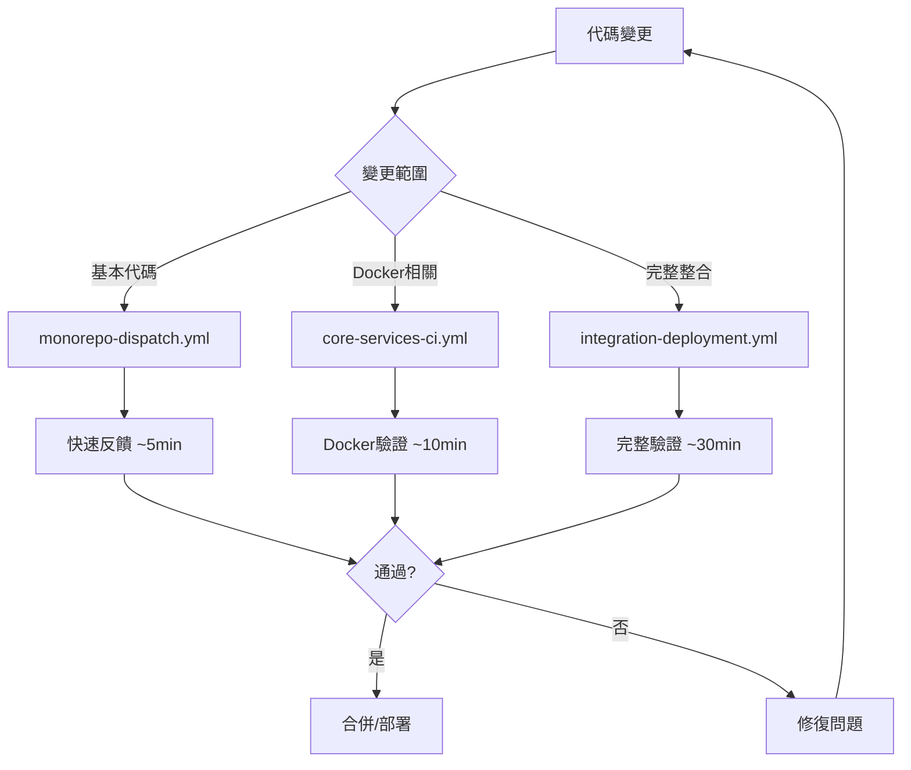

# GitHub Workflows 協調策略

## 📋 概述

本文檔說明 Unmanned Island 系統的 GitHub Actions 工作流程架構和協調策略，以優化 CI/CD 效率並降低成本。

## 🎯 工作流程層級

### 第一層：基礎 CI（快速反饋）

**工作流程**: `monorepo-dispatch.yml`

**目的**: 為每個服務變更提供快速的基本 CI 檢查

**觸發條件**:
- 每次 push 或 PR 影響 `mcp-servers/**` 或 `core/contract_service/contracts-L1/contracts/**`

**執行內容**:
- ✅ Lint 檢查
- ✅ 型別檢查
- ✅ 單元測試
- ✅ 建置驗證
- ⏭️ 跳過 Docker 建置（提高速度）
- ✅ SBOM 生成

**執行時間**: ~5-8 分鐘

**使用場景**:
- 開發過程中的快速反饋
- 驗證基本代碼品質
- PR 的初步檢查

### 第二層：核心服務 CI（Docker 驗證）

**工作流程**: `core-services-ci.yml`

**目的**: 包含 Docker 建置的全面 CI 檢查

**觸發條件**:
- push 或 PR 影響核心服務路徑
- 手動觸發 (workflow_dispatch)

**執行內容**:
- ✅ 完整的 CI 檢查（lint、test、build）
- ✅ Docker 映像建置
- ✅ Docker 映像驗證
- ⏭️ 跳過安全掃描（在第三層執行）

**執行時間**: ~10-15 分鐘

**使用場景**:
- 驗證 Docker 建置不會失敗
- 檢查容器化配置
- 合併前的 Docker 相關變更驗證

### 第三層：完整整合測試（全面驗證）

**工作流程**: `integration-deployment.yml`

**目的**: 跨所有層級的完整系統整合測試和部署準備驗證

**觸發條件**:
- 手動觸發 (workflow_dispatch)
- PR 標記 `ci:integration` 標籤
- Release 分支的 push

**執行內容**:
- ✅ 所有四個層級的完整測試
  - Tier 1: Contracts L1 Service
  - Tier 2: MCP Servers
  - Tier 3: Auto-Fix Bot System
  - Tier 4: Dashboard
- ✅ Docker 建置並執行健康檢查
- ✅ 安全掃描
- ✅ Docker Compose 驗證
- ✅ 生產就緒報告
- ✅ 互動式客服整合

**執行時間**: ~25-35 分鐘

**使用場景**:
- 合併到 main 前的最終驗證
- Release 準備檢查
- 部署前的完整系統驗證

## 🔄 工作流程協調



## 📊 成本優化策略

### 1. 路徑過濾

所有工作流程使用 `paths` 過濾器，只在相關文件變更時執行：

```yaml
on:
  push:
    paths:
      - 'mcp-servers/**'
      - 'core/contract_service/**'
```

### 2. 並發控制

使用 `concurrency` 防止同一分支的重複運行：

```yaml
concurrency:
  group: ${{ github.workflow }}-${{ github.ref }}
  cancel-in-progress: true
```

### 3. 超時保護

所有作業設置合理的 `timeout-minutes` 防止失控成本：

```yaml
jobs:
  my-job:
    timeout-minutes: 10
```

### 4. 條件性執行

重量級工作流程使用啟動閘門 (activation gate)：

```yaml
jobs:
  activation-gate:
    # 決定是否執行重量級作業
  
  heavy-job:
    needs: activation-gate
    if: needs.activation-gate.outputs['run-heavy'] == 'true'
```

## 🔧 可重用工作流程

### `reusable-ci.yml`

統一的 CI 管道，支援：
- 自動檢測專案結構
- 可配置的測試和建置
- 自定義腳本執行
- SBOM 生成
- 安全掃描

**使用範例**:
```yaml
jobs:
  ci:
    uses: ./.github/workflows/reusable-ci.yml
    with:
      working-directory: mcp-servers
      service-name: mcp-servers
      node-version: '18'
      custom-scripts: 'validate:deployment,validate:logic'
```

### `reusable-docker-build.yml`

統一的 Docker 建置管道，支援：
- Docker 映像建置和快取
- 健康檢查驗證
- 安全掃描 (Trivy)
- 推送到註冊表
- 自動標籤生成

**使用範例**:
```yaml
jobs:
  docker:
    uses: ./.github/workflows/reusable-docker-build.yml
    with:
      service-name: contracts-l1
      context: core/contract_service/contracts-L1/contracts
      dockerfile: core/contract_service/contracts-L1/contracts/Dockerfile
      health-check-url: http://localhost:3000/healthz
      enable-security-scan: true
```

## 📝 最佳實踐

### 開發階段
1. 使用 `monorepo-dispatch.yml` 進行快速迭代
2. 本地運行 lint 和 test 避免 CI 失敗

### PR 審查階段
1. `monorepo-dispatch.yml` 自動運行提供基本驗證
2. 如果涉及 Docker 變更，`core-services-ci.yml` 會自動執行
3. 如需完整驗證，添加 `ci:integration` 標籤觸發完整測試

### 合併前
1. 確保所有自動 CI 檢查通過
2. 對重大變更運行完整整合測試
3. 查看生產就緒報告

### Release 準備
1. 手動觸發 `integration-deployment.yml`
2. 設置 deploy-environment 輸入參數
3. 驗證所有層級的生產就緒狀態

## 🚨 故障排除

### CI 重複運行
- 檢查是否有多個工作流程被同一變更觸發
- 驗證路徑過濾器配置正確
- 確認 concurrency 群組設置正確

### 執行時間過長
- 檢查是否需要使用更輕量的工作流程
- 考慮跳過非必要的步驟（如 Docker 建置）
- 使用路徑過濾器限制觸發範圍

### 成本過高
- 審查觸發條件，確保不會過度執行
- 使用啟動閘門控制重量級工作流程
- 設置合理的超時限制
- 啟用 cancel-in-progress

## 📚 相關文檔

- [Stage 1 - 基礎 CI](./stage-1-basic-ci.md) - 第一階段基礎 CI 自動評論機制的實施和使用
- [CI 故障排除](../ci-troubleshooting.md) - CI/CD 常見問題診斷和解決方案
- [自主 CI 合規性](../autonomous-ci-compliance.md) - 自主 CI 系統的合規性要求和驗證
- [GitHub Actions 最佳實踐](https://docs.github.com/en/actions/learn-github-actions/best-practices-for-github-actions) - GitHub 官方的 Actions 最佳實踐指南

## 🔄 維護指南

### 添加新服務時
1. 在 `monorepo-dispatch.yml` 添加路徑檢測
2. 在 `core-services-ci.yml` 添加 Docker 建置（如需要）
3. 在 `integration-deployment.yml` 添加新層級（如需要）
4. 使用 `reusable-ci.yml` 和 `reusable-docker-build.yml` 避免重複代碼

### 更新可重用工作流程時
1. 測試所有調用該工作流程的上游工作流程
2. 保持向後相容性或同時更新所有調用方
3. 更新本文檔說明變更

### 性能優化
1. 定期審查工作流程執行時間
2. 識別瓶頸並優化
3. 考慮增加更多的路徑過濾器
4. 評估是否需要拆分大型工作流程

---

**最後更新**: 2025-12-07  
**維護者**: SynergyMesh DevOps Team
