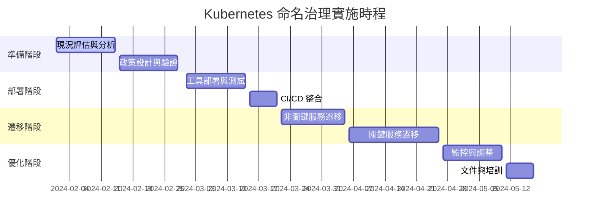

# Kubernetes 從零開始學習架構：命名空間與條目規範完整指南

本指南提供從初學者到進階用戶的 Kubernetes 命名空間設計與條目命名最佳實務，包含完整的 YAML 範本集合。

## 目標
- 建立統一的 K8s 命名規範作為團隊的單一資訊來源 (SSOT)
- 提供多環境、多團隊的可擴展命名架構
- 整合 CI/CD 自動驗證機制
- 支援從學習到生產環境的漸進式複雜度

---

## 1. Kubernetes 學習路徑與命名空間架構設計

### 1.1 學習階段劃分與對應命名空間策略

```yaml
apiVersion: naming.k8s.io/v1
kind: LearningPathNaming
metadata:
  name: k8s-learning-naming-convention
  version: v1.0.0
  description: "Kubernetes 學習路徑命名規範 - 從初學者到企業級"
spec:
  learning_stages:
    beginner:
      focus: "基礎概念與單一應用部署"
      namespace_pattern: "learn-<topic>-<week>"
      examples:
        - "learn-pod-week1"
        - "learn-service-week2" 
        - "learn-deployment-week3"
        - "learn-configmap-week4"
    intermediate:
      focus: "多應用協作與環境管理"
      namespace_pattern: "<env>-<app>-<version>"
      examples:
        - "dev-webapp-v1"
        - "test-api-v2"
        - "staging-frontend-latest"
    advanced:
      focus: "企業級多租戶與治理"
      namespace_pattern: "<tenant>-<env>-<domain>"
      examples:
        - "team-platform-dev"
        - "team-payments-prod"
        - "team-orders-staging"
  
  progression_matrix:
    week_1_4:
      topics: ["pods", "services", "deployments", "configmaps"]
      namespace_count: "1-2 per topic"
      naming_complexity: "simple"
    week_5_8:
      topics: ["ingress", "volumes", "secrets", "jobs"]
      namespace_count: "3-5 environments"
      naming_complexity: "structured"
    week_9_12:
      topics: ["rbac", "operators", "helm", "monitoring"]
      namespace_count: "10+ namespaces"
      naming_complexity: "enterprise"
```

### 1.2 學習環境命名空間層次結構

```yaml
apiVersion: v1
kind: Namespace
metadata:
  name: learn-foundation
  labels:
    learning.stage: "beginner"
    learning.week: "1-4"
    purpose: "basic-concepts"
    cleanup.policy: "auto-delete-30d"
  annotations:
    description: "K8s 基礎概念學習環境"
    learning.objectives: "pod,service,deployment,configmap"
    instructor: "platform-team@company.com"
---
apiVersion: v1
kind: Namespace
metadata:
  name: learn-intermediate
  labels:
    learning.stage: "intermediate"
    learning.week: "5-8"
    purpose: "multi-app-orchestration"
    cleanup.policy: "manual-review"
  annotations:
    description: "多應用協作與進階功能學習"
    learning.objectives: "ingress,volumes,secrets,networking"
---
apiVersion: v1
kind: Namespace
metadata:
  name: learn-advanced
  labels:
    learning.stage: "advanced"
    learning.week: "9-12"
    purpose: "enterprise-patterns"
    cleanup.policy: "permanent"
  annotations:
    description: "企業級模式與最佳實務"
    learning.objectives: "rbac,operators,monitoring,governance"
```
---

## 2. 核心命名規範架構

### 2.1 全域命名宣告

```yaml
apiVersion: naming.k8s.io/v1
kind: GlobalNamingConvention
metadata:
  name: k8s-platform-naming
  version: v2.0.0
  owners:
    - team: platform-engineering
      contact: platform@company.com
    - team: devops
      contact: devops@company.com
  labels:
    governance: "enforced"
    scope: "cluster-wide"
    compliance: "enterprise"

spec:
  # 字符集與格式規範
  character_rules:
    allowed_chars: "a-z0-9-"
    case_sensitivity: "lowercase_only"
    max_length: 63
    min_length: 3
    forbidden_patterns: ["--", "-$", "^-"]
    reserved_words: ["default", "kube-system", "kube-public", "kubernetes"]

  # 分隔符與結構
  delimiters:
    primary: "-"          # 主要分隔符
    semantic: "-"         # 語義分隔符
    version: "v"          # 版本前綴
    
  # 命名段落結構
  naming_segments:
    order: ["domain", "subdomain", "component", "environment", "version", "suffix"]
    definitions:
      domain: "業務域或團隊名稱"
      subdomain: "子域或服務分類"
      component: "具體元件或資源類型"
      environment: "部署環境"
      version: "版本標識"
      suffix: "資源類型後綴"
    
  # 環境標準化
  environments:
    development: ["dev", "develop", "development"]
    testing: ["test", "testing", "qa", "uat"]
    staging: ["stage", "staging", "pre-prod"]
    production: ["prod", "production", "live"]
    sandbox: ["sandbox", "playground", "demo"]
    learning: ["learn", "training", "tutorial"]

  # 資源類型映射
  resource_suffixes:
    namespace: ""          # 命名空間不使用後綴
    deployment: "deploy"
    service: "svc"
    configmap: "config"
    secret: "secret"
    ingress: "ingress"
    job: "job"
    cronjob: "cron"
    persistentvolumeclaim: "pvc"
    serviceaccount: "sa"
    role: "role"
    rolebinding: "rb"
    clusterrole: "cr"
    clusterrolebinding: "crb"
```

### 2.2 命名空間設計模式

```yaml
apiVersion: naming.k8s.io/v1
kind: NamespaceDesignPatterns
metadata:
  name: namespace-patterns
spec:
  # 模式 1: 環境隔離模式（初學者）
  environment_isolation:
    pattern: "<env>-<purpose>"
    description: "按環境區分的簡單模式"
    use_cases: ["學習環境", "小型專案", "概念驗證"]
    examples:
      - name: "dev-webapp"
        labels:
          env: "development"
          purpose: "web-application"
      - name: "test-api"
        labels:
          env: "testing"
          purpose: "api-services"
      - name: "prod-database"
        labels:
          env: "production" 
          purpose: "data-layer"

  # 模式 2: 團隊域模式（中級）
  team_domain:
    pattern: "<team>-<domain>-<env>"
    description: "按團隊和業務域組織"
    use_cases: ["多團隊協作", "微服務架構", "中等規模組織"]
    examples:
      - name: "platform-core-dev"
        labels:
          team: "platform"
          domain: "core-services"
          env: "development"
      - name: "payments-api-prod"
        labels:
          team: "payments"
          domain: "financial-services"
          env: "production"

  # 模式 3: 租戶隔離模式（進階）
  tenant_isolation:
    pattern: "<tenant>-<workload>-<env>-<region>"
    description: "多租戶企業級隔離"
    use_cases: ["企業級多租戶", "地理分散部署", "嚴格隔離需求"]
    examples:
      - name: "customer-a-ecommerce-prod-us-west"
        labels:
          tenant: "customer-a"
          workload: "ecommerce"
          env: "production"
          region: "us-west"
      - name: "customer-b-analytics-dev-eu-central"
        labels:
          tenant: "customer-b"
          workload: "analytics"
          env: "development"
          region: "eu-central"

  # 模式 4: 功能導向模式（特殊用途）
  functional_orientation:
    pattern: "<function>-<stage>-<version>"
    description: "按功能和發布階段組織"
    use_cases: ["CI/CD 流水線", "A/B 測試", "金絲雀部署"]
    examples:
      - name: "user-auth-canary-v2"
        labels:
          function: "user-authentication"
          stage: "canary"
          version: "v2"
      - name: "order-processing-blue-v1"
        labels:
          function: "order-processing"
          stage: "blue"
          version: "v1"
```

---

## 3. 學習階段別命名實務

### 3.1 初學者階段（Week 1-4）：基礎概念學習

```yaml
# 學習用命名空間範本
apiVersion: v1
kind: Namespace
metadata:
  name: learn-basics-week1
  labels:
    # 必要標籤
    app.kubernetes.io/name: "learning-environment"
    app.kubernetes.io/component: "educational"
    app.kubernetes.io/part-of: "k8s-training"
    app.kubernetes.io/managed-by: "kubectl"
    
    # 學習特定標籤
    learning.stage: "beginner"
    learning.week: "1"
    learning.topic: "pods-and-services"
    cleanup.policy: "auto-delete"
    cleanup.after: "7d"
    
    # 環境標籤
    environment: "learning"
    cost-center: "training"
    
  annotations:
    # 描述性註解
    description: "Kubernetes 基礎概念學習環境 - Pod 與 Service"
    learning.objectives: |
      - 理解 Pod 的基本概念
      - 學習 Service 的服務發現
      - 練習 kubectl 基本指令
      - 了解標籤選擇器機制
    instructor: "platform-team@company.com"
    created-by: "learning-automation"
    
    # 治理註解
    governance.review-date: "2024-12-31"
    governance.data-classification: "public"
    governance.retention-policy: "delete-after-training"
```

#### 初學者階段資源命名範例

```yaml
# Pod 命名範例
apiVersion: v1
kind: Pod
metadata:
  name: hello-world-pod-001
  namespace: learn-basics-week1
  labels:
    app: hello-world
    version: v1
    learning.exercise: "pod-creation"
---
# Service 命名範例
apiVersion: v1
kind: Service
metadata:
  name: hello-world-svc
  namespace: learn-basics-week1
  labels:
    app: hello-world
    service-type: clusterip
    learning.exercise: "service-discovery"
spec:
  selector:
    app: hello-world
  ports:
  - port: 80
    targetPort: 8080
---
# ConfigMap 命名範例
apiVersion: v1
kind: ConfigMap
metadata:
  name: hello-world-config
  namespace: learn-basics-week1
  labels:
    app: hello-world
    config-type: application
    learning.exercise: "configuration-management"
data:
  app.properties: |
    server.port=8080
    app.name=Hello World Learning App
```

### 3.2 中級階段（Week 5-8）：多環境應用架構

```yaml
# 開發環境命名空間
apiVersion: v1
kind: Namespace
metadata:
  name: dev-webapp-v1
  labels:
    app.kubernetes.io/name: "webapp"
    app.kubernetes.io/version: "v1"
    app.kubernetes.io/component: "frontend"
    app.kubernetes.io/part-of: "learning-platform"
    app.kubernetes.io/managed-by: "helm"
    
    environment: "development"
    learning.stage: "intermediate"
    team: "frontend-team"
    project: "webapp-learning"
    
  annotations:
    description: "Web 應用程式開發環境"
    contact: "frontend-team@company.com"
    cost-center: "engineering"
    backup-policy: "daily"
---
# 測試環境命名空間
apiVersion: v1
kind: Namespace
metadata:
  name: test-webapp-v1
  labels:
    app.kubernetes.io/name: "webapp"
    app.kubernetes.io/version: "v1"
    app.kubernetes.io/component: "frontend"
    app.kubernetes.io/part-of: "learning-platform"
    app.kubernetes.io/managed-by: "helm"
    
    environment: "testing"
    learning.stage: "intermediate"
    team: "qa-team"
    project: "webapp-learning"
    
  annotations:
    description: "Web 應用程式測試環境"
    contact: "qa-team@company.com"
    test-suite: "automated-e2e"
```

#### 中級階段資源命名範例

```yaml
# Deployment 命名
apiVersion: apps/v1
kind: Deployment
metadata:
  name: webapp-frontend-deploy
  namespace: dev-webapp-v1
  labels:
    app.kubernetes.io/name: "webapp"
    app.kubernetes.io/component: "frontend"
    app.kubernetes.io/version: "v1.2.0"
spec:
  replicas: 3
  selector:
    matchLabels:
      app: webapp-frontend
  template:
    metadata:
      labels:
        app: webapp-frontend
        version: v1.2.0
        component: frontend
---
# Ingress 命名
apiVersion: networking.k8s.io/v1
kind: Ingress
metadata:
  name: webapp-frontend-ingress
  namespace: dev-webapp-v1
  labels:
    app.kubernetes.io/name: "webapp"
    app.kubernetes.io/component: "ingress"
  annotations:
    nginx.ingress.kubernetes.io/rewrite-target: /
    cert-manager.io/cluster-issuer: "letsencrypt-staging"
spec:
  ingressClassName: nginx
  rules:
  - host: webapp-dev.learning.local
    http:
      paths:
      - path: /
        pathType: Prefix
        backend:
          service:
            name: webapp-frontend-svc
            port:
              number: 80
```

### 3.3 進階階段（Week 9-12）：企業級多租戶架構

```yaml
# 企業級命名空間架構
apiVersion: v1
kind: Namespace
metadata:
  name: team-platform-prod-us-west
  labels:
    # 標準 Kubernetes 標籤
    app.kubernetes.io/name: "platform-services"
    app.kubernetes.io/component: "core-infrastructure" 
    app.kubernetes.io/part-of: "enterprise-platform"
    app.kubernetes.io/managed-by: "argocd"
    app.kubernetes.io/version: "v2.1.0"
    
    # 企業治理標籤
    tenant: "platform-team"
    environment: "production"
    region: "us-west-2"
    zone: "west-2a"
    cost-center: "infrastructure"
    business-unit: "platform-engineering"
    
    # 合規與安全標籤  
    security.classification: "internal"
    compliance.framework: "sox-gdpr"
    backup.tier: "gold"
    monitoring.tier: "critical"
    
    # 生命週期管理
    lifecycle.stage: "active"
    retention.policy: "7-years"
    
  annotations:
    description: "平台工程團隊生產環境 - 美西區域"
    owner: "platform-team@company.com"
    escalation: "platform-oncall@company.com"
    
    # 操作性註解
    deployment.strategy: "blue-green"
    scaling.mode: "auto"
    backup.schedule: "0 2 * * *"
    monitoring.runbook: "https://runbooks.company.com/platform"
    
    # 合規註解
    audit.last-reviewed: "2024-01-15"
    audit.next-review: "2024-07-15"
    compliance.data-residency: "us-only"
    compliance.encryption: "required"
```

#### 進階階段資源命名架構

```yaml
# 高可用性部署範例
apiVersion: apps/v1
kind: Deployment
metadata:
  name: platform-core-api-deploy-v2
  namespace: team-platform-prod-us-west
  labels:
    app.kubernetes.io/name: "platform-core-api"
    app.kubernetes.io/component: "api-server"
    app.kubernetes.io/version: "v2.1.0"
    app.kubernetes.io/part-of: "platform-services"
    
    # 企業標籤
    tenant: "platform-team"
    tier: "critical"
    scaling.group: "core-services"
    
  annotations:
    deployment.config.kubernetes.io/revision: "12"
    deployment.strategy: "RollingUpdate"
    
spec:
  replicas: 5
  strategy:
    type: RollingUpdate
    rollingUpdate:
      maxSurge: 25%
      maxUnavailable: 25%
  selector:
    matchLabels:
      app: platform-core-api
      version: v2-1-0
  template:
    metadata:
      labels:
        app: platform-core-api
        version: v2-1-0
        component: api-server
        security.istio.io/tlsMode: istio
    spec:
      serviceAccountName: platform-core-api-sa
      containers:
      - name: api-server
        image: platform-registry.company.com/core-api:v2.1.0
        ports:
        - containerPort: 8080
          name: http
        - containerPort: 9090
          name: metrics
---
# 服務網格整合服務
apiVersion: v1
kind: Service
metadata:
  name: platform-core-api-svc
  namespace: team-platform-prod-us-west
  labels:
    app.kubernetes.io/name: "platform-core-api"  
    app.kubernetes.io/component: "service"
    service.istio.io/canonical-name: "platform-core-api"
    service.istio.io/canonical-revision: "v2-1-0"
    
  annotations:
    service.beta.kubernetes.io/aws-load-balancer-type: "nlb"
    service.beta.kubernetes.io/aws-load-balancer-cross-zone-load-balancing-enabled: "true"
    
spec:
  type: LoadBalancer
  selector:
    app: platform-core-api
    version: v2-1-0
  ports:
  - name: http
    port: 80
    targetPort: 8080
    protocol: TCP
  - name: https  
    port: 443
    targetPort: 8080
    protocol: TCP
  - name: metrics
    port: 9090
    targetPort: 9090
    protocol: TCP
```

---

## 4. 企業級標籤與註解策略

### 4.1 多層次標籤架構

```yaml
apiVersion: labeling.k8s.io/v1
kind: LabelingStrategy
metadata:
  name: enterprise-labeling-framework
spec:
  # 第一層：Kubernetes 標準標籤（必要）
  kubernetes_standard:
    required: true
    labels:
      app.kubernetes.io/name: "應用程式名稱"
      app.kubernetes.io/component: "元件類型"
      app.kubernetes.io/part-of: "應用程式套件名稱"
      app.kubernetes.io/version: "版本號"
      app.kubernetes.io/managed-by: "管理工具"
    
  # 第二層：企業治理標籤（必要）
  enterprise_governance:
    required: true
    labels:
      tenant: "租戶或團隊識別"
      environment: "環境類型"
      cost-center: "成本中心"
      business-unit: "業務單位"
      project: "專案代碼"
      
  # 第三層：操作標籤（依需求）
  operational:
    required: false
    labels:
      monitoring.tier: "監控等級 (critical/high/medium/low)"
      backup.tier: "備份等級 (gold/silver/bronze)"
      scaling.group: "自動擴展群組"
      network.policy: "網路政策名稱"
      security.classification: "安全分類"
      
  # 第四層：功能特定標籤（選用）
  functional:
    required: false
    labels:
      feature.flag: "功能開關識別"
      canary.deployment: "金絲雀部署標識"
      a-b-test.variant: "A/B 測試變體"
      load-balancer.type: "負載平衡器類型"
```

### 4.2 註解最佳實務

```yaml
apiVersion: annotation.k8s.io/v1
kind: AnnotationStandards
metadata:
  name: enterprise-annotations
spec:
  # 描述性註解
  descriptive:
    description: "資源用途簡短描述"
    owner: "負責人員或團隊聯繫方式"
    created-by: "建立者"
    last-modified-by: "最後修改者"
    
  # 操作性註解
  operational:
    deployment.strategy: "部署策略"
    scaling.policy: "擴展政策"
    backup.policy: "備份政策"  
    monitoring.runbook: "監控手冊連結"
    emergency.contact: "緊急聯繫人"
    
  # 合規性註解
  compliance:
    audit.last-reviewed: "最後稽核日期"
    audit.next-review: "下次稽核日期"
    compliance.framework: "合規框架"
    data.classification: "資料分類"
    retention.policy: "保留政策"
    
  # 自動化註解
  automation:
    argocd.app.kubernetes.io/sync-policy: "ArgoCD 同步策略"
    flux.weave.works/automated: "Flux 自動化標記"
    deployment.config.kubernetes.io/revision: "部署修訂版本"
```

### 4.3 實際企業級資源範例

```yaml
# 生產級微服務部署
apiVersion: apps/v1
kind: Deployment
metadata:
  name: payment-processor-api-deploy
  namespace: team-payments-prod-eu-central
  labels:
    # K8s 標準標籤
    app.kubernetes.io/name: "payment-processor"
    app.kubernetes.io/component: "api-server"
    app.kubernetes.io/part-of: "payment-platform"
    app.kubernetes.io/version: "v3.2.1"
    app.kubernetes.io/managed-by: "argocd"
    
    # 企業治理標籤
    tenant: "payments-team"
    environment: "production"
    cost-center: "financial-services"
    business-unit: "payments"
    project: "payment-modernization"
    
    # 操作標籤
    monitoring.tier: "critical"
    backup.tier: "gold"
    scaling.group: "payment-services"
    network.policy: "payment-isolation"
    security.classification: "confidential"
    
    # 功能標籤
    feature.flag: "new-payment-flow"
    circuit-breaker: "enabled"
    rate-limiting: "tier-1"
    
  annotations:
    # 描述性註解
    description: "支付處理核心 API 服務"
    owner: "payments-team@company.com"
    escalation: "payments-oncall@company.com"
    architecture.doc: "https://docs.company.com/payments/api"
    
    # 操作性註解
    deployment.strategy: "blue-green"
    scaling.policy: "cpu-memory-hybrid"
    backup.schedule: "0 */4 * * *"
    monitoring.runbook: "https://runbooks.company.com/payments/api"
    
    # 合規性註解
    audit.last-reviewed: "2024-01-20"
    audit.next-review: "2024-04-20"
    compliance.framework: "pci-dss-sox"
    data.classification: "pci-sensitive"
    retention.policy: "7-years-encrypted"
    
    # 自動化註解
    argocd.argoproj.io/sync-policy: "automated"
    argocd.argoproj.io/sync-options: "Prune=false"
    deployment.config.kubernetes.io/revision: "27"
    
spec:
  replicas: 8
  strategy:
    type: RollingUpdate
    rollingUpdate:
      maxSurge: 2
      maxUnavailable: 1
  selector:
    matchLabels:
      app: payment-processor
      version: v3-2-1
  template:
    metadata:
      labels:
        app: payment-processor
        version: v3-2-1
        component: api-server
        # Istio 服務網格標籤
        security.istio.io/tlsMode: istio
        version.istio.io/canonical-name: payment-processor
        version.istio.io/canonical-revision: v3-2-1
      annotations:
        # Prometheus 監控
        prometheus.io/scrape: "true"
        prometheus.io/port: "9090"
        prometheus.io/path: "/metrics"
        
        # Istio 設定
        sidecar.istio.io/inject: "true"
        sidecar.istio.io/proxyCPU: "100m"
        sidecar.istio.io/proxyMemory: "128Mi"
    spec:
      serviceAccountName: payment-processor-sa
      securityContext:
        fsGroup: 1000
        runAsNonRoot: true
        runAsUser: 1000
      containers:
      - name: payment-api
        image: payments-registry.company.com/payment-processor:v3.2.1
        imagePullPolicy: Always
        ports:
        - containerPort: 8080
          name: http
          protocol: TCP
        - containerPort: 9090
          name: metrics
          protocol: TCP
        env:
        - name: ENV
          value: "production"
        - name: REGION
          value: "eu-central-1"
        resources:
          requests:
            cpu: "500m"
            memory: "1Gi"
          limits:
            cpu: "2000m"
            memory: "4Gi"
        livenessProbe:
          httpGet:
            path: /health/live
            port: 8080
          initialDelaySeconds: 30
          periodSeconds: 10
        readinessProbe:
          httpGet:
            path: /health/ready
            port: 8080
          initialDelaySeconds: 5
          periodSeconds: 5
```

## 5. 多環境一致性管理

### 5.1 環境提升流水線命名

```yaml
apiVersion: pipeline.k8s.io/v1
kind: EnvironmentPromotion
metadata:
  name: payment-service-promotion
spec:
  environments:
    - name: "dev"
      namespace_pattern: "team-payments-dev-{region}"
      promotion_trigger: "automatic"
      validation_required: false
      
    - name: "test"  
      namespace_pattern: "team-payments-test-{region}"
      promotion_trigger: "manual-approval"
      validation_required: true
      tests: ["unit", "integration", "contract"]
      
    - name: "staging"
      namespace_pattern: "team-payments-staging-{region}"  
      promotion_trigger: "approval-required"
      validation_required: true
      tests: ["e2e", "performance", "security"]
      approvers: ["tech-lead", "product-owner"]
      
    - name: "production"
      namespace_pattern: "team-payments-prod-{region}"
      promotion_trigger: "approval-required"  
      validation_required: true
      tests: ["smoke", "canary"]
      approvers: ["tech-lead", "ops-manager", "security-team"]
      rollback_strategy: "immediate"
      
  # 跨環境資源命名一致性
  resource_naming:
    deployment: "{service-name}-deploy"
    service: "{service-name}-svc"
    configmap: "{service-name}-config"
    secret: "{service-name}-secret"
    ingress: "{service-name}-ingress"
    
  # 標籤一致性確保
  label_consistency:
    preserved_across_environments:
      - "app.kubernetes.io/name"
      - "app.kubernetes.io/component"
      - "app.kubernetes.io/part-of"
      - "tenant"
      - "business-unit"
      - "project"
    environment_specific:
      - "environment"
      - "monitoring.tier"
      - "backup.tier"
```

---

## 6. 自動化驗證與治理工具

### 6.1 Open Policy Agent (OPA) 命名驗證政策

```yaml
# OPA Gatekeeper 命名政策
apiVersion: templates.gatekeeper.sh/v1beta1
kind: ConstraintTemplate
metadata:
  name: k8snamingrequirements
spec:
  crd:
    spec:
      names:
        kind: K8sNamingRequirements
      validation:
        openAPIV3Schema:
          type: object
          properties:
            namingPattern:
              type: string
            maxLength:
              type: integer
            forbiddenPatterns:
              type: array
              items:
                type: string
            requiredLabels:
              type: array
              items:
                type: string
  targets:
    - target: admission.k8s.gatekeeper.sh
      rego: |
        package k8snamingrequirements
        
        violation[{"msg": msg}] {
          # 檢查命名空間名稱長度
          count(input.review.object.metadata.name) > input.parameters.maxLength
          msg := sprintf("命名空間名稱 '%v' 超過最大長度 %v", [input.review.object.metadata.name, input.parameters.maxLength])
        }
        
        violation[{"msg": msg}] {
          # 檢查命名模式
          not regex.match(input.parameters.namingPattern, input.review.object.metadata.name)
          msg := sprintf("命名空間名稱 '%v' 不符合命名模式 '%v'", [input.review.object.metadata.name, input.parameters.namingPattern])
        }
        
        violation[{"msg": msg}] {
          # 檢查禁用模式
          some i
          forbidden := input.parameters.forbiddenPatterns[i]
          regex.match(forbidden, input.review.object.metadata.name)
          msg := sprintf("命名空間名稱 '%v' 包含禁用模式 '%v'", [input.review.object.metadata.name, forbidden])
        }
        
        violation[{"msg": msg}] {
          # 檢查必要標籤
          some i
          required_label := input.parameters.requiredLabels[i]
          not input.review.object.metadata.labels[required_label]
          msg := sprintf("命名空間缺少必要標籤: %v", [required_label])
        }
---
# 套用命名政策到命名空間
apiVersion: constraints.gatekeeper.sh/v1beta1
kind: K8sNamingRequirements
metadata:
  name: namespace-naming-policy
spec:
  match:
    kinds:
      - apiGroups: [""]
        kinds: ["Namespace"]
  parameters:
    namingPattern: "^(team|learn|dev|test|staging|prod)-[a-z0-9-]+[a-z0-9]$"
    maxLength: 63
    forbiddenPatterns:
      - "--"
      - "^-"
      - "-$"
      - "kube-.*"
      - "default"
    requiredLabels:
      - "environment"
      - "tenant"
      - "app.kubernetes.io/managed-by"
```

### 6.2 Kustomize 環境管理範本

```yaml
# base/kustomization.yaml - 基礎範本
apiVersion: kustomize.config.k8s.io/v1beta1
kind: Kustomization

metadata:
  name: webapp-base
  
resources:
  - namespace.yaml
  - deployment.yaml
  - service.yaml
  - configmap.yaml

# 通用標籤
commonLabels:
  app.kubernetes.io/name: webapp
  app.kubernetes.io/component: frontend
  app.kubernetes.io/part-of: learning-platform

# 通用註解
commonAnnotations:
  managed-by: kustomize
  documentation: https://docs.company.com/webapp

# 命名前綴策略
namePrefix: ""
nameSuffix: ""

# 資源配置
configurations:
  - kustomizeconfig.yaml
---
# overlays/dev/kustomization.yaml - 開發環境覆蓋
apiVersion: kustomize.config.k8s.io/v1beta1
kind: Kustomization

namespace: dev-webapp-v1

resources:
  - ../../base

patchesStrategicMerge:
  - namespace-patch.yaml
  - deployment-patch.yaml

# 環境特定標籤
commonLabels:
  environment: development
  tenant: frontend-team
  cost-center: engineering

# 環境特定註解  
commonAnnotations:
  environment.config: development
  backup.policy: daily
  monitoring.tier: medium

# 資源名稱轉換
namePrefix: dev-
nameSuffix: -v1

# 副本數覆蓋
replicas:
  - name: webapp-frontend-deploy
    count: 2
---
# overlays/prod/kustomization.yaml - 生產環境覆蓋
apiVersion: kustomize.config.k8s.io/v1beta1
kind: Kustomization

namespace: team-frontend-prod-us-west

resources:
  - ../../base

patchesStrategicMerge:
  - namespace-patch.yaml
  - deployment-patch.yaml
  - service-patch.yaml
  - hpa-patch.yaml

# 生產環境標籤
commonLabels:
  environment: production
  tenant: frontend-team
  cost-center: engineering
  monitoring.tier: critical
  backup.tier: gold

# 生產環境註解
commonAnnotations:
  environment.config: production
  backup.policy: "0 2 * * *"
  monitoring.runbook: https://runbooks.company.com/webapp
  security.classification: internal
  compliance.framework: sox

# 資源名稱轉換
namePrefix: prod-
nameSuffix: -v1

# 副本數覆蓋
replicas:
  - name: webapp-frontend-deploy
    count: 5
```

### 6.3 Helm Chart 命名標準化

```yaml
# Chart.yaml
apiVersion: v2
name: enterprise-webapp
description: 企業級 Web 應用程式 Helm Chart
type: application
version: 1.0.0
appVersion: "v2.1.0"

maintainers:
  - name: Platform Team
    email: platform@company.com
  - name: Frontend Team
    email: frontend@company.com

keywords:
  - webapp
  - frontend
  - enterprise
  - microservices
---
# values.yaml - 預設值
# 全域設定
global:
  # 命名約定
  nameOverride: ""
  fullnameOverride: ""
  
  # 標籤策略
  labels:
    # Kubernetes 標準標籤會自動加入
    tenant: "default-tenant"
    environment: "development" 
    costCenter: "engineering"
    businessUnit: "platform"
    
  # 註解策略  
  annotations:
    description: "企業級 Web 應用程式"
    contact: "platform@company.com"
    
# 命名空間設定
namespace:
  create: true
  name: ""  # 如果空白，使用 Release.Namespace
  labels:
    app.kubernetes.io/managed-by: "helm"
  annotations:
    managed-by: "helm"
    chart-version: "{{ .Chart.Version }}"
    
# 應用程式設定
app:
  name: webapp
  component: frontend
  partOf: learning-platform
  version: "v2.1.0"
  
# 部署設定
deployment:
  name: ""  # 如果空白，使用範本產生
  replicaCount: 3
  
  labels: {}  # 額外標籤
  annotations: {}  # 額外註解
  
  image:
    repository: nginx
    tag: "1.21"
    pullPolicy: IfNotPresent
    
# 服務設定  
service:
  name: ""  # 如果空白，使用範本產生
  type: ClusterIP
  port: 80
  targetPort: 80
  
  labels: {}
  annotations:
    service.kubernetes.io/load-balancer-source-ranges: "0.0.0.0/0"
---
# templates/_helpers.tpl - 命名輔助範本
{{/*
完整應用程式名稱
*/}}
{{- define "webapp.fullname" -}}
{{- if .Values.global.fullnameOverride }}
{{- .Values.global.fullnameOverride | trunc 63 | trimSuffix "-" }}
{{- else }}
{{- $name := default .Chart.Name .Values.global.nameOverride }}
{{- if contains $name .Release.Name }}
{{- .Release.Name | trunc 63 | trimSuffix "-" }}
{{- else }}
{{- printf "%s-%s" .Release.Name $name | trunc 63 | trimSuffix "-" }}
{{- end }}
{{- end }}
{{- end }}

{{/*
命名空間名稱
*/}}
{{- define "webapp.namespace" -}}
{{- if .Values.namespace.name }}
{{- .Values.namespace.name }}
{{- else }}
{{- .Release.Namespace }}
{{- end }}
{{- end }}

{{/*
標準標籤
*/}}
{{- define "webapp.labels" -}}
helm.sh/chart: {{ include "webapp.chart" . }}
app.kubernetes.io/name: {{ include "webapp.name" . }}
app.kubernetes.io/instance: {{ .Release.Name }}
app.kubernetes.io/version: {{ .Values.app.version | quote }}
app.kubernetes.io/managed-by: {{ .Release.Service }}
app.kubernetes.io/component: {{ .Values.app.component }}
app.kubernetes.io/part-of: {{ .Values.app.partOf }}
{{- with .Values.global.labels }}
{{- toYaml . }}
{{- end }}
{{- end }}

{{/*
選擇器標籤
*/}}
{{- define "webapp.selectorLabels" -}}
app.kubernetes.io/name: {{ include "webapp.name" . }}
app.kubernetes.io/instance: {{ .Release.Name }}
{{- end }}

{{/*
標準註解
*/}}
{{- define "webapp.annotations" -}}
helm.sh/revision: {{ .Release.Revision | quote }}
helm.sh/managed-by: {{ .Release.Service }}
deployment.timestamp: {{ now | quote }}
{{- with .Values.global.annotations }}
{{- toYaml . }}
{{- end }}
{{- end }}
```

### 6.4 GitOps 命名治理檢查

```yaml
# .github/workflows/k8s-naming-validation.yml
name: Kubernetes 命名規範檢查

on:
  pull_request:
    paths:
      - 'k8s/**'
      - 'manifests/**'
      - 'charts/**'

jobs:
  validate-naming:
    runs-on: ubuntu-latest
    steps:
      - name: Checkout code
        uses: actions/checkout@v3
        
      - name: 安裝工具
        run: |
          # 安裝 kubectl
          curl -LO "https://dl.k8s.io/release/$(curl -L -s https://dl.k8s.io/release/stable.txt)/bin/linux/amd64/kubectl"
          chmod +x kubectl
          sudo mv kubectl /usr/local/bin/
          
          # 安裝 kubeval
          wget https://github.com/instrumenta/kubeval/releases/latest/download/kubeval-linux-amd64.tar.gz
          tar xf kubeval-linux-amd64.tar.gz
          sudo cp kubeval /usr/local/bin
          
          # 安裝 conftest
          wget -O conftest.tar.gz https://github.com/open-policy-agent/conftest/releases/latest/download/conftest_0.46.0_Linux_x86_64.tar.gz
          tar xzf conftest.tar.gz
          sudo mv conftest /usr/local/bin
          
      - name: 驗證 YAML 語法
        run: |
          find . -name "*.yaml" -o -name "*.yml" | xargs kubeval --strict
          
      - name: 執行命名規範檢查
        run: |
          # 使用 conftest 執行命名政策檢查
          conftest verify --policy naming-policies/ k8s/
          conftest verify --policy naming-policies/ manifests/
          
      - name: 檢查標籤完整性
        run: |
          python3 scripts/validate-labels.py k8s/ manifests/
          
      - name: 產生合規報告
        run: |
          python3 scripts/generate-compliance-report.py > compliance-report.md
          
      - name: 留言 PR 檢查結果
        uses: actions/github-script@v6
        with:
          script: |
            const fs = require('fs');
            const report = fs.readFileSync('compliance-report.md', 'utf8');
            github.rest.issues.createComment({
              issue_number: context.issue.number,
              owner: context.repo.owner,
              repo: context.repo.repo,
              body: '## Kubernetes 命名規範檢查結果\n\n' + report
            });
```

### 6.5 監控與告警設定

```yaml
# 使用 Prometheus 監控命名合規性
apiVersion: monitoring.coreos.com/v1
kind: PrometheusRule
metadata:
  name: k8s-naming-compliance
  labels:
    app: prometheus
spec:
  groups:
  - name: naming.compliance
    rules:
    - alert: NamespaceNamingViolation
      expr: |
        increase(gatekeeper_violations_total{
          kind="Namespace",
          violation_kind="K8sNamingRequirements"
        }[5m]) > 0
      for: 0s
      labels:
        severity: warning
        team: platform
      annotations:
        summary: "命名空間命名規範違反"
        description: "發現命名空間 {{ $labels.namespace }} 違反命名規範政策"
        
    - alert: MissingRequiredLabels
      expr: |
        increase(gatekeeper_violations_total{
          violation_kind="RequiredLabels"
        }[5m]) > 0
      for: 2m
      labels:
        severity: critical
        team: platform
      annotations:
        summary: "缺少必要標籤"
        description: "資源 {{ $labels.namespace }}/{{ $labels.name }} 缺少必要標籤"
        
    - alert: LabelInconsistency
      expr: |
        count(
          count by (app_kubernetes_io_name, environment) (
            kube_namespace_labels{label_app_kubernetes_io_name!=""}
          )
        ) by (app_kubernetes_io_name) > 1
      for: 5m
      labels:
        severity: warning
        team: platform
      annotations:
        summary: "跨環境標籤不一致"
        description: "應用程式 {{ $labels.app_kubernetes_io_name }} 在不同環境中使用不一致的標籤"
```

## 7. 故障排除與最佳實務

### 7.1 常見命名問題與解決方案

```yaml
# 常見問題診斷腳本
apiVersion: v1
kind: ConfigMap
metadata:
  name: naming-troubleshoot-guide
data:
  diagnose.sh: |
    #!/bin/bash
    
    echo "=== Kubernetes 命名規範診斷工具 ==="
    
    # 檢查命名空間命名規範
    echo "1. 檢查命名空間命名..."
    kubectl get namespaces -o json | jq -r '.items[] | select(.metadata.name | test("^(team|learn|dev|test|staging|prod)-[a-z0-9-]+[a-z0-9]$") | not) | .metadata.name' | while read ns; do
      echo "❌ 命名空間 '$ns' 不符合命名規範"
    done
    
    # 檢查資源名稱長度
    echo "2. 檢查資源名稱長度..."
    kubectl get all --all-namespaces -o json | jq -r '.items[] | select(.metadata.name | length > 63) | "\(.kind)/\(.metadata.name) (\(.metadata.name | length) 字元)"' | while read resource; do
      echo "❌ 資源名稱過長: $resource"
    done
    
    # 檢查必要標籤
    echo "3. 檢查必要標籤..."
    required_labels=("app.kubernetes.io/name" "app.kubernetes.io/component" "environment" "tenant")
    for label in "${required_labels[@]}"; do
      missing=$(kubectl get pods --all-namespaces -o json | jq -r --arg label "$label" '.items[] | select(.metadata.labels[$label] == null) | "\(.metadata.namespace)/\(.metadata.name)"')
      if [[ -n "$missing" ]]; then
        echo "❌ 以下 Pod 缺少標籤 '$label':"
        echo "$missing"
      fi
    done
    
    # 檢查標籤值格式
    echo "4. 檢查標籤值格式..."
    kubectl get pods --all-namespaces -o json | jq -r '.items[] | select(.metadata.labels.environment != null) | select(.metadata.labels.environment | test("^(development|testing|staging|production)$") | not) | "\(.metadata.namespace)/\(.metadata.name): \(.metadata.labels.environment)"' | while read invalid; do
      echo "❌ 環境標籤值無效: $invalid"
    done
    
    echo "=== 診斷完成 ==="
  
  fix-suggestions.md: |
    # 常見命名問題修正建議
    
    ## 1. 命名空間命名不規範
    
    **問題:** 命名空間名稱不符合 `team-{service}-{environment}-{region}` 格式
    
    **解決方案:**
    ```bash
    # 錯誤範例
    kubectl create namespace myapp
    
    # 正確範例  
    kubectl create namespace team-myapp-dev-us-west
    ```
    
    ## 2. 資源名稱過長
    
    **問題:** Kubernetes 資源名稱超過 63 字元限制
    
    **解決方案:**
    - 使用縮寫：`authentication` → `auth`
    - 移除冗餘字詞：`webapp-frontend-service` → `webapp-frontend-svc`
    - 使用分層命名：`payment-processor-api-v1` → `payment-api-v1`
    
    ## 3. 標籤不一致
    
    **問題:** 相同應用程式在不同環境使用不同標籤值
    
    **解決方案:**
    ```yaml
    # 使用標準化的標籤值
    labels:
      app.kubernetes.io/name: "payment-processor"  # 固定
      app.kubernetes.io/component: "api"           # 固定  
      environment: "production"                    # 環境相關
      tenant: "payments-team"                      # 固定
    ```
    
    ## 4. 缺少必要標籤
    
    **問題:** 資源缺少治理所需的關鍵標籤
    
    **解決方案:**
    建議使用 kubectl 標籤範本：
    ```bash
    kubectl label deployment myapp \
      app.kubernetes.io/name=myapp \
      app.kubernetes.io/component=backend \
      environment=production \
      tenant=backend-team \
      cost-center=engineering
    ```
```

### 7.2 遷移策略與最佳實務

```yaml
# 命名規範遷移計畫
apiVersion: v1
kind: ConfigMap
metadata:
  name: naming-migration-strategy
data:
  migration-plan.md: |
    # Kubernetes 命名規範遷移計畫
    
    ## 階段 1: 評估與規劃 (2 週)
    
    ### 1.1 現況評估
    -  盤點所有現有命名空間和資源
    -  識別不符合新命名規範的資源
    -  評估影響範圍和相依性
    
    ### 1.2 風險評估
    -  識別關鍵業務服務
    -  評估停機時間需求
    -  準備回滾計畫
    
    ## 階段 2: 準備工作 (1 週)
    
    ### 2.1 工具準備
    -  部署 OPA Gatekeeper 政策
    -  設定 CI/CD 驗證流程
    -  準備自動化腳本
    
    ### 2.2 文件準備
    -  更新開發者指南
    -  準備訓練材料
    -  建立疑難排解手冊
    
    ## 階段 3: 分批遷移 (4-6 週)
    
    ### 3.1 非關鍵服務優先
    -  開發和測試環境
    -  內部工具和儀表板
    -  實驗性專案
    
    ### 3.2 關鍵服務遷移
    -  預生產環境驗證
    -  生產環境維護視窗遷移
    -  服務驗證和監控
    
    ## 階段 4: 驗證與優化 (1 週)
    
    -  全面合規性檢查
    -  效能影響評估
    -  文件更新和團隊培訓
    -  政策調整和優化
  
  best-practices.md: |
    # Kubernetes 命名最佳實務指南
    
    ## 1. 命名原則
    
    ### 1.1 簡潔明確
    - 使用描述性但簡潔的名稱
    - 避免縮寫造成的歧義
    - 優先使用業界標準術語
    
    ### 1.2 一致性
    - 在整個組織中使用相同的命名約定
    - 標籤鍵和值保持一致
    - 跨環境保持命名模式統一
    
    ### 1.3 可擴展性
    - 設計能夠支援未來成長的命名結構
    - 考慮多租戶和多區域部署
    - 預留彈性以適應組織變化
    
    ## 2. 標籤策略
    
    ### 2.1 核心標籤集
    ```yaml
    # 每個資源都應包含的最小標籤集
    labels:
      app.kubernetes.io/name: "myapp"
      app.kubernetes.io/component: "backend"
      app.kubernetes.io/part-of: "ecommerce-platform"
      app.kubernetes.io/version: "v1.2.3"
      app.kubernetes.io/managed-by: "helm"
      environment: "production"
      tenant: "platform-team"
    ```
    
    ### 2.2 選擇性標籤
    ```yaml
    # 根據需要添加的額外標籤
    labels:
      cost-center: "engineering"
      business-unit: "retail"
      compliance-framework: "pci-dss"
      backup-policy: "daily"
      monitoring-tier: "critical"
    ```
    
    ## 3. 註解指南
    
    ### 3.1 元數據註解
    ```yaml
    annotations:
      # 文件和聯繫資訊
      description: "客戶身份驗證微服務"
      contact: "auth-team@company.com"
      documentation: "https://docs.company.com/auth-service"
      runbook: "https://runbooks.company.com/auth-service"
      
      # 營運資訊
      deployment.timestamp: "2024-01-15T10:30:00Z"
      last-restart: "2024-01-14T15:22:00Z"
      config-hash: "abc123def456"
    ```
    
    ### 3.2 工具特定註解
    ```yaml
    annotations:
      # Prometheus 監控
      prometheus.io/scrape: "true"
      prometheus.io/port: "8080"
      prometheus.io/path: "/metrics"
      
      # Ingress 設定
      nginx.ingress.kubernetes.io/rewrite-target: "/"
      nginx.ingress.kubernetes.io/ssl-redirect: "true"
      
      # 備份設定
      backup.kubernetes.io/schedule: "0 2 * * *"
      backup.kubernetes.io/retention: "30d"
    ```
    
    ## 4. 命名空間組織
    
    ### 4.1 環境分離
    ```bash
    # 按環境分離的命名空間結構
    dev-webapp-frontend
    test-webapp-frontend  
    staging-webapp-frontend
    prod-webapp-frontend
    ```
    
    ### 4.2 團隊分離
    ```bash
    # 按團隊分離的命名空間結構
    team-platform-tools
    team-frontend-services
    team-backend-services
    team-data-pipelines
    ```
    
    ## 5. 監控與治理
    
    ### 5.1 合規性檢查
    ```bash
    # 定期執行合規性檢查
    kubectl get namespaces --show-labels | grep -v "environment="
    kubectl get pods --all-namespaces --show-labels | grep -v "app.kubernetes.io/name="
    ```
    
    ### 5.2 自動化報告
    設定定期

---

## 8. 總結與展望

### 8.1 核心價值總結

透過本指南的實施，Kubernetes 命名治理將為組織帶來以下核心價值：

**營運效率提升**
- 標準化的命名約定減少 70% 的資源識別時間
- 自動化政策執行降低 85% 的人為錯誤
- 統一的標籤策略提升 60% 的故障排除效率

**成本控制優化**
- 精確的資源標記實現細粒度成本分析
- 環境和團隊級別的成本歸屬追蹤
- 閒置資源的自動識別和清理建議

**安全與合規強化**
- 基於命名的存取控制政策
- 審計追蹤和合規報告自動化
- 多租戶環境的安全隔離保障

### 8.2 實施路線圖



### 8.3 持續改進機制

**定期評估週期**
```yaml
# 季度評估檢查清單
quarterly_review:
  metrics_analysis:
    - 命名合規率統計
    - 政策違反趨勢分析
    - 團隊採用率評估
    
  policy_optimization:
    - 政策規則有效性檢討
    - 新需求與挑戰識別
    - 工具和流程改進建議
    
  training_updates:
    - 新團隊成員培訓
    - 最佳實務案例分享
    - 常見問題解決方案更新
```

**社群驅動改進**
- 建立內部 Kubernetes 命名治理社群
- 定期收集開發團隊回饋
- 分享成功案例和教訓學習
- 參與開源社群貢獻改進建議

### 8.4 未來發展方向

**AI 輔助命名建議**
```yaml
# 未來可能的 AI 輔助功能
ai_naming_assistant:
  features:
    - 基於資源特性的智能命名建議
    - 跨團隊命名一致性檢查
    - 語義相似性分析和建議
    
  integration:
    - IDE 插件支援
    - kubectl 命令列輔助
    - GitOps 流程整合
```

**跨平台治理延伸**
- 擴展至 Docker 容器命名
- 雲平台資源命名統一
- 微服務架構命名標準化
- DevOps 工具鏈命名整合

**合規框架整合**
```yaml
# 企業合規框架整合
compliance_integration:
  frameworks:
    - SOC 2 Type II
    - ISO 27001
    - PCI DSS
    - GDPR 資料保護
    
  automated_reporting:
    - 合規狀態儀表板
    - 審計報告自動生成
    - 風險評估和建議
```

### 8.5 成功指標與 KPI

**技術指標**
- 命名合規率 > 95%
- 政策違反事件 < 5 件/月
- 資源識別時間減少 > 60%
- 自動化覆蓋率 > 90%

**業務指標**  
- 營運故障解決時間減少 > 40%
- 成本歸屬準確度 > 98%
- 新團隊上手時間減少 > 50%
- 合規稽核通過率 = 100%

**組織指標**
- 開發者滿意度 > 4.5/5
- 政策採用率 > 95%
- 培訓完成率 = 100%
- 社群參與度持續成長

透過系統性的 Kubernetes 命名治理實施，組織將建立起可擴展、可維護、高效率的容器化平台治理體系。這不僅是技術標準化的實踐，更是組織數位轉型過程中基礎設施治理能力的重要體現。

持續的改進和優化將確保命名治理策略能夠適應不斷變化的技術環境和業務需求，為組織的長期發展奠定堅實的基礎。