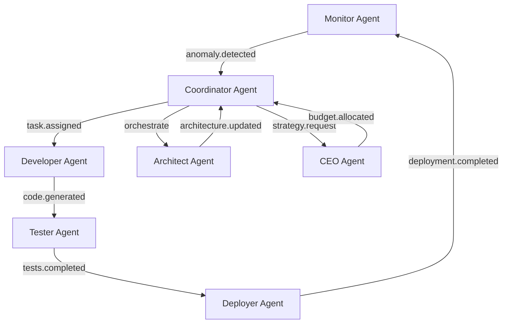

# Self-Healing Integration Manifest
# 自我修復跨維度整合清單

**版本 / Version**: 1.0.0  
**狀態 / Status**: ACTIVE  
**更新時間 / Updated**: 2025-12-11T12:58:00Z  
**適用範圍 / Scope**: SynergyMesh Governance Dimensions (00-40) + Self-Healing Framework

---

## 🎯 Integration Overview (整合概覽)

本文檔定義自我修復系統 (Self-Healing System) 與 SynergyMesh 治理維度 (Governance Dimensions 00-39) 的整合點、數據流和依賴關係。

### Core Integration Principles (核心整合原則)

```yaml
integration_principles:
  responsibility_clarity:
    - "AI 100% 自主運營層"
    - "人類 100% 控制戰略層"
    
  instant_execution:
    - "< 1 秒理解"
    - "2-3 分鐘完整堆疊部署"
    - "< 45 秒自我修復 MTTR"
    
  zero_manual_intervention:
    - "完全自動化部署"
    - "自我修復與演化"
    - "持續監控與優化"
    
  continuous_evolution:
    - "事件驅動 (非週期性)"
    - "實時監控與決策"
    - "自動化持續改進"
```

---

## 🔗 Dimension Integration Points (維度整合點)

### 00 - Vision & Strategy (願景與戰略)

```yaml
dimension_00:
  name: "Vision & Strategy"
  path: "governance/00-vision-strategy"
  
  integration_files:
    ai_behavior_contract:
      file: "AI-BEHAVIOR-CONTRACT.md"
      purpose: "定義 AI 責任邊界與行為準則"
      integrates_with:
        - "7 AI Agents (所有)"
        - "AI Agents Orchestrator"
      
    instant_execution_manifest:
      file: "INSTANT-EXECUTION-MANIFEST.yaml"
      purpose: "定義即時執行標準與性能基線"
      integrates_with:
        - "Deployer Agent"
        - "Monitor Agent"
        - "Coordinator Agent"
      
    autonomous_agent_state:
      file: "AUTONOMOUS_AGENT_STATE.md"
      purpose: "Machine-readable 專案狀態索引"
      integrates_with:
        - "所有 AI Agents (狀態查詢)"
        - "Island Orchestrator (狀態更新)"
  
  ai_agents_involved:
    - "CEO Agent (戰略決策)"
    - "Coordinator Agent (協調執行)"
  
  api_endpoints:
    - endpoint: "/api/vision/strategy"
      method: "GET"
      description: "獲取戰略目標與願景"
      
    - endpoint: "/api/vision/state"
      method: "GET"
      description: "獲取專案當前狀態"
```

### 14 - Improvement & Learning (改進與學習)

```yaml
dimension_14:
  name: "Improvement & Learning"
  path: "governance/14-improvement"
  
  integration_files:
    self_healing_framework:
      file: "self-healing-improvement.yaml"
      purpose: "自我修復框架定義"
      integrates_with:
        - "Monitor Agent (異常檢測)"
        - "Coordinator Agent (修復協調)"
        - "Deployer Agent (自動部署修復)"
      
    improvement_policy:
      file: "improvement-policy.yaml"
      purpose: "持續改進政策"
      integrates_with:
        - "Architect Agent (架構改進)"
        - "Developer Agent (代碼優化)"
  
  ai_agents_involved:
    - "Monitor Agent (監控分析)"
    - "Architect Agent (架構優化)"
    - "Coordinator Agent (改進協調)"
  
  api_endpoints:
    - endpoint: "/api/improvement/heal"
      method: "POST"
      description: "觸發自我修復流程"
      request_body:
        issue_type: "string"
        severity: "low|medium|high|critical"
      
    - endpoint: "/api/improvement/metrics"
      method: "GET"
      description: "獲取改進指標"
  
  event_subscriptions:
    - event: "anomaly.detected"
      handler: "Monitor Agent → Self-Healing Workflow"
      
    - event: "remediation.completed"
      handler: "Coordinator Agent → Learning Update"
```

### 28 - Tests & Validation (測試與驗證)

```yaml
dimension_28:
  name: "Tests & Validation"
  path: "governance/28-tests"
  
  integration_files:
    validation_script:
      file: "self-healing-validation.py"
      purpose: "驗證自我修復整合完整性"
      integrates_with:
        - "Tester Agent (測試執行)"
        - "Coordinator Agent (結果彙總)"
  
  ai_agents_involved:
    - "Tester Agent (測試執行)"
    - "Coordinator Agent (測試協調)"
  
  api_endpoints:
    - endpoint: "/api/tests/validate"
      method: "POST"
      description: "執行驗證測試套件"
      
    - endpoint: "/api/tests/results"
      method: "GET"
      description: "獲取測試結果"
  
  validation_checks:
    - "配置文件語法正確性"
    - "AI Agents 健康狀態"
    - "API 端點可訪問性"
    - "性能基線符合性"
    - "集成測試覆蓋率 > 80%"
```

### 30 - Integration & Coordination (整合與協調)

```yaml
dimension_30:
  name: "Integration & Coordination"
  path: "governance/30-integration"
  
  integration_files:
    integration_manifest:
      file: "self-healing-integration.md"
      purpose: "本文檔，定義跨維度整合"
      integrates_with:
        - "所有 AI Agents"
        - "AI Agents Orchestrator"
  
  ai_agents_involved:
    - "Coordinator Agent (協調中樞)"
    - "Architect Agent (整合設計)"
  
  api_endpoints:
    - endpoint: "/api/integration/status"
      method: "GET"
      description: "獲取整合狀態"
      
    - endpoint: "/api/integration/dimensions"
      method: "GET"
      description: "列出所有整合維度"
  
  coordination_responsibilities:
    - "跨維度事件路由"
    - "Agent 間通信協調"
    - "資源調度與分配"
    - "衝突解決與優先級管理"
```

### 39 - Automation & Orchestration (自動化與編排)

```yaml
dimension_39:
  name: "Automation & Orchestration"
  path: "governance/39-automation"
  
  integration_files:
    integration_engine:
      file: "self-healing-engine.py"
      purpose: "整合引擎主程序"
      integrates_with:
        - "AI Agents Orchestrator (v2-multi-agents)"
        - "所有 7 AI Agents"
        - "Governance Dimensions (00-39)"
  
  ai_agents_involved:
    - "Deployer Agent (部署自動化)"
    - "Coordinator Agent (編排協調)"
  
  api_endpoints:
    - endpoint: "/api/automation/deploy"
      method: "POST"
      description: "觸發自動化部署"
      
    - endpoint: "/api/automation/orchestrate"
      method: "POST"
      description: "執行編排任務"
      request_body:
        task_type: "deploy|monitor|heal|analyze"
        task_params: "object"
  
  automation_capabilities:
    - "完整堆疊自動化部署 (< 3 分鐘)"
    - "CI/CD pipeline 自動化"
    - "自動擴展與縮容"
    - "自動化回滾與恢復"
```

---

## 🤖 AI Agents Integration Matrix (AI Agents 整合矩陣)

### CEO Agent (戰略決策)

```yaml
ceo_agent:
  type: "ceo_agent"
  authority_level: "STRATEGIC"
  location: "ai-agents-executive/"
  
  integrated_dimensions:
    - "00-vision-strategy"
    - "10-stakeholder"
    - "15-economic"
  
  responsibilities:
    - "商業戰略制定"
    - "資源預算分配"
    - "利益相關者管理"
  
  api_endpoints:
    - endpoint: "/api/ceo/strategy"
      method: "GET/POST"
      description: "戰略決策 API"
  
  event_publications:
    - "strategy.updated"
    - "budget.allocated"
    - "stakeholder.decision"
  
  event_subscriptions:
    - "system.critical_failure"
    - "compliance.violation"
```

### Architect Agent (架構設計)

```yaml
architect_agent:
  type: "architect_agent"
  authority_level: "TACTICAL"
  location: "ai-agents/src/architect"
  
  integrated_dimensions:
    - "01-architecture"
    - "14-improvement"
    - "30-integration"
  
  responsibilities:
    - "系統架構設計與優化"
    - "技術棧選擇"
    - "架構改進建議"
  
  api_endpoints:
    - endpoint: "/api/architect/design"
      method: "POST"
      description: "架構設計 API"
  
  event_publications:
    - "architecture.updated"
    - "improvement.proposed"
  
  event_subscriptions:
    - "performance.degradation"
    - "scalability.issue"
```

### Developer Agent (代碼實現)

```yaml
developer_agent:
  type: "developer_agent"
  authority_level: "OPERATIONAL"
  location: "ai-agents/src/developer"
  
  integrated_dimensions:
    - "03-change"
    - "14-improvement"
    - "39-automation"
  
  responsibilities:
    - "代碼生成與重構"
    - "Bug 修復"
    - "功能實現"
  
  api_endpoints:
    - endpoint: "/api/developer/generate"
      method: "POST"
      description: "代碼生成 API"
  
  event_publications:
    - "code.generated"
    - "refactoring.completed"
  
  event_subscriptions:
    - "feature.requested"
    - "bug.reported"
```

### Tester Agent (質量保證)

```yaml
tester_agent:
  type: "tester_agent"
  authority_level: "OPERATIONAL"
  location: "ai-agents/src/tester"
  
  integrated_dimensions:
    - "28-tests"
    - "05-compliance"
    - "06-security"
  
  responsibilities:
    - "自動化測試生成與執行"
    - "質量驗證"
    - "覆蓋率分析"
  
  api_endpoints:
    - endpoint: "/api/tester/test"
      method: "POST"
      description: "測試執行 API"
  
  event_publications:
    - "tests.completed"
    - "coverage.reported"
  
  event_subscriptions:
    - "code.generated"
    - "deployment.triggered"
```

### Deployer Agent (部署管理)

```yaml
deployer_agent:
  type: "deployer_agent"
  authority_level: "OPERATIONAL"
  location: "ai-agents/deployment/deployment"
  
  integrated_dimensions:
    - "39-automation"
    - "03-change"
    - "04-risk"
  
  responsibilities:
    - "CI/CD 自動化"
    - "部署編排"
    - "回滾管理"
  
  api_endpoints:
    - endpoint: "/api/deployer/deploy"
      method: "POST"
      description: "部署執行 API"
  
  event_publications:
    - "deployment.started"
    - "deployment.completed"
    - "deployment.failed"
  
  event_subscriptions:
    - "tests.completed"
    - "approval.granted"
```

### Monitor Agent (監控分析)

```yaml
monitor_agent:
  type: "monitor_agent"
  authority_level: "OPERATIONAL"
  location: "ai-agents/deployment/monitoring"
  
  integrated_dimensions:
    - "14-improvement"
    - "09-performance"
    - "04-risk"
  
  responsibilities:
    - "實時性能監控"
    - "異常檢測"
    - "告警管理"
  
  api_endpoints:
    - endpoint: "/api/monitor/metrics"
      method: "GET"
      description: "指標查詢 API"
  
  event_publications:
    - "anomaly.detected"
    - "threshold.breached"
    - "service.unhealthy"
  
  event_subscriptions:
    - "deployment.completed"
    - "system.started"
```

### Coordinator Agent (協調器)

```yaml
coordinator_agent:
  type: "coordinator_agent"
  authority_level: "OPERATIONAL"
  location: "ai-agents/orchestrator"
  
  integrated_dimensions:
    - "30-integration"
    - "39-automation"
    - "所有維度 (協調中樞)"
  
  responsibilities:
    - "多 Agent 協調"
    - "任務分發與調度"
    - "資源管理"
  
  api_endpoints:
    - endpoint: "/api/coordinator/orchestrate"
      method: "POST"
      description: "協調執行 API"
  
  event_publications:
    - "task.assigned"
    - "coordination.completed"
  
  event_subscriptions:
    - "所有其他 Agents 的事件"
```

---

## 📊 Data Flow & Dependencies (數據流與依賴關係)

### Cross-Dimension Event Flow



### API Dependency Graph

```yaml
api_dependencies:
  coordinator_api:
    depends_on:
      - "agents_orchestrator_api"
      - "all_agent_apis"
    provides:
      - "unified_orchestration_endpoint"
      - "cross_dimension_coordination"
  
  monitor_api:
    depends_on:
      - "prometheus_api"
      - "grafana_api"
    provides:
      - "real_time_metrics"
      - "anomaly_detection"
  
  deployer_api:
    depends_on:
      - "kubernetes_api"
      - "docker_registry"
      - "github_api"
    provides:
      - "automated_deployment"
      - "rollback_capability"
```

---

## 🔐 Security & Compliance (安全與合規)

```yaml
security_integration:
  authentication:
    method: "JWT + API Keys"
    token_expiry: "1 hour"
    refresh_policy: "Automatic"
    
  authorization:
    model: "RBAC (Role-Based Access Control)"
    roles:
      strategic_level:
        - "CEO Agent"
        - "Human Administrators"
      tactical_level:
        - "Architect Agent"
      operational_level:
        - "Developer Agent"
        - "Tester Agent"
        - "Deployer Agent"
        - "Monitor Agent"
        - "Coordinator Agent"
  
  audit_logging:
    location: "governance/07-audit/self-healing-audit.log"
    retention: "90 days"
    events_logged:
      - "All API calls"
      - "Agent decisions"
      - "Configuration changes"
      - "Deployment actions"
  
  compliance:
    dimensions:
      - "05-compliance"
      - "06-security"
    validations:
      - "GDPR compliance (data privacy)"
      - "SOC 2 Type II (security controls)"
      - "ISO 27001 (information security)"
```

---

## 📈 Performance Baselines (性能基線)

```yaml
performance_sla:
  understanding_time:
    target: "< 1 second"
    measured_by: "AUTONOMOUS_AGENT_STATE.md load time"
    
  full_stack_deployment:
    target: "2-3 minutes"
    measured_by: "make deploy-self-healing"
    
  self_healing_mttr:
    target: "< 45 seconds"
    measured_by: "anomaly detection → recovery verification"
    
  api_response_time:
    target: "< 200ms (p95)"
    measured_by: "HTTP request → response"
    
  agent_coordination_latency:
    target: "< 100ms"
    measured_by: "Agent A → Agent B communication"
  
  event_propagation:
    target: "< 5 seconds"
    measured_by: "Event publish → All subscribers notified"
```

---

## ✅ Integration Validation Checklist (整合驗證清單)

```yaml
validation_checklist:
  configuration:
    - "所有 YAML 文件語法正確"
    - "Python 腳本無語法錯誤"
    - "API 端點定義完整"
    
  connectivity:
    - "7 AI Agents 全部可達 (HTTP 200)"
    - "AI Agents Orchestrator 可訪問"
    - "跨維度事件流暢通"
    
  functionality:
    - "自動化部署流程完整"
    - "自我修復機制有效"
    - "監控告警正常工作"
    - "協調任務正確執行"
    
  performance:
    - "理解時間 < 1 秒"
    - "部署時間 < 3 分鐘"
    - "MTTR < 45 秒"
    - "API 響應 < 200ms p95"
    
  security:
    - "所有 API 需要認證"
    - "審計日誌正確記錄"
    - "權限控制生效"
```

---

## 🔄 Continuous Improvement (持續改進)

```yaml
improvement_loop:
  measurement:
    frequency: "REAL-TIME (continuous)"
    metrics:
      - "Integration health score"
      - "Agent coordination efficiency"
      - "Cross-dimension event latency"
      - "Overall system performance"
  
  analysis:
    triggers:
      - "Performance degradation > 10%"
      - "Error rate > 1%"
      - "Coordination failures"
    
    tools:
      - "AI-powered anomaly detection"
      - "Statistical trend analysis"
  
  action:
    automated:
      - "Configuration tuning"
      - "Resource reallocation"
      - "Threshold adjustment"
    
    human_required:
      - "Architecture refactoring"
      - "Major version upgrades"
      - "Security policy changes"
```

---

## 📞 Support & Contact (支援與聯絡)

```yaml
support:
  automated:
    level: "AI-powered self-service"
    response_time: "< 1 second"
    contact: "Coordinator Agent API"
    
  human:
    level: "Strategic escalations only"
    response_time: "< 1 hour (business hours)"
    contact: "synergymesh-self-healing@example.com"
    
  documentation:
    location: "governance/29-docs/self-healing/"
    format: "Markdown + YAML"
    update_frequency: "Continuous (Git-based)"
```

---

**狀態 / Status**: 🟢 ACTIVE  
**維護者 / Maintainer**: SynergyMesh Unmanned Island Team  
**審查週期 / Review Cycle**: Monthly  
**最後更新 / Last Updated**: 2025-12-11T12:16:00Z  
**下次審查 / Next Review**: 2026-01-11
