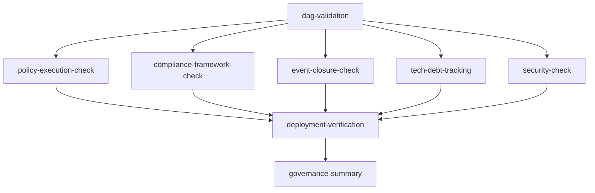

# CI Pipeline Refactoring Guide | CI 管線重構指南

> **Version**: 2.0.0 | **Last Updated**: 2025-12-12

## 📋 Overview | 概述

This guide documents the refactoring of SynergyMesh's CI pipeline from 74 fragmented
workflows to a streamlined 24-workflow system.

本指南記錄了 SynergyMesh CI 管線從 74 個碎片化工作流重構為 24 個精簡工作流的過程。

---

## 🎯 Goals | 目標

### Problems Addressed | 解決的問題

1. **Fragmentation (碎片化)**: 74 active workflows → 24 streamlined workflows
2. **Overlap (重疊)**: Removed 50 redundant/overlapping workflows
3. **Traceability (可追溯性)**: Clear core workflows (01-08) + governance CI
4. **Cost (成本)**: ~68% reduction in workflow count

### Final State | 最終狀態

| Before | After | Reduction |
|--------|-------|-----------|
| 74 active workflows | 24 workflows | -68% |
| Fragmented governance checks | Single `governance-closed-loop-ci.yml` | Centralized |
| Overlapping security scans | Consolidated `06-security-scan.yml` | Simplified |
| Multiple validation workflows | Unified `01-validate.yml` | Streamlined |

---

## 📊 Final Workflow Structure | 最終工作流結構

### Core Workflows (24 total) | 核心工作流

| # | Workflow | Purpose |
|---|----------|---------|
| 1 | `01-validate.yml` | Lint and format validation |
| 2 | `02-test.yml` | Multi-language test suite |
| 3 | `03-build.yml` | Build matrix (TS/Rust/Go/Java) |
| 4 | `04-deploy-staging.yml` | Staging deployment |
| 5 | `05-deploy-production.yml` | Production deployment |
| 6 | `06-security-scan.yml` | Security scanning |
| 7 | `07-dependency-update.yml` | Dependency updates |
| 8 | `08-sync-subdirs.yml` | Subdirectory sync |
| 9 | `auto-vulnerability-fix.yml` | Auto security fixes |
| 10 | `codeql.yml` | CodeQL analysis |
| 11 | `copilot-setup-steps.yml` | Copilot integration |
| 12 | `governance-closed-loop-ci.yml` | Governance checks (7 jobs) |
| 13 | `island-ai-setup-steps.yml` | Island AI setup |
| 14 | `label.yml` | PR labeling |
| 15 | `pr-security-gate.yml` | PR security checks |
| 16 | `release.yml` | Release management |
| 17 | `reusable-ci.yml` | Reusable CI pipeline |
| 18 | `reusable-docker-build.yml` | Reusable Docker build |
| 19 | `reusable-setup.yml` | Reusable setup |
| 20 | `reusable-validation.yml` | Reusable validation |
| 21 | `secret-bypass-request.yml` | Secret bypass handling |
| 22 | `secret-protection.yml` | Secret protection |
| 23 | `stale.yml` | Stale PR management |
| 24 | `static.yml` | Static site deployment |

### Deleted Workflows (50 total) | 已刪除工作流

The following workflows were removed as redundant or low-value:

- `eslint.yml` - Covered by `01-validate.yml`
- `docs-lint.yml` - Covered by `01-validate.yml`
- `validate-yaml.yml` - Covered by governance CI
- `python-validation.yml` - Covered by `02-test.yml`
- `language-check.yml` - Covered by `01-validate.yml`
- `governance-validation.yml` - Consolidated into governance CI
- `gac-validation.yml` - Consolidated into governance CI
- `conftest-validation.yml` - Consolidated into governance CI
- `policy-simulate.yml` - Consolidated into governance CI
- `arch-governance-validation.yml` - Consolidated into governance CI
- `compliance-report.yml` - Consolidated into governance CI
- `gac-auto-sync.yml` - Low value
- `ci-auto-comment.yml` - Overly complex
- `ci-cost-dashboard.yml` - Not essential
- `ci-failure-auto-solution.yml` - Overly complex
- `dynamic-ci-assistant.yml` - Overly complex
- `interactive-ci-service.yml` - Not essential
- `autonomous-ci-guardian.yml` - Overly complex
- `self-healing-ci.yml` - Redundant
- `extreme-problem-identification.yml` - Low value
- `language-governance.yml` - Overly complex
- `language-governance-dashboard.yml` - Low value
- `env-setup.yml` - Covered by reusable workflows
- `dependency-manager-ci.yml` - Covered by `07-dependency-update.yml`
- `project-self-awareness.yml` - Low value
- `project-self-awareness-nightly.yml` - Low value
- `auto-update-knowledge-graph.yml` - Low value
- `mndoc-knowledge-graph.yml` - Low value
- `update-refactor-playbooks.yml` - Low value
- `system-evolution.yml` - Low value
- `autofix-bot.yml` - Low value
- `auto-review-merge.yml` - Not essential
- `monorepo-dispatch.yml` - Low value
- `phase1-integration.yml` - Outdated
- `integration-deployment.yml` - Covered by deploy workflows
- `validate-ai-behavior-contract.yml` - Low value
- `validate-copilot-instructions.yml` - Low value
- `validate-island-ai-instructions.yml` - Low value
- `build-linux.yml` - Covered by `03-build.yml`
- `build-macos.yml` - Covered by `03-build.yml`
- `build-windows.yml` - Covered by `03-build.yml`
- `osv-scanner.yml` - Covered by `06-security-scan.yml`
- `snyk-security.yml` - Covered by `06-security-scan.yml`
- `core-services-ci.yml` - Covered by main workflows
- `contracts-cd.yml` - Covered by main workflows
- `mcp-servers-cd.yml` - Covered by main workflows
- `project-cd.yml` - Covered by main workflows
- `create-staging-branch.yml` - Low value
- `delete-staging-branches.yml` - Low value
- `setup-runner.yml` - Not essential

---

## 🏗️ New Governance Closed-Loop CI | 新治理閉環 CI

The new `governance-closed-loop-ci.yml` consolidates all governance checks into 7 core
jobs:

### Job Structure | 工作結構

```
governance-closed-loop-ci.yml
├── 1️⃣ dag-validation         # DAG 驗證
├── 2️⃣ policy-execution-check  # 策略執行檢查
├── 3️⃣ compliance-framework    # 合規框架檢查
├── 4️⃣ event-closure-check    # 事件閉環檢查
├── 5️⃣ tech-debt-tracking     # 技術債務追蹤
├── 6️⃣ security-check         # 安全檢查
├── 7️⃣ deployment-verification # 部署驗證
└── 📊 governance-summary      # 摘要報告
```

### Job Dependencies | 工作依賴



### What Each Job Checks | 各工作檢查內容

| Job | Checks | Failure Criteria |
|-----|--------|------------------|
| DAG Validation | Circular dependencies, missing deps, orphans | Cycles detected |
| Policy Execution | Required dimensions have structure | Missing config files |
| Compliance Framework | ISO-42001, NIST-AI-RMF coverage | Blocking controls not implemented |
| Event Closure | Causal chain completeness | Bootstrap files missing |
| Tech Debt Tracking | TODO/FIXME/DEBT markers | Informational only |
| Security Check | SBOM, attestations, SLSA level | Missing security artifacts |
| Deployment Verification | All artifacts ready | Index/config missing |

---

## 📅 Migration Status | 遷移狀態

### ✅ Completed | 已完成

- [x] Create `governance-closed-loop-ci.yml` with 7 core governance jobs
- [x] Create `CI_REFACTORING_GUIDE.md`
- [x] Delete 50 redundant/low-value workflows
- [x] Reduce workflow count from 74 to 24 (-68%)
- [x] Update documentation references

### Future Considerations | 未來考量

- [ ] Monitor CI performance with streamlined workflows
- [ ] Evaluate need for additional reusable workflows
- [ ] Consider further consolidation if needed

---

## 📈 Results | 成果

| Metric | Before | After | Improvement |
|--------|--------|-------|-------------|
| Active workflows | 74 | 24 | -68% |
| Governance checks | 6+ fragmented | 1 unified (7 jobs) | Centralized |
| Security scans | 4+ overlapping | 2 consolidated | Simplified |
| Validation workflows | 8+ redundant | 1 unified | Streamlined |
| CI complexity | High | Low | Simplified |

---

## 🔧 How to Use | 使用方式

### Running Governance CI Manually

```bash
# Via GitHub Actions UI
# Go to Actions > Governance Closed-Loop CI > Run workflow

# With full scan enabled
# Set full_scan: true in workflow dispatch inputs
```

### Adding New Governance Checks

1. Add new job to `governance-closed-loop-ci.yml`
2. Add to job dependencies if needed
3. Update summary job to include new check
4. Document in this guide

### Marking Workflows for Deprecation

Add this header to deprecated workflow files:

```yaml
# =============================================================================
# ⚠️ DEPRECATED - This workflow is scheduled for removal
# =============================================================================
# Replacement: governance-closed-loop-ci.yml
# Migration deadline: 2026-03-31
# See: governance/CI_REFACTORING_GUIDE.md
# =============================================================================
```

---

## 📚 Related Documentation | 相關文檔

- [Governance README](./README.md)
- [Governance Index](./governance-index.json)
- [Dimensions Index](./index/dimensions.json)
- [Compliance Index](./index/compliance.json)
- [Workflow README](../WORKFLOW_README.md)

---

## 📝 Changelog | 變更日誌

| Date | Version | Changes |
|------|---------|---------|
| 2025-12-12 | 1.0.0 | Initial CI refactoring guide |

---

**Owner**: DevOps Team  
**Last Updated**: 2025-12-12
