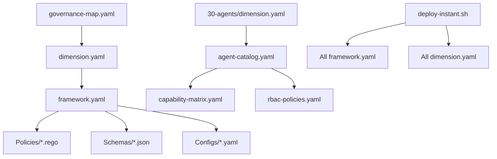

# Governance 檔案內容結構深度分析報告

# Deep Analysis: Governance File Content Structure

> **分析日期 (Analysis Date)**: 2025-12-12  
> **版本 (Version)**: 2.0.0  
> **分析範圍 (Scope)**: `./governance` 實際檔案內容結構  
> **分析者 (Analyzer)**: Unmanned Island Agent  
> **基於 (Based on)**: DEEP_ANALYSIS_GOVERNANCE_STRUCTURE.md

---

## 📋 執行摘要 (Executive Summary)

本報告延伸 `DEEP_ANALYSIS_GOVERNANCE_STRUCTURE.md`，深入分析 SynergyMesh
Governance 子專案的**實際檔案內容結構**。著重於檔案格式模式、內容組織、資料結構、整合介面及最佳實踐，提供開發者與維護者完整的檔案內容規範參考。

### 關鍵統計 (Key Statistics)

| 檔案類型      | 數量 | 主要用途                    | 關鍵範例                                              |
| ------------- | ---- | --------------------------- | ----------------------------------------------------- |
| **YAML**      | 377  | 配置、元數據、註冊表        | dimension.yaml, framework.yaml, agent-catalog.yaml    |
| **YAML (短)** | 5    | 簡短配置                    | docker-compose.yml, CI 整合                           |
| **Rego**      | 183  | 策略即代碼 (Policy as Code) | security-policy.rego, agent-policy.rego               |
| **JSON**      | 146  | Schema 定義、結構化資料     | vulnerability.schema.json, technical-debt-report.json |
| **Markdown**  | 171  | 文檔、指南                  | README.md, INTEGRATION_ARCHITECTURE.md                |
| **Python**    | 90   | 自動化腳本、工具            | technical_debt_manager.py, instant-governance-cli.py  |
| **目錄數**    | 282  | 分層組織                    | 80+ 治理維度 + 共享資源                               |

### 核心檔案內容模式 (Core Content Patterns)

```
governance/
├── 📄 dimension.yaml        # 維度元數據與介面定義
├── 📄 framework.yaml        # 框架配置與架構定義
├── 📄 governance-map.yaml   # 中央註冊表與依賴圖
├── 📄 technical-debt-report.json  # 結構化債務追蹤
├── 📄 deploy-instant.sh     # 編排部署流程
└── 📁 {nn-dimension}/       # 維度內部結構
    ├── dimension.yaml       # 維度元數據
    ├── framework.yaml       # 框架配置
    ├── README.md           # 維度文檔
    └── {subfolders}/       # 功能子目錄
```

---

## 🗂️ 一、核心檔案內容結構 (Core File Content Structures)

### 1.1 dimension.yaml - 維度元數據定義

**用途**: 每個治理維度的元數據、介面與依賴定義

**標準結構**:

```yaml
apiVersion: governance.synergymesh.io/v2
kind: DimensionModule
metadata:
  id: { nn-dimension-name } # 唯一識別碼
  name: { 中文名稱 } # 中文顯示名稱
  name_en: { English Name } # 英文顯示名稱
  version: 1.0.0 # 語義化版本
  created_at: '2025-12-11T22:17:20.909717Z'
  updated_at: '2025-12-11T22:17:20.909723Z'
  owner: governance-bot # 所有者
  category: { strategic|orchestration|execution|observability|feedback }
  tags:
    - { tag1 }
    - { tag2 }

spec:
  description: '{描述此維度的目的與範圍}'

  schema:
    path: ./schema.json # Schema 檔案路徑
    format: json-schema # Schema 格式
    validation: optional|required # 驗證強度

  policy:
    path: ./policy.rego # 策略檔案路徑
    engine: opa # 策略引擎
    enforcement: optional|required # 執行強度

  dependencies:
    required: [] # 必需依賴
    optional: [] # 可選依賴

  interface:
    inputs:
      - name: config
        type: object
        required: true
    outputs:
      - name: result
        type: object
```

**實際範例** (30-agents/dimension.yaml):

```yaml
apiVersion: governance.synergymesh.io/v2
kind: DimensionModule
metadata:
  id: 30-agents
  name: 代理治理
  name_en: Agents Governance
  version: 1.0.0
  created_at: '2025-12-11T22:17:20.939047Z'
  updated_at: '2025-12-11T22:17:20.939053Z'
  owner: governance-bot
  category: execution
  tags:
    - 30_agents
    - execution
```

**關鍵欄位說明**:

- `apiVersion`: 使用 `governance.synergymesh.io/v2` 統一 API 版本
- `kind`: 固定為 `DimensionModule`
- `metadata.id`: 必須與目錄名稱匹配 (例: `30-agents`)
- `metadata.category`: 對應 5 層架構 (strategic/orchestration/execution/observability/feedback)
- `spec.schema.validation`: `required` 強制驗證, `optional` 寬鬆模式
- `spec.policy.enforcement`: `required` 強制執行, `optional` 建議執行

---

### 1.2 framework.yaml - 框架配置定義

**用途**: 定義維度的架構、元件、策略類別、工具、指標與整合

**標準結構**:

```yaml
---
# Framework Configuration
# 框架配置

metadata:
  name: '{Framework Name}'
  version: '1.0.0'
  description: '{描述框架的目的與範圍}'
  owner: '{Team Name}'
  created_at: '2025-12-11'
  updated_at: '2025-12-11'

# Framework Architecture
architecture:
  layers:
    { layer_name }:
      description: '{層級描述}'
      components:
        - { component1 }
        - { component2 }

# Policy Categories (for Policy frameworks)
policy_categories:
  { category_name }:
    description: '{類別描述}'
    policies:
      - { policy1 }
      - { policy2 }

# Tools & Integration
tools:
  policy_engine: '{engine_name}'
  validation_tools:
    - { tool1 }
    - { tool2 }

# Metrics
metrics:
  { metric_name }:
    description: '{指標描述}'
    type: '{counter|gauge|histogram}'
    unit: '{單位}'

# Integrations
integrations:
  external_systems:
    - name: '{system_name}'
      type: '{integration_type}'
      config: '{config_path}'
```

**實際範例** (10-policy/framework.yaml):

```yaml
---
# PaC Framework Configuration
# Policy as Code 框架配置

metadata:
  name: 'PaC Framework'
  version: '1.0.0'
  description: 'Enterprise Policy as Code governance framework'
  owner: 'Policy Governance Team'
  created_at: '2025-12-11'
  updated_at: '2025-12-11'

# Framework Architecture
architecture:
  layers:
    strategy_layer:
      description: '策略層 - 定義高階治理規則與合規政策'
      components:
        - base_policies
        - domain_policies
        - compliance_standards

    orchestration_layer:
      description: '協調層 - 策略閘與執行協調'
      components:
        - policy_gates
        - policy_engine
        - suppress_manager

    execution_layer:
      description: '執行層 - 實際策略驗證與執行'
      components:
        - opa_runtime
        - conftest
        - custom_validators

    observability_layer:
      description: '觀測層 - 監控、審計與度量'
      components:
        - policy_metrics
        - audit_logs
        - compliance_reports
```

**實際範例** (30-agents/framework.yaml):

```yaml
---
# AI Agent Governance Framework
# AI Agent 治理框架配置

metadata:
  name: 'AI Agent Governance Framework'
  version: '1.0.0'
  description: 'Comprehensive AI Agent lifecycle and governance management'
  owner: 'AI Agent Governance Team'
  created_at: '2025-12-11'
  updated_at: '2025-12-11'

# Lifecycle Management
lifecycle:
  stages:
    development:
      - design
      - training
      - testing
      - validation

    deployment:
      approval_required: true
      source_verification: true
      permission_assignment: true
      health_check: true

    operation:
      continuous_monitoring: true
      performance_tracking: true
      behavior_analysis: true
      auto_scaling: true

    maintenance:
      version_updates: true
      retraining: true
      configuration_tuning: true

    retirement:
      data_deletion: true
      permission_revocation: true
      audit_archival: true

# Permission Model
permission_model:
  type: 'least_privilege'
  enforcement: 'mandatory'

  capabilities:
    read:
      - config/*
      - governance/*
    write:
      - reports/*
      - logs/*
    execute:
      - automation.*
```

**關鍵模式**:

- 每個框架根據其特性定義不同的結構 (architecture, lifecycle,
  permission_model 等)
- 使用分層架構 (layers) 組織複雜系統
- 包含明確的 metadata 用於追蹤與審計
- 整合工具與外部系統通過 `tools` 與 `integrations` 區塊

---

### 1.3 governance-map.yaml - 中央註冊表與依賴圖

**用途**: 整體治理結構的中央註冊表，定義所有維度、依賴關係與狀態

**標準結構**:

```yaml
apiVersion: governance.synergymesh.io/v2
kind: GovernanceStructureMap
metadata:
  name: governance-structure-registry
  version: 1.1.0
  created_at: '2025-12-11T21:54:00Z'
  updated_at: '2025-12-12T12:02:00Z'
  owner: governance-bot
  description:
    Central registry of all governance directories and their relationships

validation_rules:
  numbered_directories:
    pattern: ^\d{2}-[a-z-]+$
    purpose: Single governance dimension assets only
    required_files:
      - dimension.yaml

  unnumbered_directories:
    purpose: Cross-dimensional shared resources
    naming_convention: semantic names or prefixes (shared-, platform-, infra-)

  migration_deadline: '2026-03-31'

dimensions:
  - name: { nn-dimension-name }
    type: dimension|shared
    category: strategic|orchestration|execution|observability|feedback
    owner: { team-name }
    path: governance/{nn-dimension-name}
    depends_on:
      - { dependency1 }
      - { dependency2 }
    purpose: '{描述維度的目的}'
    status: active|deprecated|migrating
    execution: optional|required
```

**實際範例片段**:

```yaml
dimensions:
  - name: 00-vision-strategy
    type: dimension
    category: strategic
    owner: governance-team
    path: governance/00-vision-strategy
    depends_on:
      - 01-architecture
      - 23-policies
    purpose: Vision, strategy, and long-term planning governance
    status: active

  - name: 30-agents
    type: dimension
    category: execution
    owner: ai-agent-team
    path: governance/30-agents
    depends_on:
      - 10-policy
      - 20-intent
      - 37-behavior-contracts
    purpose: AI Agent lifecycle and governance management
    status: active
    execution: required

  - name: 60-contracts
    type: dimension
    category: observability
    owner: contract-team
    path: governance/60-contracts
    depends_on:
      - 30-agents
    purpose: Contract verification and observability
    status: active
```

**關鍵功能**:

- 提供整體治理圖譜的單一事實來源 (Single Source of Truth)
- 定義維度之間的依賴關係 (`depends_on`)
- 追蹤維度狀態 (`active`, `deprecated`, `migrating`)
- 驗證規則確保結構一致性

---

## 🤖 二、AI Agent 治理檔案結構 (AI Agent Governance Files)

### 2.1 agent-catalog.yaml - Agent 註冊表

**用途**: 中央化的 AI
Agent 註冊表，記錄所有 Agent 的生命週期、權限、資源限制與合規資訊

**標準結構**:

```yaml
---
# AI Agent Catalog - Central Registry
# AI Agent 目錄 - 中央註冊表

metadata:
  name: 'AI Agent Catalog'
  version: '1.0.0'
  description: 'Central registry for all AI agents in SynergyMesh system'
  owner: 'AI Agent Governance Team'
  created_at: '2025-12-11'
  updated_at: '2025-12-11'

# Agent Registry
agents:
  - agent_id: '{unique-agent-id}'
    name: '{Agent Display Name}'
    description: '{Agent 的功能描述}'
    version: '{semantic_version}'
    status: active|inactive|deprecated

    # Lifecycle
    lifecycle:
      stage: development|testing|staging|production
      deployed_at: '{ISO8601_timestamp}'
      last_updated: '{ISO8601_timestamp}'
      next_review: '{ISO8601_timestamp}'

    # Owner & Responsibility
    ownership:
      team: '{Owning Team}'
      owner: '{Primary Owner}'
      contact: '{contact_email}'
      on_call: '{on_call_team}'

    # Capabilities
    capabilities:
      - capability1
      - capability2

    # Permissions (RBAC)
    permissions:
      read:
        - 'path/pattern1'
        - 'path/pattern2'
      write:
        - 'path/pattern3'
      execute:
        - 'action1'
        - 'action2'

    # Resource Limits
    resource_limits:
      memory: '{memory_limit}'
      cpu: '{cpu_limit}'
      network_bandwidth: '{bandwidth_limit}'
      max_concurrent_tasks: { number }

    # Compliance
    compliance:
      standards:
        - 'ISO/IEC 42001'
        - 'NIST AI RMF'
        - 'AI Behavior Contract'
      audit_frequency: monthly|quarterly|annually
      last_audit: '{ISO8601_date}'
      next_audit: '{ISO8601_date}'

    # Integration
    integrations:
      - name: '{system_name}'
        type: '{integration_type}'
        status: active|inactive

    # Monitoring
    monitoring:
      health_check_endpoint: '{endpoint_url}'
      metrics_endpoint: '{metrics_url}'
      alert_channels:
        - '{channel1}'
        - '{channel2}'

    # Self-Healing
    self_healing:
      enabled: true|false
      auto_restart: true|false
      max_restart_attempts: { number }
      escalation_policy: '{policy_name}'
```

**實際範例** (30-agents/registry/agent-catalog.yaml):

```yaml
agents:
  - agent_id: 'unmanned-island-agent'
    name: 'Unmanned Island Agent'
    description:
      'Intelligent automation agent for the Unmanned Island System platform'
    version: '2.0.0'
    status: 'active'

    # Lifecycle
    lifecycle:
      stage: 'production'
      deployed_at: '2025-12-11T16:00:00Z'
      last_updated: '2025-12-11T16:00:00Z'
      next_review: '2026-03-11T16:00:00Z'

    # Owner & Responsibility
    ownership:
      team: 'SynergyMesh Core Team'
      owner: 'AI Agent Governance Team'
      contact: 'governance@synergymesh.io'
      on_call: 'platform-team'

    # Capabilities
    capabilities:
      - intelligent_automation
      - platform_integration
      - autonomous_operation
      - governance_compliance
      - behavior_contract_enforcement

    # Permissions
    permissions:
      read:
        - 'config/*'
        - 'governance/*'
        - 'core/*'
        - 'automation/*'
      write:
        - 'reports/automation/*'
        - 'logs/agent/*'
      execute:
        - 'automation.deploy'
        - 'automation.monitor'
        - 'automation.heal'

    # Resource Limits
    resource_limits:
      memory: '2GB'
      cpu: '1 core'
      network_bandwidth: '50 Mbps'
      max_concurrent_tasks: 10

    # Compliance
    compliance:
      standards:
        - 'ISO/IEC 42001'
        - 'NIST AI RMF'
        - 'AI Behavior Contract'
      audit_frequency: 'monthly'
      last_audit: '2025-12-11'
      next_audit: '2026-01-11'
```

**關鍵設計模式**:

- **完整生命週期追蹤**: 從開發到退役的每個階段
- **細粒度權限控制**: 基於 RBAC 的讀寫執行權限
- **資源限制**: 防止資源濫用與系統過載
- **合規追蹤**: 符合 ISO 42001, NIST AI RMF 等國際標準
- **可觀測性整合**: 健康檢查、指標、告警

---

### 2.2 capability-matrix.yaml - 能力矩陣

**用途**: 定義 Agent 可用的能力集合與權限映射

**標準結構**:

```yaml
---
# AI Agent Capability Matrix
# AI Agent 能力矩陣

metadata:
  name: 'Agent Capability Matrix'
  version: '1.0.0'
  description:
    'Defines available capabilities and permission mappings for AI agents'

capabilities:
  { capability_name }:
    description: '{能力描述}'
    category: { automation|integration|governance|observability }
    risk_level: low|medium|high|critical

    required_permissions:
      read:
        - '{path_pattern}'
      write:
        - '{path_pattern}'
      execute:
        - '{action}'

    dependencies:
      - '{dependency1}'
      - '{dependency2}'

    compliance_requirements:
      - '{standard1}'
      - '{standard2}'
```

**實際範例**:

```yaml
capabilities:
  intelligent_automation:
    description: 'Automated decision-making and workflow execution'
    category: automation
    risk_level: medium

    required_permissions:
      read:
        - 'config/automation/*'
        - 'governance/39-automation/*'
      write:
        - 'reports/automation/*'
      execute:
        - 'automation.deploy'
        - 'automation.execute'

    dependencies:
      - 'platform_integration'

    compliance_requirements:
      - 'ISO/IEC 42001'
      - 'NIST AI RMF'
```

---

### 2.3 rbac-policies.yaml - RBAC 策略

**用途**: 定義角色基礎存取控制 (Role-Based Access Control) 策略

**標準結構**:

```yaml
---
# RBAC Policies for AI Agents
# AI Agent RBAC 策略

metadata:
  name: 'Agent RBAC Policies'
  version: '1.0.0'

roles:
  { role_name }:
    description: '{角色描述}'
    permissions:
      - capability: '{capability_name}'
        actions:
          - read
          - write
          - execute
        resources:
          - '{resource_pattern}'

    constraints:
      max_resource_usage:
        memory: '{limit}'
        cpu: '{limit}'
      allowed_hours: '{time_range}'

agent_assignments:
  - agent_id: '{agent_id}'
    roles:
      - '{role1}'
      - '{role2}'
```

---

## 📜 三、策略即代碼檔案結構 (Policy as Code Files)

### 3.1 .rego 檔案 - OPA 策略定義

**用途**: 使用 Open Policy Agent (OPA) 語言定義可執行的治理策略

**標準結構**:

```rego
# =============================================================================
# SynergyMesh Governance - {Policy Name}
# {Policy Description}
# =============================================================================

package governance.{policy_domain}

import future.keywords.in
import future.keywords.if
import future.keywords.contains

# =============================================================================
# METADATA
# =============================================================================
metadata := {
    "policy_id": "governance.{policy_domain}",
    "version": "1.0.0",
    "description": "{策略描述}",
    "compliance": ["ISO-27001", "NIST-CSF", "Zero-Trust"]
}

# =============================================================================
# DEFAULT DECISIONS
# =============================================================================
default allow := false
default {decision_name} := false

# =============================================================================
# POLICY RULES
# =============================================================================

allow if {
    {condition1}
    {condition2}
    no_violations
}

{decision_name} if {
    allow
    {additional_condition}
}

# =============================================================================
# HELPER FUNCTIONS
# =============================================================================

no_violations if {
    count(violations) == 0
}

violations[msg] {
    {violation_condition}
    msg := sprintf("Violation: %s", [{description}])
}

# =============================================================================
# COMPLIANCE CHECKS
# =============================================================================

compliant if {
    allow
    meets_standard_requirements
}
```

**實際範例** (23-policies/security-policy.rego):

```rego
# =============================================================================
# SynergyMesh Governance - Security Policy
# Security-focused governance rules
# =============================================================================

package governance.security

import future.keywords.in
import future.keywords.if
import future.keywords.contains

# =============================================================================
# METADATA
# =============================================================================
metadata := {
    "policy_id": "governance.security",
    "version": "1.0.0",
    "description": "Security policy for governance framework",
    "compliance": ["ISO-27001", "NIST-CSF", "Zero-Trust"]
}

# =============================================================================
# DEFAULT DECISIONS
# =============================================================================
default allow := false
default secure := false

# =============================================================================
# SECURITY RULES
# =============================================================================

allow if {
    no_security_violations
    authentication_valid
    authorization_valid
}

secure if {
    allow
    encryption_enabled
    audit_logging_enabled
}
```

**關鍵模式**:

- 使用 `package governance.{domain}` 命名空間組織策略
- `metadata` 提供策略元資訊與合規標準
- `default` 定義安全的預設決策 (通常為拒絕)
- 使用 helper functions 提高可讀性與可維護性
- 支援結構化的違規訊息 (`violations` 集合)

---

## 📐 四、JSON Schema 檔案結構 (JSON Schema Files)

### 4.1 \*.schema.json - 結構化資料驗證

**用途**: 定義資料結構的驗證規則，確保資料一致性

**標準結構**:

```json
{
  "$schema": "http://json-schema.org/draft-07/schema#",
  "$id": "https://synergymesh.dev/schemas/{schema-name}.schema.json",
  "title": "{Schema Title}",
  "description": "{Schema 用途描述}",
  "type": "object",
  "required": ["field1", "field2"],
  "properties": {
    "field1": {
      "type": "string",
      "description": "{欄位描述}",
      "pattern": "^{regex_pattern}$"
    },
    "field2": {
      "type": "string",
      "format": "date-time",
      "description": "{欄位描述}"
    },
    "field3": {
      "type": "string",
      "enum": ["option1", "option2", "option3"],
      "description": "{欄位描述}"
    },
    "field4": {
      "type": "number",
      "minimum": 0,
      "description": "{欄位描述}"
    }
  }
}
```

**實際範例** (31-schemas/vulnerability.schema.json):

```json
{
  "$schema": "http://json-schema.org/draft-07/schema#",
  "$id": "https://synergymesh.dev/schemas/vulnerability.schema.json",
  "title": "Vulnerability Report",
  "description": "Schema for vulnerability detection results from SynergyMesh security scanner",
  "type": "object",
  "required": [
    "scan_id",
    "timestamp",
    "repository",
    "vulnerabilities",
    "summary"
  ],
  "properties": {
    "scan_id": {
      "type": "string",
      "description": "Unique identifier for this scan",
      "pattern": "^vuln-scan-[a-zA-Z0-9_-]+$"
    },
    "timestamp": {
      "type": "string",
      "format": "date-time",
      "description": "ISO 8601 timestamp of scan"
    },
    "repository": {
      "type": "string",
      "description": "Repository identifier"
    },
    "commit_hash": {
      "type": "string",
      "description": "Git commit hash",
      "pattern": "^[a-f0-9]{40}$"
    },
    "scan_type": {
      "type": "string",
      "description": "Type of scan performed",
      "enum": ["full", "incremental", "targeted", "dependency"]
    },
    "duration": {
      "type": "number",
      "description": "Scan duration in seconds",
      "minimum": 0
    }
  }
}
```

**關鍵模式**:

- 使用 JSON Schema Draft-07 標準
- 定義明確的 `$id` 用於 schema 引用
- `required` 陣列強制必填欄位
- 使用 `pattern` 正規表示式驗證字串格式
- 使用 `enum` 限制可選值
- 使用 `format` 驗證特殊格式 (date-time, email 等)

---

## 🔄 五、整合與編排檔案 (Integration & Orchestration Files)

### 5.1 deploy-instant.sh - 部署編排腳本

**用途**: INSTANT 治理框架快速部署腳本 (目標 < 3 分鐘)

**標準結構**:

```bash
#!/bin/bash
# INSTANT Governance Deployment - 立即部署治理框架
# Target: 2-3 minutes full stack deployment
# Human Intervention: 0 (Operational Layer)

set -e

SCRIPT_DIR="$(cd "$(dirname "${BASH_SOURCE[0]}")" && pwd)"
GOVERNANCE_DIR="$SCRIPT_DIR/../governance"

echo "🚀 SynergyMesh Governance Framework - INSTANT Deployment"
echo "========================================================"
echo "Target: 2-3 minutes | Human Intervention: 0"
echo ""

START_TIME=$(date +%s)

# Phase 1: Load Configuration (目標 10 seconds)
echo "📦 Phase 1: Loading Configuration..."
phase1_start=$(date +%s)

# Validate framework YAML files
{validation_commands}

phase1_end=$(date +%s)
phase1_duration=$((phase1_end - phase1_start))
echo "  ✅ Phase 1 Complete: ${phase1_duration}s"
echo ""

# Phase 2: Deploy Components (目標 120 seconds)
echo "🔧 Phase 2: Deploying Governance Components..."
phase2_start=$(date +%s)

# Deploy each component with timing
{component_deployment_commands}

phase2_end=$(date +%s)
phase2_duration=$((phase2_end - phase2_start))
echo "  ✅ Phase 2 Complete: ${phase2_duration}s"
echo ""

# Phase 3: Validation (目標 50 seconds)
echo "✅ Phase 3: Validating Deployment..."
phase3_start=$(date +%s)

{validation_commands}

phase3_end=$(date +%s)
phase3_duration=$((phase3_end - phase3_start))
echo "  ✅ Phase 3 Complete: ${phase3_duration}s"
echo ""

# Summary
END_TIME=$(date +%s)
TOTAL_DURATION=$((END_TIME - START_TIME))

echo "🎉 Deployment Complete!"
echo "Total Duration: ${TOTAL_DURATION}s"
```

**實際範例片段**:

```bash
# Phase 1: Load Configuration (10 seconds)
echo "📦 Phase 1: Loading Configuration..."
phase1_start=$(date +%s)

# Validate all framework YAML files
echo "  ✓ Validating 10-policy/framework.yaml"
python3 -c "import yaml; yaml.safe_load(open('$GOVERNANCE_DIR/10-policy/framework.yaml'))" || exit 1

echo "  ✓ Validating 30-agents/registry/agent-catalog.yaml"
python3 -c "import yaml; yaml.safe_load(open('$GOVERNANCE_DIR/30-agents/registry/agent-catalog.yaml'))" || exit 1

phase1_end=$(date +%s)
phase1_duration=$((phase1_end - phase1_start))
echo "  ✅ Phase 1 Complete: ${phase1_duration}s"

# Phase 2: Deploy Components (120 seconds / 2 minutes)
echo "🔧 Phase 2: Deploying Governance Components..."

echo "  [1/6] Deploying Policy Engine (10-policy/)..."
echo "  [2/6] Deploying Intent Orchestrator (20-intent/)..."
echo "  [3/6] Deploying AI Agents (30-agents/)..."
echo "  [4/6] Deploying Contracts (60-contracts/)..."
echo "  [5/6] Deploying Audit (70-audit/)..."
echo "  [6/6] Deploying Feedback Loop (80-feedback/)..."
```

**關鍵設計原則**:

- **快速部署**: 目標 < 3 分鐘完整部署
- **零人工介入**: 全自動化操作層部署
- **分階段驗證**: 每個階段獨立驗證與計時
- **錯誤快速失敗**: 使用 `set -e` 在錯誤時立即中斷
- **可觀測性**: 詳細的進度輸出與計時資訊

---

### 5.2 technical-debt-report.json - 技術債務追蹤

**用途**: 結構化追蹤技術債務 (TODO, FIXME, DEPRECATED)

**標準結構**:

```json
{
  "debt_items": [
    {
      "id": "DEBT-{number}",
      "type": "maintenance|refactoring|documentation|testing",
      "severity": "low|medium|high|critical",
      "file_path": "{relative_path}",
      "line_number": {number},
      "description": "{debt_description}",
      "estimated_effort_hours": {hours},
      "created_date": {unix_timestamp},
      "resolved": false,
      "resolution_notes": ""
    }
  ]
}
```

**實際範例**:

```json
{
  "debt_items": [
    {
      "id": "DEBT-0000",
      "type": "maintenance",
      "severity": "high",
      "file_path": "governance/technical_debt_manager.py",
      "line_number": 27,
      "description": "DEPRECATED: DEPRECATED found",
      "estimated_effort_hours": 4.0,
      "created_date": 1765546640.3435328,
      "resolved": false,
      "resolution_notes": ""
    }
  ]
}
```

---

## 📊 六、檔案內容最佳實踐 (Best Practices)

### 6.1 YAML 檔案最佳實踐

1. **使用一致的縮排**: 統一使用 2 空格縮排
2. **明確的 apiVersion**: 使用 `governance.synergymesh.io/v2`
3. **完整的 metadata**: 包含 name, version, description, owner, timestamps
4. **語義化版本**: 遵循 SemVer (major.minor.patch)
5. **雙語命名**: 中文 `name` + 英文 `name_en`
6. **明確的類型定義**: 使用 `kind` 標識資源類型
7. **可追溯性**: 包含 `created_at`, `updated_at`, `owner`

### 6.2 Rego 策略最佳實踐

1. **使用明確的 package 命名**: `package governance.{domain}`
2. **包含 metadata 區塊**: 提供策略元資訊
3. **安全的預設決策**: `default allow := false`
4. **導入現代關鍵字**: `import future.keywords.*`
5. **結構化註解**: 使用區塊註解分隔不同部分
6. **可測試性**: 提供 helper functions 與違規訊息
7. **合規標準標記**: 在 metadata 中記錄合規標準

### 6.3 JSON Schema 最佳實踐

1. **使用 Draft-07**: `"$schema": "http://json-schema.org/draft-07/schema#"`
2. **定義明確的 $id**: 使用完整的 URL schema 識別碼
3. **完整的 description**: 每個欄位包含清晰描述
4. **強制必填欄位**: 使用 `required` 陣列
5. **格式驗證**: 使用 `pattern`, `format`, `enum` 限制輸入
6. **範圍限制**: 使用 `minimum`, `maximum` 限制數值範圍
7. **版本控制**: 在 schema 中包含版本資訊

### 6.4 Python 腳本最佳實踐

1. **Type hints**: 使用 Python 3.10+ type annotations
2. **Docstrings**: 函數與類別包含完整文檔
3. **錯誤處理**: 使用明確的 exception handling
4. **日誌記錄**: 使用 logging module 而非 print
5. **配置管理**: 使用環境變數或配置檔案
6. **測試覆蓋**: 包含單元測試與整合測試
7. **CLI 介面**: 使用 `argparse` 或 `click` 提供友善介面

### 6.5 Markdown 文檔最佳實踐

1. **雙語標題**: 中英文並列 (中文 / English)
2. **結構化章節**: 使用清晰的標題層級
3. **目錄 (TOC)**: 長文檔包含目錄
4. **程式碼範例**: 使用 fenced code blocks 與語法高亮
5. **表格呈現**: 複雜資料使用表格呈現
6. **視覺輔助**: 使用 emoji 標記重要區塊
7. **版本資訊**: 在文檔開頭標記版本與日期

---

## 🎯 七、檔案組織模式總結 (File Organization Summary)

### 7.1 典型維度內部結構

```
{nn-dimension}/
├── dimension.yaml           # ⭐ 必需：維度元數據
├── framework.yaml           # ⭐ 必需：框架配置
├── README.md               # ⭐ 必需：維度文檔
├── {功能子目錄}/
│   ├── {config}.yaml       # 配置檔案
│   ├── {policy}.rego       # 策略檔案
│   └── {schema}.json       # Schema 檔案
└── {其他子目錄}/
```

**範例 - 30-agents 結構**:

```
30-agents/
├── dimension.yaml           # 維度元數據
├── framework.yaml           # AI Agent 框架配置
├── README.md               # 維度文檔
├── registry/               # 註冊表
│   ├── agent-catalog.yaml  # Agent 中央註冊表
│   ├── capability-matrix.yaml
│   └── dependency-map.yaml
├── permissions/            # 權限管理
│   └── rbac-policies.yaml
├── monitoring/             # 監控配置
│   ├── health-checks.yaml
│   └── performance-metrics.yaml
├── compliance/             # 合規追蹤
│   └── iso-42001.yaml
└── lifecycle/              # 生命週期管理
    └── continuous-evolution.yaml
```

### 7.2 檔案命名慣例

| 檔案類型    | 命名模式                 | 範例                                        |
| ----------- | ------------------------ | ------------------------------------------- |
| 維度元數據  | `dimension.yaml`         | `30-agents/dimension.yaml`                  |
| 框架配置    | `framework.yaml`         | `30-agents/framework.yaml`                  |
| 策略檔案    | `{domain}-policy.rego`   | `security-policy.rego`, `agent-policy.rego` |
| Schema 定義 | `{entity}.schema.json`   | `vulnerability.schema.json`                 |
| 配置檔案    | `{function}-config.yaml` | `rbac-policies.yaml`                        |
| 註冊表      | `{entity}-catalog.yaml`  | `agent-catalog.yaml`                        |
| 腳本        | `{action}_{entity}.py`   | `technical_debt_manager.py`                 |
| 部署腳本    | `deploy-{target}.sh`     | `deploy-instant.sh`                         |

### 7.3 依賴關係圖



---

## 📈 八、統計資料與分布 (Statistics & Distribution)

### 8.1 維度檔案數量分布

| 維度編號 | 維度名稱        | 總檔案數 | YAML | Rego | JSON | MD  | Python |
| -------- | --------------- | -------- | ---- | ---- | ---- | --- | ------ |
| 00       | vision-strategy | 77       | 47   | 12   | 1    | 11  | 0      |
| 10       | policy          | 4        | 3    | 0    | 0    | 1   | 0      |
| 20       | intent          | 3        | 2    | 0    | 0    | 1   | 0      |
| 30       | agents          | 14       | 10   | 0    | 0    | 4   | 0      |
| 23       | policies        | 26       | 14   | 9    | 0    | 3   | 0      |
| 26       | tools           | 16       | 1    | 0    | 0    | 0   | 14     |
| 28       | tests           | 24       | 5    | 0    | 2    | 6   | 10     |
| 29       | docs            | 71       | 15   | 0    | 1    | 55  | 0      |
| 31       | schemas         | 29       | 1    | 0    | 27   | 1   | 0      |
| 35       | scripts         | 15       | 2    | 0    | 0    | 1   | 8      |
| 39       | automation      | 14       | 1    | 0    | 0    | 3   | 10     |

### 8.2 檔案類型用途分布

```
YAML (377)
├── 配置檔案 (Configuration): 45%
├── 元數據檔案 (Metadata): 25%
├── 註冊表 (Registries): 15%
├── 框架定義 (Frameworks): 10%
└── 其他 (Others): 5%

Rego (183)
├── 安全策略 (Security): 35%
├── 合規策略 (Compliance): 25%
├── Agent 策略: 20%
├── 領域策略: 15%
└── 測試策略: 5%

JSON (146)
├── JSON Schema: 60%
├── 結構化報告: 20%
├── 配置檔案: 15%
└── 資料檔案: 5%

Python (90)
├── 自動化腳本: 45%
├── 測試腳本: 25%
├── 工具腳本: 20%
└── 驗證腳本: 10%
```

---

## 🔐 九、安全與合規 (Security & Compliance)

### 9.1 檔案內容安全檢查清單

- [ ] **敏感資訊**: 檔案不包含明文密碼、API keys、tokens
- [ ] **權限設定**: 配置檔案設定適當的檔案權限 (644 for configs, 755 for
      scripts)
- [ ] **輸入驗證**: Schema 定義包含完整的驗證規則
- [ ] **路徑檢查**: 腳本檔案使用絕對路徑或相對於 SCRIPT_DIR
- [ ] **錯誤處理**: Python/Bash 腳本包含適當的錯誤處理
- [ ] **日誌審計**: 關鍵操作記錄到審計日誌
- [ ] **版本控制**: 所有配置檔案包含版本資訊

### 9.2 合規標準映射

| 檔案類型                  | 合規標準                   | 驗證方式             |
| ------------------------- | -------------------------- | -------------------- |
| agent-catalog.yaml        | ISO/IEC 42001, NIST AI RMF | 包含 compliance 區塊 |
| security-policy.rego      | ISO 27001, NIST CSF        | metadata 標記        |
| vulnerability.schema.json | OWASP, CWE                 | schema 驗證          |
| rbac-policies.yaml        | ISO 27001, Zero Trust      | 權限驗證             |

---

## 🚀 十、後續優化建議 (Optimization Recommendations)

### 10.1 短期優化 (1-3 months)

1. **Schema 驗證自動化**: 所有 YAML/JSON 檔案在 CI 中自動驗證
2. **策略測試覆蓋**: 為所有 .rego 檔案建立單元測試
3. **文檔生成自動化**: 從 dimension.yaml 自動生成 README 骨架
4. **依賴追蹤視覺化**: 從 governance-map.yaml 生成依賴圖

### 10.2 中期優化 (3-6 months)

1. **版本管理強化**: 實施 schema evolution 策略
2. **多環境配置**: 支援 dev/staging/prod 環境分離
3. **性能優化**: 優化大型 YAML 檔案載入速度
4. **監控增強**: 為所有關鍵配置檔案建立變更追蹤

### 10.3 長期優化 (6-12 months)

1. **配置即服務**: 建立配置管理 API
2. **AI 驅動驗證**: 使用 AI 檢查配置一致性
3. **動態策略更新**: 支援 hot-reload 策略更新
4. **跨系統整合**: 與外部治理系統深度整合

---

## 📚 十一、參考資源 (References)

### 11.1 內部文檔

- `DEEP_ANALYSIS_GOVERNANCE_STRUCTURE.md` - 目錄結構分析
- `GOVERNANCE_INTEGRATION_ARCHITECTURE.md` - 整合架構
- `RESTRUCTURING_GUIDE.md` - 重組指南
- `INSTANT_EXECUTION_README.md` - 立即執行指南

### 11.2 外部標準

- [OPA Policy Language](https://www.openpolicyagent.org/docs/latest/policy-language/)
- [JSON Schema Draft-07](https://json-schema.org/draft-07/json-schema-release-notes.html)
- [ISO/IEC 42001](https://www.iso.org/standard/81230.html) - AI Management
  System
- [NIST AI RMF](https://www.nist.gov/itl/ai-risk-management-framework) - AI Risk
  Management Framework
- [YAML 1.2 Specification](https://yaml.org/spec/1.2.2/)

### 11.3 工具與驗證器

- **YAML Validator**: `python3 -c "import yaml; yaml.safe_load(open('{file}'))"`
- **JSON Schema Validator**: `ajv validate -s {schema} -d {data}`
- **OPA Policy Testing**: `opa test {policy_dir}/`
- **Markdown Linter**: `markdownlint "**/*.md"`

---

## ✅ 結論 (Conclusion)

本報告深入分析了 SynergyMesh Governance 子專案的實際檔案內容結構，涵蓋：

1. **5 種主要檔案類型**: YAML, Rego, JSON, Markdown, Python
2. **3 層核心結構**: dimension.yaml (元數據) → framework.yaml (配置) → 功能檔案
3. **完整的 AI Agent 治理**: agent-catalog.yaml, capability-matrix.yaml,
   rbac-policies.yaml
4. **Policy as Code 實踐**: 183 個 Rego 策略檔案，涵蓋安全、合規、Agent 治理
5. **Schema 驅動驗證**: 146 個 JSON Schema 確保資料一致性
6. **自動化部署**: deploy-instant.sh 實現 < 3 分鐘快速部署
7. **最佳實踐**: 每種檔案類型的標準模式與建議

此結構為 SynergyMesh 提供了**可擴展、可維護、可審計**的治理框架，支援企業級 AI 系統的全生命週期管理。

---

**文檔版本**: 2.0.0  
**最後更新**: 2025-12-12  
**維護者**: Unmanned Island Agent  
**聯繫**: <governance@synergymesh.io>
