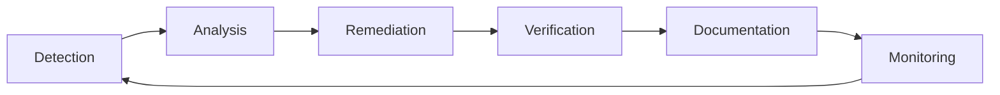

# Knowledge Base

這個目錄包含 Unmanned Island System 的活體知識庫（Living Knowledge Base），記錄所有語言治理相關的歷史、指標和分析結果。

## 📁 檔案結構

### `language-history.yaml`
記錄所有語言治理修復事件的歷史紀錄。

**內容包含**:
- 違規類型
- 修復動作
- 檔案路徑
- 嚴重程度
- 時間戳記
- 統計資料

**更新方式**:
```bash
python tools/language-history-writer.py \
  --violation-type "forbidden-language" \
  --file-path "services/api/script.php" \
  --action "removed" \
  --reason "PHP forbidden in services directory"
```

### `language-health-score.yaml`
語言層級健康分數（0-100）及其組成部分。

**評分維度**:
- Violation Score (40 分): 語言治理違規
- Security Score (30 分): 安全漏洞
- Architecture Score (20 分): 架構對齊
- Trend Score (10 分): 修復趨勢

**計算方式**:
```bash
python tools/language-health-score.py \
  --governance-report governance/language-governance-report.json \
  --history knowledge/language-history.yaml \
  --output knowledge/language-health-score.yaml \
  --display
```

### `language-history-report.md`
人類可讀的語言治理歷史報告，包含統計圖表和趨勢分析。

## 🔄 知識循環 (Knowledge Cycle)

Living Knowledge Base 運作在持續循環中：



1. **Detection (偵測)**: Language Governance, CodeQL, Semgrep 掃描偵測問題
2. **Analysis (分析)**: AI 分析違規並生成修復建議
3. **Remediation (修復)**: Auto-Fix Bot 創建並應用 patches
4. **Verification (驗證)**: 透過 CI/CD 驗證變更
5. **Documentation (文檔化)**: 更新知識庫記錄學習成果
6. **Monitoring (監控)**: 重新計算健康分數並追蹤

## 📊 整合工具

### Living Knowledge Base Updater
更新活體知識庫及觸發知識循環：
```bash
python tools/lkb-update.py \
  --event "auto-fix" \
  --description "AI Auto-Fix Bot applied repository repairs" \
  --violations-fixed 10 \
  --health-score 85.5 \
  --files-changed 5
```

### Semantic Commit Generator
生成符合 Conventional Commits 的提交訊息：
```bash
python tools/semantic-commit-generator.py \
  --files "services/api/legacy.php" \
  --action "removed" \
  --reason "PHP forbidden in services directory" \
  --violation-type "language-governance" \
  --use-ai
```

## 🤖 自動化

所有這些工具都已整合到 AI Auto-Fix Bot 工作流中，當偵測到違規時會自動執行：

1. **Generate Semantic Commit**: 創建語義化提交訊息
2. **Record Fix History**: 記錄修復到歷史檔案
3. **Calculate Health Score**: 計算當前健康分數
4. **Update Living Knowledge Base**: 更新知識圖譜和報告

## 📈 指標追蹤

知識庫自動追蹤以下指標：

- **Total Fixes**: 累計修復數量
- **By Violation Type**: 按違規類型分類
- **By Action**: 按修復動作分類  
- **By Severity**: 按嚴重程度分類
- **Health Score Trend**: 健康分數趨勢
- **Fix Velocity**: 修復速度

## 🔗 相關文檔

- [Language Stack](../docs/architecture/language-stack.md) - 語言分層策略
- [Language Governance](../docs/architecture/language-governance.md) - 治理實施指南
- [Language Policy](../config/language-policy.yaml) - 語言策略配置
- [Knowledge Health](../docs/KNOWLEDGE_HEALTH.md) - 知識健康報告

## 📝 維護

此目錄由以下系統自動維護：
- AI Auto-Fix Bot Workflow
- Language Governance Analyzer
- Living Knowledge Base Updater

手動更新時請遵循 YAML 格式規範，確保資料結構一致性。
