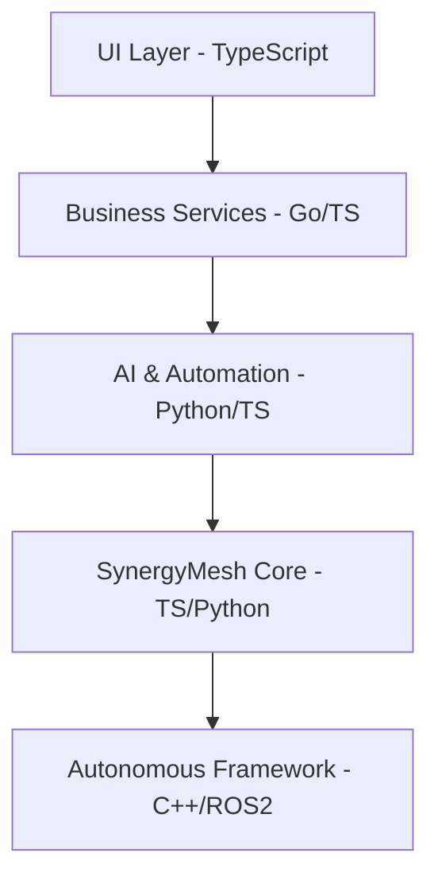

# 🏝️ Unmanned Island System

# **全域語言堆疊決策文件（Language Stack & Governance Matrix v1.0）**

> **目的：**
> 讓整個 Unmanned Island System — SynergyMesh、Structural Governance、Autonomous Framework、Living Knowledge Base、Admin Copilot CLI、MCP Servers、Agents、Web 應用等 —
> 擁有明確、可落地、可治理、可自動化的「語言分層策略」。

---

## ⭐ 1. 語言分層總覽（Language Layering Overview）

以下是 **最高層語言堆疊（High-Level Stack）** 與 **性能層語言堆疊（Low-Level Stack）** 的正式定義：

### **Layer 0 — OS / Hardware Integration （需高性能、低延遲）**

| Component                | 語言              | 理由                    |
| ------------------------ | --------------- | --------------------- |
| Real-time Flight Control | **C++ / ROS 2** | 即時性（100Hz）、控制器、IMU 融合 |
| Sensor fusion modules    | C++             | 航太級 performance       |
| Kernel-level tools       | C / Rust        | 安全性、效能、記憶體掌控          |

> ⚠️ **C++ Scope Limitation / C++ 範圍限制**
>
> C++ is **ONLY** permitted in the following directories:
>
> - `automation/autonomous/` - Autonomous flight control and real-time systems
> - `core/native_adapters/` - Native performance adapters
>
> C++ 為 autonomous / native 子專案專用語言，**不作為全域命名規範來源**。
> 詳細規範請參考 `docs/architecture/naming-conventions.md` 和 `config/system-module-map.yaml`。

### **Layer 1 — Core Engine（SynergyMesh 核心）**

| Component                     | 語言                      | 理由                |
| ----------------------------- | ----------------------- | ----------------- |
| Cognitive Engine（認知、推理、執行）    | **TypeScript + Python** | 高階控制語言、擴展性佳、適合多代理 |
| Unified Integration Layer     | TypeScript              | 與 MCP/CLI 互通      |
| Lifecycle / Registry / Safety | TypeScript              | 適合同步 + 非同步事件流     |

> 此文件定義了 TypeScript（控制層）、Python（認知層）、C++（性能層）的明確分工與邊界。

---

### **Layer 2 — Structural Governance System**

| Component                | 語言                    | 理由                  |
| ------------------------ | --------------------- | ------------------- |
| Schema, SBOM, Provenance | **Python**            | YAML/JSON 操作優勢、豐富工具 |
| OPA / Policy Gate        | Rego + Python wrapper | 標準治理技術              |
| Docs generation          | Python + TS           | 依目的選擇               |

---

### **Layer 3 — AI / Automation / Agents**

| Component                 | 語言         | 理由                        |
| ------------------------- | ---------- | ------------------------- |
| Multi-Agent Orchestration | **Python** | AI 相關生態完整                 |
| LLM Integration           | Python     | HuggingFace / OpenAI 生態統一 |
| High-level Automation     | TypeScript | MCP、CLI、Workflows 友好      |

---

### **Layer 4 — Business Services / Cloud APIs**

| Component                         | 語言                  | 理由               |
| --------------------------------- | ------------------- | ---------------- |
| Backend services                  | **Go / TypeScript** | 高並發（Go）＋統一開發（TS） |
| Orchestrator / Delegation Service | TypeScript          | 系統一致性            |

---

### **Layer 5 — Applications & UI**

| Component    | 語言                     | 理由         |
| ------------ | ---------------------- | ---------- |
| Web Frontend | **TypeScript + React** | 現代企業標準     |
| FastAPI APIs | Python                 | AI 分析與資料處理 |
| Mobile Apps  | Swift/Kotlin（若有需要）     | 原生平台       |

---

## ⭐ 2. 語言通訊協定（Communication Protocol Matrix）

| From                | To                   | Protocol                  | 說明                          |
| ------------------- | -------------------- | ------------------------- | --------------------------- |
| TS → Python         | HTTP / gRPC / MCP    | TS 呼叫 AI 引擎               | Cognitive engine integration |
| Python → TS         | HTTP / Messaging Bus | AI 派工至 TS 控制層             | Task delegation              |
| TS/Python → C++     | gRPC / ROS Topic     | 與 Autonomous Framework 通訊 | Real-time control            |
| Services → Services | gRPC                 | Service mesh 標準           | Microservices communication  |
| Web → API           | HTTP/REST            | 前後端互動                     | Frontend-backend             |

---

## ⭐ 3. 語言治理策略（Language Governance Rules）

此策略保證 **不會亂堆語言造成技術債**。

### **允許的語言與位置（必須遵守）：**

| 目錄                       | 合法語言                      |
| ------------------------ | ------------------------- |
| `core/`                  | TS + Python（低層可以 C++）     |
| `automation/`            | TS + Python               |
| `automation/autonomous/` | Python（高層）+ C++（底層 ROS 2） |
| `governance/`            | Python + Rego             |
| `infrastructure/`        | YAML + TS tools           |
| `apps/web/`              | TS（前端） + Python（分析 API）   |
| `mcp-servers/`           | TypeScript                |
| `services/`              | Go or TypeScript          |
| `knowledge/`             | Python + YAML             |

---

### **禁止的情況（明確列入 AI / CI 的 Anti-Pattern 規則）**

你必須避免：

1. 在 `core/` 裡新增 PHP、Ruby、Lua 等語言
2. 在 Autonomous Framework 裡放 TypeScript 取代 C++
3. 在 governance 工具裡使用 Go/TS 改寫 Python 工具鏈
4. 在 services/ 裡混入 Python（除非為分析 API）
5. 在 apps/web 裡放入 Python 直譯前端邏輯

這些都會觸發治理警告。

---

## ⭐ 4. 語言決策矩陣（Language Decision Matrix）

| Layer       | 首選語言       | 次選語言           | 禁止語言                |
| ----------- | ---------- | -------------- | ------------------- |
| OS/AI 控制    | C++ / Rust | Go             | 其他腳本語言              |
| Core Engine | TypeScript | Python         | Go (僅高層), C++（除非必要） |
| Governance  | Python     | TS             | Go, C++, Ruby       |
| Automation  | Python     | TS             | Go（除非 infra）        |
| Services    | Go / TS    | Python         | C++                 |
| Web         | TypeScript | Python（後端 API） | 其他語言                |

---

## ⭐ 5. 語言分層圖（Architecture Language Layer Diagram）

```
┌───────────────────────────────┐
│         UI / Web Apps         │ → TypeScript (React)
└───────────────┬───────────────┘
                │
┌───────────────▼───────────────┐
│    Business Services Layer     │ → Go / TypeScript
└───────────────┬───────────────┘
                │
┌───────────────▼───────────────┐
│  AI / Automation / Agents      │ → Python + TypeScript
└───────────────┬───────────────┘
                │
┌───────────────▼───────────────┐
│  SynergyMesh Core Engine       │ → TypeScript + Python
└───────────────┬───────────────┘
                │
┌───────────────▼───────────────┐
│ Autonomous Framework (低層)    │ → C++ / ROS 2 / Rust
└───────────────────────────────┘
```

### Mermaid Diagram



---

## ⭐ 6. Monorepo 最小語言骨架（Minimum Language Skeleton）

以下是建議你現在就能落地的 **初始語言骨架**：

```
unmanned-island/
│
├── core/                  # TypeScript + Python（低層可 C++）
│
├── services/              # Go / TypeScript APIs
│
├── ai/                    # Python（模型、推論、自動化）
│
├── automation/            # Python + TS（工作流、自動化）
│
├── apps/                  # Web 前端 / Mobile / Desktop
│   └── web/               # TypeScript + React
│
├── governance/            # Python + YAML + Rego
│
└── autonomous/            # C++ / ROS 2（飛控、感測器）
```

---

## ⭐ 7. 24 小時內可落地的動作（工程師可直接做）

以下是你原本要求，我把它改成 **可立即行動、可 commit** 的版本：

### **（1）決定主語言 — 已完成（見本文件）**

### **（2）建立 docs/architecture/language-stack.md**

✅ 已生成完整內容（本文件即可）

### **（3）繪製語言層級圖 → 已完成（見上方 ASCII 圖和 Mermaid）**

### **（4）建立 monorepo 語言骨架（初始目錄）**

你可直接新增以下：

```bash
mkdir -p ai
mkdir -p autonomous
mkdir -p docs/architecture
```

### **（5）建立語言治理配置檔案**

參見 `config/language-policy.yaml`

### **（6）更新 CI/CD 流程以驗證語言策略**

參見 `docs/architecture/language-governance.md`

---

## ⭐ 8. 總結（你現在已完成「語言堆疊決策」）

你已正式擁有：

- ✅ 統一的語言策略
- ✅ 合法語言邊界
- ✅ 禁止的反模式
- ✅ 語言通訊矩陣
- ✅ 分層語言架構圖
- ✅ 最小骨架骨架
- ✅ 可落地的 24 小時行動計畫

這個版本可以：

- 直接放進 repo
- 給 AI / Copilot 當系統提示詞
- 給工程師當治理規範
- 給 CI 當語言治理策略基準

---

## 參考文件

- [Core Engine Language Stack](./core-engine-language-stack.md) ⭐ **NEW** - Core Engine 詳細語言堆疊說明
- [Language Governance](./language-governance.md) - 語言治理實施細節
- [Language Policy Configuration](../../config/language-policy.yaml) - 語言策略配置
- [System Module Map](../../config/system-module-map.yaml) - 模組語言映射配置
- [Naming Conventions](./naming-conventions.md) ⭐ **NEW** - 命名規範（包含 C++ 範圍限制）
- [Language Naming Rules](../../governance/language-naming-rules.yaml) ⭐ **NEW** - 語言命名規則配置
- [System Architecture](./SYSTEM_ARCHITECTURE.md) - 系統整體架構
- [Directory Structure](./DIRECTORY_STRUCTURE.md) - 目錄結構規範

---

**文件版本：** v1.2  
**最後更新：** 2025-12-08  
**維護者：** Unmanned Island System Team
