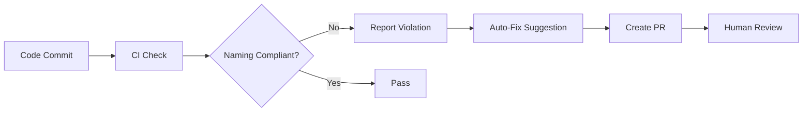

# Naming Conventions (命名規範)

## 📋 Overview / 概覽

This document defines the naming conventions for all files, directories, and code symbols across the SynergyMesh repository. These conventions ensure consistency, maintainability, and enable AI-powered governance automation.

本文件定義 SynergyMesh 倉庫中所有檔案、目錄和程式碼符號的命名規範。這些規範確保一致性、可維護性，並實現 AI 驅動的治理自動化。

**Version:** 1.0  
**Last Updated:** 2025-12-08  
**Status:** Active

---

## 🎯 Naming Convention Strategy

### Design Principles / 設計原則

1. **Consistency First** - 同一語言使用統一命名風格
2. **Language Idiomatic** - 遵循各語言社群慣例
3. **AI Governable** - 可被 AI 工具自動檢查與修正
4. **Clear Boundaries** - 明確的語言範圍界定

### Technical Debt Acknowledgment / 技術債承認

>
> If existing code does not fully comply with these conventions, it is considered "technical debt" and will be gradually cleaned up through Refactor Playbooks and the Auto-Fix pipeline.

---

## 📚 Language-Specific Conventions

### TypeScript / JavaScript

**Applies to:** `apps/`, `frontend/`, `services/`, `mcp-servers/`, `core/` (部分)

#### File Naming / 檔案命名

| Type | Convention | Example |
|------|------------|---------|
| React Component | `PascalCase.tsx` | `AutoFixDashboard.tsx`, `SystemMonitor.tsx` |
| General Module | `kebab-case.ts` | `language-governance.ts`, `config-manager.ts` |
| Test File | `kebab-case.test.ts` | `language-governance.test.ts` |
| Type Definition | `kebab-case.d.ts` | `unified-config.d.ts` |

#### Code Symbols / 程式碼符號

| Type | Convention | Example |
|------|------------|---------|
| Variable | `camelCase` | `userConfig`, `moduleRegistry` |
| Function | `camelCase` | `runCiEvolution()`, `resolveDependencies()` |
| Class | `PascalCase` | `EvolutionReport`, `ClusterHeatmapService` |
| Interface | `PascalCase` | `IConfigManager`, `ServiceMetadata` |
| Type Alias | `PascalCase` | `LanguagePolicy`, `ModuleConfig` |
| Enum | `PascalCase` | `ExecutionStatus`, `PolicyLevel` |
| Constant | `SCREAMING_SNAKE_CASE` | `DEFAULT_TIMEOUT_MS`, `MAX_RETRY_COUNT` |

#### Directory Naming / 目錄命名

- Use `kebab-case` for directories: `unified-integration/`, `contract-service/`
- Component directories may use `PascalCase`: `Dashboard/`, `Components/`

#### ESLint Enforcement / ESLint 強制執行

These conventions can be enforced via ESLint configuration:

```javascript
// eslint.config.js or .eslintrc.yaml
rules: {
  '@typescript-eslint/naming-convention': [
    'error',
    { selector: 'variable', format: ['camelCase', 'UPPER_CASE'] },
    { selector: 'function', format: ['camelCase'] },
    { selector: 'typeLike', format: ['PascalCase'] },
  ]
}
```

---

### Python

**Applies to:** `runtime/`, `tools/`, `ai/`, `automation/`, `tests/`, `governance/` (部分)

#### File Naming / 檔案命名

| Type | Convention | Example |
|------|------------|---------|
| Module | `snake_case.py` | `generate_refactor_playbook.py`, `config_manager.py` |
| Package | `snake_case/` | `unified_integration/`, `safety_mechanisms/` |
| Test File | `test_*.py` or `*_test.py` | `test_language_governance.py` |

#### Code Symbols / 程式碼符號

| Type | Convention | Example |
|------|------------|---------|
| Variable | `snake_case` | `module_config`, `execution_result` |
| Function | `snake_case` | `count_language_violations()`, `build_migration_flow()` |
| Class | `PascalCase` (CamelCase) | `RefactorPlaybookGenerator`, `ConfigurationManager` |
| Method | `snake_case` | `validate_schema()`, `process_data()` |
| Constant | `SCREAMING_SNAKE_CASE` | `MAX_SEMGREP_HIGH`, `DEFAULT_CONFIG_PATH` |
| Private Variable | `_leading_underscore` | `_internal_cache`, `_private_method()` |

#### Directory Naming / 目錄命名

- Use `snake_case` for directories: `unified_integration/`, `execution_engine/`

#### PEP 8 Compliance

All Python code should follow [PEP 8](https://peps.python.org/pep-0008/) guidelines and can be checked with:

```bash
# Using flake8 or ruff
ruff check --select N  # Naming conventions check
```

---

### Go

**Applies to:** `services/` (某些子目錄), `infra/`

#### File Naming / 檔案命名

| Type | Convention | Example |
|------|------------|---------|
| Package File | `lowercase` or `snake_case` | `config.go`, `user_service.go` |
| Test File | `*_test.go` | `config_test.go` |

#### Code Symbols / 程式碼符號

| Type | Convention | Example |
|------|------------|---------|
| Variable (local) | `camelCase` or `mixedCaps` | `userID`, `configPath` |
| Function (exported) | `PascalCase` | `GetConfig()`, `ProcessRequest()` |
| Function (private) | `camelCase` | `validateInput()`, `parseData()` |
| Struct | `PascalCase` | `UserConfig`, `ServiceRegistry` |
| Constant | `PascalCase` or `camelCase` | `MaxRetries`, `defaultTimeout` |

#### Go Conventions

- Follow standard Go community conventions
- Use `go fmt` for automatic formatting
- Exported names start with capital letter
- Private names start with lowercase letter

```bash
# Format code automatically
go fmt ./...
```

---

### Rust

**Applies to:** `infra/` (某些模組), `services/` (某些子目錄)

#### File Naming / 檔案命名

| Type | Convention | Example |
|------|------------|---------|
| Module | `snake_case.rs` | `config_manager.rs`, `service_registry.rs` |
| Test File | Part of same file or `tests/` dir | `mod tests { ... }` |

#### Code Symbols / 程式碼符號

| Type | Convention | Example |
|------|------------|---------|
| Variable | `snake_case` | `user_config`, `service_name` |
| Function | `snake_case` | `validate_config()`, `process_request()` |
| Struct | `PascalCase` | `UserConfig`, `ServiceRegistry` |
| Enum | `PascalCase` | `ExecutionStatus`, `PolicyLevel` |
| Trait | `PascalCase` | `ConfigProvider`, `ServiceHandler` |
| Constant | `SCREAMING_SNAKE_CASE` | `MAX_CONNECTIONS`, `DEFAULT_PORT` |
| Macro | `snake_case!` | `create_config!()` |

#### Rust Conventions

- Follow [Rust API Guidelines](https://rust-lang.github.io/api-guidelines/naming.html)
- Use `rustfmt` for automatic formatting

```bash
# Format code automatically
cargo fmt
```

---

### C++

**Applies to:** `autonomous/`, `core/native_adapters/` **ONLY**

> ⚠️ **Scope Limitation / 範圍限制**
>
> C++ is **ONLY** permitted in the following directories:
>
> - `automation/autonomous/`
> - `core/native_adapters/`
>
> C++ is designated for autonomous/native subsystems and is **NOT** a global naming convention source.
>
> 詳細說明請參閱 `docs/architecture/language-stack.md` 和 `config/system-module-map.yaml`。

#### File Naming / 檔案命名

| Type | Convention | Example |
|------|------------|---------|
| Header | `snake_case.h` or `.hpp` | `trajectory_planner.h`, `sensor_fusion.hpp` |
| Implementation | `snake_case.cpp` or `.cc` | `trajectory_planner.cpp`, `sensor_fusion.cc` |
| Test File | `*_test.cpp` | `trajectory_planner_test.cpp` |

#### Code Symbols / 程式碼符號

| Type | Convention | Example |
|------|------------|---------|
| Variable | `snake_case` | `sensor_data`, `flight_mode` |
| Function | `snake_case` or `PascalCase` | `calculate_trajectory()` or `CalculateTrajectory()` |
| Class | `PascalCase` | `TrajectoryPlanner`, `SensorFusion` |
| Struct | `PascalCase` | `FlightData`, `SensorReading` |
| Constant | `kPascalCase` or `SCREAMING_SNAKE_CASE` | `kMaxSpeed` or `MAX_ALTITUDE` |
| Namespace | `snake_case` | `autonomous::flight_control` |
| Macro | `SCREAMING_SNAKE_CASE` | `ROS_INFO`, `MAX_BUFFER_SIZE` |

#### C++ Project-Specific Conventions

For autonomous/native subsystems, choose **ONE** convention per project and enforce it consistently:

**Option A: Google C++ Style**

- Functions: `PascalCase()`
- Variables: `snake_case`
- Constants: `kPascalCase`

**Option B: ROS 2 Style**

- Functions: `snake_case()`
- Variables: `snake_case`
- Constants: `SCREAMING_SNAKE_CASE`

**Important:** Within each C++ subsystem, maintain internal consistency. Document the chosen style in the subsystem's README.

---

## 🗂️ Directory Naming Conventions

### General Rules / 通用規則

1. **Lowercase preferred** - Use lowercase for most directories
2. **Use hyphens or underscores** - `kebab-case` or `snake_case`
3. **Descriptive names** - Self-explanatory directory names
4. **Avoid spaces** - Never use spaces in directory names

### Language-Specific Directory Conventions

| Language | Convention | Example |
|----------|------------|---------|
| TypeScript/JavaScript | `kebab-case` | `contract-service/`, `unified-integration/` |
| Python | `snake_case` | `execution_engine/`, `safety_mechanisms/` |
| Go | `lowercase` | `services/`, `infra/` |
| Mixed Projects | Choose one and be consistent | Prefer `kebab-case` in root |

---

## 🔍 Configuration File Naming

| Type | Convention | Example |
|------|------------|---------|
| YAML | `kebab-case.yaml` or `snake_case.yaml` | `language-policy.yaml`, `system_manifest.yaml` |
| JSON | `kebab-case.json` or `camelCase.json` | `package.json`, `tsconfig.json` |
| Environment | `.env` or `.env.*` | `.env.production`, `.env.local` |
| Config scripts | Match language convention | `eslint.config.js`, `setup.py` |

---

## 📖 Documentation File Naming

| Type | Convention | Example |
|------|------------|---------|
| Markdown | `SCREAMING_SNAKE_CASE.md` or `kebab-case.md` | `README.md`, `naming-conventions.md` |
| Architecture Docs | `kebab-case.md` | `language-stack.md`, `system-architecture.md` |
| Guides | `kebab-case.md` | `quick-start.md`, `deployment-guide.md` |

---

## 🤖 AI-Powered Governance Integration

### Automated Checking / 自動化檢查

These naming conventions are integrated into:

1. **Language Governance CI** - `.github/workflows/language-governance.yml`
2. **Auto-Fix Bot** - Suggests rename PRs for violations
3. **Refactor Playbooks** - P2 continuous refactoring tasks
4. **Governance Rules** - `governance/language-naming-rules.yaml`

### Enforcement Pipeline / 執行管道



### Integration with Refactor Playbooks

每個 cluster 的 refactor playbook 在 **P2 持續重構** 階段包含：

> 不符合規範 → 由 Auto-Fix Bot 提出 rename 建議 PR

---

## 🔧 Tooling and Enforcement

### TypeScript/JavaScript

```bash
# ESLint naming convention check
npm run lint

# Auto-fix where possible
npm run lint -- --fix
```

### Python

```bash
# Check naming conventions with ruff
ruff check --select N

# Format code with ruff
ruff format
```

### Go

```bash
# Format and check
go fmt ./...
golangci-lint run
```

### Rust

```bash
# Format
cargo fmt

# Lint
cargo clippy
```

### C++

```bash
# Format with clang-format
clang-format -i **/*.cpp **/*.h

# Check with clang-tidy
clang-tidy autonomous/**/*.cpp
```

---

## 📊 Compliance Monitoring

### Metrics Tracked / 追蹤指標

1. **Naming Violation Count** - 命名違規數量
2. **Convention Adoption Rate** - 規範採用率
3. **Auto-Fix Success Rate** - 自動修復成功率
4. **Technical Debt Trend** - 技術債趨勢

### Reporting / 報告

- **Weekly Report** - Auto-generated compliance report
- **Quarterly Review** - Deep analysis in governance meetings
- **Annual Assessment** - Convention effectiveness evaluation

---

## 🎓 Best Practices

### DO ✅

- Follow language idiomatic conventions
- Use descriptive, self-documenting names
- Be consistent within the same file/module
- Update imports when renaming
- Document exceptions clearly

### DON'T ❌

- Mix naming conventions in the same file
- Use abbreviations unless widely understood
- Create names that differ only by case
- Use reserved keywords as names
- Ignore linter warnings without justification

---

## 🔗 Related Documentation

- [Language Stack](./language-stack.md) - 語言堆疊決策
- [Language Governance](./language-governance.md) - 語言治理實施
- [Language Policy Config](../../config/language-policy.yaml) - 語言策略配置
- [Language Naming Rules](../../governance/language-naming-rules.yaml) - 命名規則定義
- [Refactor Playbooks](../refactor_playbooks/README.md) - 重構計畫系統

---

## 📝 Change Log

| Version | Date | Changes |
|---------|------|---------|
| 1.0 | 2025-12-08 | Initial version with TS, Python, Go, Rust, C++ conventions |

---

## 🤝 Contributing

When proposing changes to naming conventions:

1. Create an issue explaining the rationale
2. Show examples of current vs. proposed
3. Assess impact on existing codebase
4. Get approval from architecture team
5. Update this document and related configurations

---

**Document Owner:** Unmanned Island System Team  
**Review Cycle:** Quarterly  
**Next Review:** 2025-03-08
