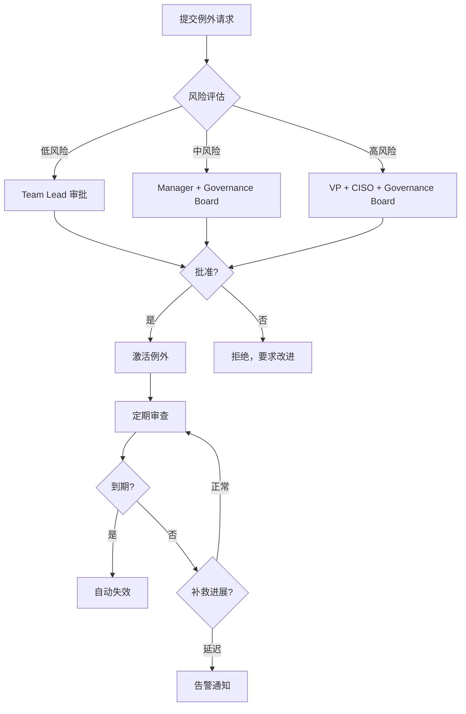

# 例外处理 (Exception Handling)

> **治理模块**: 例外管理 (Exception Management)
> **版本**: v1.0.0
> **状态**: 已批准 (Approved)
> **最后更新**: 2025-01-15

## 概述

例外处理机制允许在特殊情况下临时偏离既定的治理策略。通过标准化的例外请求、风险评估和时限管理，我们确保例外是受控的、可追溯的，并最终得到解决。

## 核心原则

1. **例外是临时的**: 所有例外必须有明确的到期日期
2. **例外需要补救**: 必须有计划最终符合标准
3. **风险透明化**: 例外的风险必须清晰评估和记录
4. **审批分级**: 根据风险级别确定审批层级
5. **定期审查**: 例外不是"一劳永逸"，需要持续监控

## 何时使用例外

### ✅ 合理的例外场景

| 场景 | 示例 | 理由 |
|------|------|------|
| **遗留系统** | 老系统命名不符合新规范 | 重命名成本高，计划迁移 |
| **技术限制** | 第三方工具强制的命名格式 | 无法控制外部系统 |
| **时间紧迫** | 紧急修复无法完全测试 | 临时措施，后续补充 |
| **成本考量** | 大规模重构成本过高 | 有渐进迁移计划 |
| **业务优先** | 关键功能上线压力 | 明确补救时间表 |

### ❌ 不应使用例外的场景

| 场景 | 为什么不行 | 正确做法 |
|------|-----------|---------|
| **懒惰** | "改名太麻烦" | 投入时间正确执行 |
| **无知** | "不知道有这个规范" | 加强培训和文档 |
| **习惯** | "我们一直这么做" | 适应新标准 |
| **绕过审查** | "不想等审批" | 遵循正常流程 |
| **永久偏离** | "我们团队就是不同" | 统一标准更重要 |

## 例外类型

### 1. 命名合规例外

**场景**: 资源命名无法符合标准模式

```yaml
apiVersion: governance.machinenativeops.io/v1alpha1
kind: ExceptionRequest
metadata:
  id: "EXC-2025-001"
  title: "Legacy Payment System 命名例外"
  category: "naming-compliance"

spec:
  policyViolated: "k8s-deployment-standard"

  item:
    resourceType: "Deployment"
    resourceName: "old-payment-system"
    namespace: "production"
    expectedPattern: "prod-payment-legacy-deploy-v1.0.0"
    actualPattern: "old-payment-system"

  reason: |
    历史遗留系统，建立于 2018 年，命名方式不符合当前标准。
    重命名会影响以下依赖:
    - 10+ 个下游服务的硬编码引用
    - 监控和告警配置
    - CI/CD pipeline
    - 客户端 SDK

  riskEvaluation:
    riskLevel: "中"
    impact: |
      - 自动化工具可能无法识别
      - 需要手动维护文档映射
      - 新团队成员可能困惑
    mitigation: |
      - 在文档中明确标注为遗留系统
      - 监控配置添加特殊标签
      - 新服务不再允许类似命名

  requestedExpire: "2025-12-31"

  remediation:
    plan: |
      1. Q2 2025: 启动新系统开发，使用标准命名
      2. Q3 2025: 逐步迁移流量到新系统
      3. Q4 2025: 完全下线遗留系统
    milestones:
      - date: "2025-06-30"
        description: "新系统 MVP 上线"
      - date: "2025-09-30"
        description: "50% 流量迁移"
      - date: "2025-12-31"
        description: "完全下线遗留系统"
```

### 2. 变更管理例外

**场景**: 无法遵循标准变更流程

```yaml
metadata:
  id: "EXC-2025-002"
  title: "跳过 Staging 环境的紧急修复"
  category: "change-management"

spec:
  policyViolated: "change-policy-staging-validation"

  reason: |
    生产环境发现关键安全漏洞（CVE-2025-XXXX），需要立即修复。
    Staging 环境当前正在进行大规模测试，无法立即腾出资源。

  riskEvaluation:
    riskLevel: "高"
    impact: |
      - 未经 staging 测试，可能引入新问题
      - 可能影响生产稳定性
    mitigation: |
      - 在隔离的测试环境快速验证
      - 准备立即回滚方案
      - 增加监控和值班人员
      - 事后在 staging 补充完整测试

  requestedExpire: "2025-01-16T23:59:59Z"  # 24 小时

  remediation:
    plan: |
      1. 立即部署修复到生产
      2. 24 小时内在 staging 完成补充测试
      3. 更新 runbook 记录此类场景处理方式
```

### 3. 安全策略例外

**场景**: 临时需要放宽安全限制

```yaml
metadata:
  id: "EXC-2025-003"
  title: "测试环境临时开放 SSH 访问"
  category: "security-policy"

spec:
  policyViolated: "no-direct-ssh-access"

  reason: |
    需要对测试环境进行深度调试和性能分析，
    需要直接 SSH 访问收集系统级指标。

  riskEvaluation:
    riskLevel: "低"
    impact: "仅限测试环境，无生产数据"
    mitigation: |
      - 仅限特定 IP 白名单
      - 所有 SSH 会话记录审计日志
      - 7 天后自动关闭访问

  requestedExpire: "2025-01-22"  # 7 天

  remediation:
    plan: |
      1. 完成调试后，使用标准 observability 工具
      2. 关闭 SSH 访问
      3. 总结经验，改进标准调试流程
```

### 4. 文档要求例外

**场景**: 文档暂时不完整

```yaml
metadata:
  id: "EXC-2025-004"
  title: "新功能文档延后提交"
  category: "documentation"

spec:
  policyViolated: "complete-documentation-before-release"

  reason: |
    关键功能需要在季度末前上线以满足业务承诺，
    完整文档需要 2 周时间准备。

  riskEvaluation:
    riskLevel: "低"
    impact: "暂时缺少详细文档，可能影响其他团队使用"
    mitigation: |
      - 提供基础 README 和 API 文档
      - 安排技术分享会介绍功能
      - 2 周内补充完整文档

  requestedExpire: "2025-02-15"  # 1 个月

  remediation:
    plan: |
      1. 2025-02-01: 完成用户指南
      2. 2025-02-08: 完成 API 参考文档
      3. 2025-02-15: 完成架构和运维文档
```

## 风险级别与审批

### 风险级别定义

| 级别 | 影响范围 | 安全影响 | 持续时间 | 示例 |
|------|----------|----------|----------|------|
| **低** | 单个非关键系统 | 无 | < 1 个月 | 测试环境配置偏离 |
| **中** | 多个系统或单个关键系统 | 低 | 1-6 个月 | 遗留系统命名不合规 |
| **高** | 核心系统或安全关键 | 中-高 | > 6 个月 | 生产安全策略放宽 |

### 审批层级

```yaml
# policies/exception/exception-policy.yaml
approvalMatrix:
  low:
    approvers:
      - role: "Team Lead"
        count: 1
    sla: "2 business days"

  medium:
    approvers:
      - role: "Manager"
        count: 1
      - role: "Governance Board Member"
        count: 1
    sla: "5 business days"

  high:
    approvers:
      - role: "VP of Engineering"
        count: 1
      - role: "CISO"
        count: 1
      - role: "Governance Board"
        count: 2
    sla: "10 business days"
```

### 审批流程



## 例外生命周期

### 状态流转

```yaml
状态:
  - draft: 草稿，正在编写
  - under-review: 审查中，等待批准
  - approved: 已批准，未生效
  - active: 已激活，生效中
  - remediated: 已补救，问题已解决
  - expired: 已过期，自动失效
  - revoked: 已撤销，提前结束
```

### 状态转换规则

```
draft → under-review → approved → active → (remediated | expired | revoked)
   ↑                      ↓
   └──────── rejected ────┘
```

## 监控与告警

### 例外指标

```promql
# 活跃例外总数
governance_exception_active_total

# 按风险级别分类
governance_exception_active_total{risk_level="高"}

# 即将到期的例外（7 天内）
governance_exception_expiring_soon

# 已过期但仍在使用的例外
governance_exception_expired_active
```

### 告警规则

```yaml
# templates/governance/k8s/prometheus-rule-naming-alert.template.yaml
- alert: ExceptionExpiringSoon
  expr: |
    (governance_exception_expiry_timestamp - time()) < 7 * 24 * 3600
  labels:
    severity: warning
  annotations:
    summary: "例外即将到期"
    description: |
      例外 {{ $labels.exception_id }} 将在 7 天内到期。
      请审查是否需要续期或已完成补救。

- alert: ExpiredExceptionInUse
  expr: governance_exception_expired_active > 0
  labels:
    severity: critical
  annotations:
    summary: "过期例外仍在使用"
    description: |
      {{ $value }} 个过期例外仍然活跃。
      必须立即撤销或续期。

- alert: HighRiskExceptionCountHigh
  expr: count(governance_exception_risk_level{level="高"}) > 5
  for: 1d
  labels:
    severity: warning
  annotations:
    summary: "高风险例外数量过多"
    description: |
      当前有 {{ $value }} 个高风险例外。
      请审查并减少高风险例外数量。
```

### 定期审查

**月度审查会议**:

- **时间**: 每月第一个周五
- **参与者**: Governance Board, Team Leads
- **议程**:
  1. 回顾所有活跃例外
  2. 检查补救进展
  3. 审查即将到期的例外
  4. 决定续期、撤销或结束

**审查清单**:

```yaml
- [ ] 例外是否仍然必要？
- [ ] 风险评估是否仍然准确？
- [ ] 补救计划是否按期进展？
- [ ] 是否有新的替代方案？
- [ ] 是否需要调整到期日期？
```

## 自动化工具

### 1. 提交例外请求

```bash
# 使用模板创建例外请求
cp templates/governance/forms/exception-request.template.yaml \
   exceptions/EXC-2025-001.yaml

# 填写后提交
git add exceptions/EXC-2025-001.yaml
git commit -m "feat: 提交例外请求 EXC-2025-001"
git push origin exception/EXC-2025-001
```

### 2. 验证例外请求

```bash
# 验证格式和完整性
python tools/governance/python/validate_exception.py \
  --file exceptions/EXC-2025-001.yaml \
  --schema schemas/exception-request.schema.yaml

# 输出
✓ Schema validation passed
✓ Risk assessment complete
✓ Remediation plan provided
✗ Warning: High risk exception requires VP approval
```

### 3. 例外状态查询

```bash
# 查询所有活跃例外
./tools/governance/bash/list_exceptions.sh --status active

# 查询即将到期的例外
./tools/governance/bash/list_exceptions.sh --expiring-in 7d

# 查询特定团队的例外
./tools/governance/bash/list_exceptions.sh --team backend-team
```

### 4. 自动到期

```bash
# Cron job: 每天检查并自动过期
0 0 * * * /tools/governance/bash/expire_exceptions.sh

# 手动触发
./tools/governance/bash/expire_exceptions.sh --dry-run
```

## 例外数据库

### 集中存储

所有例外请求存储在 Git 仓库的 `exceptions/` 目录：

```
exceptions/
├── active/
│   ├── EXC-2025-001.yaml  # 活跃例外
│   ├── EXC-2025-003.yaml
│   └── EXC-2025-005.yaml
├── expired/
│   └── EXC-2024-099.yaml  # 已过期
├── remediated/
│   └── EXC-2024-087.yaml  # 已补救
└── revoked/
    └── EXC-2024-076.yaml  # 已撤销
```

### 查询和报告

```bash
# 生成例外报告
python tools/governance/python/generate_exception_report.py \
  --period 2025-01 \
  --output reports/exceptions/2025-01-exceptions.yaml

# 报告内容
- 总例外数和按状态分类
- 高风险例外列表
- 即将到期例外
- 长期未补救例外
- 趋势分析
```

## 最佳实践

### ✅ DO

1. **明确时限**: 所有例外必须有具体的到期日期
2. **详细记录**: 清楚说明为什么需要例外和风险
3. **补救计划**: 提供可执行的补救措施和时间表
4. **定期审查**: 不要"设置后就忘记"
5. **透明沟通**: 让所有相关方知道例外的存在
6. **持续改进**: 从例外中学习，改进标准和流程

### ❌ DON'T

1. **永久例外**: 例外不应该是无限期的
2. **批量例外**: 避免为大量资源申请单一例外
3. **隐藏例外**: 不记录或不报告的偏离
4. **无补救计划**: 没有回归正常的路径
5. **忽视审查**: 不定期检查例外状态
6. **滥用例外**: 将例外作为规避标准的捷径

## 报告和可视化

### Grafana 仪表板

访问例外管理仪表板：

```
http://grafana.example.com/d/governance-exceptions
```

**仪表板面板**:

- 活跃例外总数（按风险级别）
- 即将到期例外（< 30 天）
- 例外持续时间分布
- 按团队分类的例外数量
- 补救进展跟踪
- 例外趋势（月度对比）

### 月度报告

自动生成并发送月度例外报告：

```yaml
# 报告内容
summary:
  activeExceptions: 12
  newThisMonth: 3
  expiredThisMonth: 2
  remediatedThisMonth: 1

byRiskLevel:
  high: 2
  medium: 5
  low: 5

expiringNext30Days:
  - EXC-2025-001
  - EXC-2025-004

longRunning:  # 超过 6 个月
  - EXC-2024-045: "已运行 8 个月，补救计划延迟"
```

## 案例分析

### 成功案例：遗留系统迁移

```yaml
例外: EXC-2024-023
描述: 老支付系统命名不符合规范
时长: 9 个月
结果: 成功补救

时间线:
  2024-04: 提交例外请求（计划 12 个月）
  2024-06: 新系统开发完成
  2024-09: 开始流量迁移
  2024-12: 完全迁移，关闭例外

关键成功因素:
  - 明确的迁移计划和里程碑
  - 定期进展汇报
  - 充分的资源投入
  - 提前 3 个月完成补救
```

### 失败案例：无限期例外

```yaml
例外: EXC-2023-012
描述: 测试环境放宽安全限制
时长: 18 个月（原计划 1 个月）
结果: 撤销

问题:
  - 申请时说"临时 1 个月"
  - 实际续期 18 次
  - 补救计划从未执行
  - 最终被强制撤销

教训:
  - 例外不应该续期超过 2 次
  - 必须有真正的补救行动
  - 长期问题需要修改策略，而非无限例外
```

## 工具和模板

### 模板

- `templates/governance/forms/exception-request.template.yaml` - 例外请求模板
- `src/governance/dimensions/examples/exception/EXC-2025-001.yaml` - 完整示例

### 验证工具

- `tools/governance/python/validate_exception.py` - 例外请求验证
- `tools/governance/bash/check_exception_expiry.sh` - 到期检查

### 自动化脚本

- `tools/governance/bash/list_exceptions.sh` - 查询例外
- `tools/governance/bash/expire_exceptions.sh` - 自动过期
- `tools/governance/python/generate_exception_report.py` - 生成报告

## 治理委员会职责

### 例外审批

- 审查和批准中高风险例外
- 评估风险和影响
- 决定批准、拒绝或要求修改

### 定期审查

- 每月审查所有活跃例外
- 跟踪补救进展
- 决定续期或撤销

### 政策改进

- 从例外中识别政策问题
- 建议政策调整或改进
- 减少不必要的例外需求

## 指标目标

| 指标 | 目标 | 说明 |
|------|------|------|
| **例外总数** | < 20 | 活跃例外保持较低水平 |
| **高风险例外** | < 5 | 严格控制高风险例外 |
| **平均持续时间** | < 3 个月 | 例外应该尽快补救 |
| **补救成功率** | > 80% | 大部分例外应按计划补救 |
| **过期例外** | 0 | 不允许过期例外继续存在 |
| **续期次数** | < 2 | 避免无限续期 |

## 参考资料

### 内部资源

- `schemas/exception-request.schema.yaml` - 例外请求 Schema
- `policies/exception/exception-policy.yaml` - 例外管理策略
- `governance-manifest.yaml` - 治理框架总览

### 外部参考

- [ITIL Service Design - Policy Exceptions](https://www.axelos.com/)
- [NIST Risk Management Framework](https://csrc.nist.gov/projects/risk-management)
- [ISO 27001 - Risk Treatment](https://www.iso.org/standard/27001)

## FAQ

### Q: 例外和变更请求有什么区别？

A: 变更请求用于按照既定流程进行的变更。例外请求用于需要偏离既定流程或策略的情况。

### Q: 可以为整个团队申请例外吗？

A: 不推荐。例外应该针对具体的资源或场景。如果整个团队需要偏离，应该考虑修改策略。

### Q: 例外到期后会自动撤销吗？

A: 是的。到期后例外自动失效。如果需要继续，必须重新申请或续期（不推荐）。

### Q: 如何处理第三方强制的命名格式？

A: 这是合理的例外场景。记录原因，评估影响，并在文档中清楚标注。

### Q: 可以为同一资源多次申请例外吗？

A: 可以，但不鼓励。如果同一问题反复需要例外，应该考虑调整策略或提供永久解决方案。

## 变更历史

| 版本 | 日期 | 变更内容 | 作者 |
|------|------|----------|------|
| v1.0.0 | 2025-01-15 | 初始版本，定义例外管理机制 | Governance Team |

---

**下一步**: 阅读 [06-metrics-and-audit.md](./06-metrics-and-audit.md) 了解如何监控和审计治理合规性。
