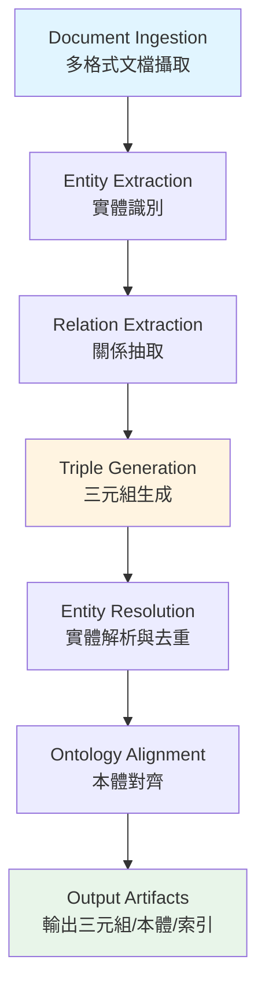

# Knowledge Graph Builder Plugin - Deconstruction Analysis

# 知識圖譜構建器插件 - 解構分析

**解構日期 (Deconstruction Date)**: 2025-12-07  
**原始來源 (Original Source)**: `docs/refactor_playbooks/_legacy_scratch/README.md`  
**文件版本 (Document Version)**: v1.0.0  
**解構範圍 (Deconstruction Scope)**: Complete YAML specification analysis

---

## 📋 1. 執行摘要 (Executive Summary)

`_legacy_scratch/README.md` 包含一個完整的知識圖譜構建器插件規範（Knowledge Graph Builder Plugin），採用 Quantum-YAML 格式定義。該規範描述了一個企業級的語義處理系統，用於從文檔中提取三元組（triples）、構建本體（ontology）、並進行實體解析（entity resolution）。

### 核心發現 (Key Findings)

- **文件性質**: 插件規範模板（Plugin Specification Template）
- **技術層次**: 企業級知識處理系統（Enterprise Knowledge Processing System）
- **主要功能**: 三元組提取、本體生成、實體解析、語義索引
- **部署模式**: Kubernetes 原生，支持批處理與流處理
- **依賴系統**: Neo4j、Redis、Kafka、NLP Pipeline
- **目標受眾**: AXIOM 系統插件註冊表

---

## 🔍 2. 核心概念抽取 (Core Concepts Extraction)

### 2.1 高階概念 (High-Level Concepts)

1. **Knowledge Graph Construction (知識圖譜構建)**
   - Triple Extraction: 從文本中抽取 (主語-謂語-賓語) 三元組
   - Ontology Generation: 自動生成語義本體結構
   - Entity Resolution: 實體去重與關聯
   - Semantic Indexing: 語義向量化與檢索

2. **Plugin Architecture (插件架構)**
   - Plugin Registry: 插件註冊與發現機制
   - Namespace Binding: 命名空間與資源配額
   - Vector Alignment: 向量嵌入對齊策略
   - Dependency Management: 硬依賴與軟依賴管理

3. **Processing Pipeline (處理流水線)**
   - 6-Stage Pipeline: 文檔攝取 → 實體提取 → 關係提取 → 三元組生成 → 實體解析 → 本體對齊
   - Hybrid Processing: 批處理 + 流處理雙模式
   - Multi-Format Support: 支持 PDF, DOCX, TXT, HTML, Markdown, JSON

4. **Enterprise Governance (企業治理)**
   - Security Clearance: L25-high 安全等級
   - Compliance Tags: semantic-web, GDPR-compliant, enterprise-ready
   - Data Privacy: PII 檢測、K-匿名化、GDPR 合規
   - Provenance Tracking: 區塊鏈錨定溯源

### 2.2 技術架構概念 (Technical Architecture Concepts)

1. **Kubernetes Native Deployment**
   - Deployment Specification: 3副本、高可用部署
   - Resource Management: CPU/Memory/GPU 資源配額
   - Service Account & RBAC: 細粒度權限控制
   - Health Probes: Liveness & Readiness 健康檢查

2. **Storage Architecture**
   - Primary Store: Neo4j 5.x 集群模式，3副本
   - Cache Layer: Redis 集群，LRU 策略
   - Backup Strategy: 增量備份 + 每週全量備份，AES-256-GCM 加密

3. **Observability**
   - Custom Metrics: Prometheus 格式指標（triple 數量、準確率、處理時長）
   - Structured Logging: 包含 document_id, processing_stage, confidence_score
   - Performance Targets: SLO 定義（1000 triples/分鐘、P95 延遲 < 30秒）

4. **Integration Points**
   - Upstream: Document Management System (REST API), Data Lake (S3), Streaming Pipeline (Kafka)
   - Downstream: KG-Vector-Hybrid (Cypher), Reasoning Engine (OWL-RDF), Semantic Search (JSON-LD)

---

## 🧩 3. 功能模組識別 (Functional Modules Identification)

### 3.1 核心處理模組 (Core Processing Modules)

| 模組名稱 | 功能描述 | 關鍵技術 | 對應 YAML Section |
|---------|---------|---------|------------------|
| **Document Ingestion** | 多格式文檔解析 | multi-format-parser | architecture.processing_pipeline.stages[0] |
| **Entity Extraction** | 命名實體識別 | spacy-en-core-lg, machinenativeops-domain-ner | architecture.processing_pipeline.stages[1] |
| **Relation Extraction** | 依存句法分析 | dependency-parser-enhanced | architecture.processing_pipeline.stages[2] |
| **Triple Generation** | 三元組生成與驗證 | subject-predicate-object-extractor | architecture.processing_pipeline.stages[3] |
| **Entity Resolution** | 模糊匹配與實體合併 | fuzzy-matching-engine | architecture.processing_pipeline.stages[4] |
| **Ontology Alignment** | 本體映射與對齊 | schema-mapper | architecture.processing_pipeline.stages[5] |

### 3.2 支撐服務模組 (Supporting Service Modules)

| 模組名稱 | 功能描述 | 技術實現 |
|---------|---------|---------|
| **Vector Embedding** | 語義向量化 | machinenativeops-embed-v2 (1024維), relation-embed (768維), onto-embed (512維) |
| **Quality Control** | 質量驗證與信心評分 | triple_validation, confidence_scoring |
| **Error Handling** | 錯誤處理與容錯 | skip-with-logging, fallback-to-rule-based, exponential-backoff |
| **Data Privacy** | PII 檢測與匿名化 | k-anonymity, GDPR compliance |
| **Provenance** | 數據溯源 | blockchain-anchored, hash verification (sha3-256) |

### 3.3 運營與維護模組 (Operations & Maintenance Modules)

| 模組名稱 | 頻率 | 功能 |
|---------|-----|-----|
| **Data Cleanup** | 每週 | 移除低信心三元組(<0.3)、合併重複實體(>0.95)、歸檔日誌(>30天) |
| **Model Updates** | 每月 | 評估新 NER 模型、重訓關係分類器、更新本體映射 |
| **Performance Optimization** | 雙週 | 分析查詢模式、優化索引結構、調整快取配置 |

---

## 🔗 4. 流程與階段映射 (Process & Stage Mapping)

### 4.1 知識圖譜構建流程 (KG Construction Flow)



### 4.2 數據流與存儲階段 (Data Flow & Storage Stages)

```
[Upstream Sources]
    ├─ Document Management System (REST API + OAuth2)
    ├─ Data Lake (S3-compatible, Parquet/JSON/CSV)
    └─ Streaming Pipeline (Kafka, Avro)
         ↓
[Processing Layer]
    ├─ Batch Processing (1000 docs/chunk, 8 workers)
    └─ Streaming Processing (Kafka consumer, 5s batch timeout)
         ↓
[Storage Layer]
    ├─ Primary: Neo4j 5.x (3-replica cluster)
    ├─ Cache: Redis Cluster (1h TTL, LRU)
    └─ Backup: Incremental + Weekly Full (90d retention, AES-256-GCM)
         ↓
[Downstream Consumers]
    ├─ KG-Vector-Hybrid (Cypher query API)
    ├─ Reasoning Engine (OWL-RDF ontology API)
    └─ Semantic Search (JSON-LD entity API)
```

---

## 📦 5. 依賴關係分析 (Dependency Analysis)

### 5.1 硬依賴 (Hard Dependencies)

| 依賴項 | 版本要求 | 用途 | 影響範圍 |
|-------|---------|-----|---------|
| **machinenativeops-kernel-compute** | >= 1.0.0 | 計算內核 | 核心運行時，無法啟動如缺失 |
| **hlp-executor-core** | >= 1.0.0 | 高層規劃執行器 | 工作流調度，無法啟動如缺失 |
| **neo4j-database** | 5.x | 圖數據庫 | 三元組存儲，系統核心 |
| **nlp-processing-pipeline** | N/A | NLP 處理管線 | 實體與關係提取 |
| **machinenativeops-trust-bundle** | N/A | 信任捆綁包 | 安全與認證 |

### 5.2 軟依賴 (Soft Dependencies)

| 依賴項 | 版本要求 | 降級策略 | 影響 |
|-------|---------|---------|-----|
| **embedding-offline-pack** | >= 0.9.0 | graceful_degradation: true | 可用在線嵌入服務替代 |

### 5.3 外部系統依賴 (External System Dependencies)

- **Redis Cluster**: 快取層，影響性能但非關鍵
- **Kafka**: 流處理輸入，批處理模式下非必需
- **S3-compatible Storage**: 數據湖接入，可選數據源
- **Prometheus + Grafana**: 可觀測性，非功能性依賴

---

## 🎯 6. 配置與參數體系 (Configuration & Parameter System)

### 6.1 關鍵配置維度 (Key Configuration Dimensions)

1. **向量嵌入配置 (Vector Alignment Map)**
   - Entity Extraction: 1024維, threshold 0.75
   - Relation Classification: 768維, threshold 0.70
   - Ontology Alignment: 512維, threshold 0.85

2. **處理模式配置 (Processing Mode Configuration)**
   - Batch: chunk_size=1000, parallel_workers=8, memory_limit=4Gi
   - Streaming: kafka_topic, consumer_group, batch_timeout=5s, max_batch_size=100

3. **質量控制配置 (Quality Control Configuration)**
   - Triple Validation: subject_required, predicate_vocabulary_check, object_type_consistency
   - Confidence Scoring: extraction (model-based), resolution (similarity-based)
   - Thresholds: NER confidence=0.8, relation confidence=0.7, merge=0.85, alignment=0.75

4. **資源配額配置 (Resource Quota Configuration)**
   - Requests: 6 CPU, 24Gi Memory, 1 GPU
   - Limits: 12 CPU, 48Gi Memory, 2 GPU
   - Storage: 50Gi processing workspace, model cache PVC

### 6.2 環境變量體系 (Environment Variables System)

```yaml
Configuration Categories:
  - Database Connection: NEO4J_URI, NEO4J_AUTH
  - Processing Mode: PROCESSING_MODE (hybrid-batch-streaming)
  - Model Paths: ENTITY_EXTRACTION_MODEL, RELATION_PATTERNS_PATH
  - Cache Settings: ONTOLOGY_CACHE_SIZE
```

---

## 🚨 7. Anti-Patterns 與技術債 (Anti-Patterns & Technical Debt)

### 7.1 架構層面問題 (Architectural Issues)

1. **過度耦合 (Over-Coupling)**
   - ❌ Plugin 規範與 AXIOM 系統強綁定（machinenativeops.io namespace）
   - ❌ 硬編碼 Kubernetes 部署配置在插件規範中
   - 💡 **建議**: 將部署配置與插件接口規範分離

2. **配置爆炸 (Configuration Explosion)**
   - ❌ 單一 YAML 文件包含 564 行，混合了元數據、架構、部署、運維等多重關注點
   - 💡 **建議**: 按關注點分離（Separation of Concerns）

3. **硬編碼依賴 (Hard-coded Dependencies)**
   - ❌ 特定模型名稱（spacy-en-core-lg, machinenativeops-domain-ner）硬編碼
   - ❌ 特定版本（Neo4j 5.x）硬編碼
   - 💡 **建議**: 使用配置注入或插件化模型加載

### 7.2 文檔層面問題 (Documentation Issues)

1. **格式混亂 (Format Confusion)**
   - ❌ 聲稱是 "YAML 1.2" 但缺少實際 YAML 解析器驗證
   - ❌ 混合使用 "quantum-yaml" 非標準術語
   - 💡 **建議**: 使用標準 YAML 1.2 或 JSON Schema

2. **缺少實現引用 (Missing Implementation References)**
   - ❌ 定義了 interfaces (extract_triples, build_ontology) 但無實際代碼指向
   - ❌ 提到 "KgGraphBuilderPlugin" 類但無模組路徑
   - 💡 **建議**: 添加實現文件路徑或 API 文檔鏈接

3. **版本管理問題 (Version Management Issues)**
   - ❌ 創建日期 "2025-09-14" 在未來（可能是筆誤）
   - ❌ 缺少變更歷史詳細信息
   - 💡 **建議**: 使用正確的時間戳和完整的變更日誌

---

## 📊 8. 風險評估 (Risk Assessment)

### 8.1 重構風險矩陣 (Refactoring Risk Matrix)

| 風險類別 | 風險等級 | 描述 | 緩解策略 |
|---------|---------|-----|---------|
| **供應商鎖定** | 🔴 高 | AXIOM 系統特定概念（quantum_timestamp, machinenativeops-embed-v2） | 抽象化為通用接口 |
| **配置複雜度** | 🟡 中 | 單一文件混合多重關注點 | 分解為多個配置文件 |
| **依賴脆弱性** | 🟡 中 | 硬依賴特定版本（Neo4j 5.x, hlp-executor-core） | 使用語義化版本約束 |
| **文檔過時** | 🟢 低 | 作為模板存在於 _legacy_scratch | 標記為歷史文檔並遷移有效內容 |

### 8.2 遷移風險評估 (Migration Risk Assessment)

- **數據遷移風險**: 🟢 低（純規範文檔，無實際數據）
- **API 破壞風險**: 🟢 低（規範級別，無運行時代碼）
- **學習曲線**: 🟡 中（需理解知識圖譜與本體工程概念）
- **工具鏈依賴**: 🟡 中（需 Neo4j, NLP Pipeline, Kubernetes 環境）

---

## 🔄 9. 與現有系統對齊分析 (Alignment with Existing System)

### 9.1 與 Unmanned Island 架構對齊 (Alignment with Unmanned Island Architecture)

| Unmanned Island 組件 | KG Builder 對應組件 | 對齊程度 | 整合策略 |
|---------------------|-------------------|---------|---------|
| **core/unified_integration/** | Plugin Registry System | 🟡 部分 | 將插件規範集成到統一註冊表 |
| **automation/intelligent/** | Processing Pipeline | 🟢 高 | 複用 NLP 處理能力 |
| **knowledge/** | Output Artifacts (Triples, Ontology) | 🟢 高 | 作為知識庫構建工具 |
| **governance/schemas/** | Plugin Specification Schema | 🟡 部分 | 定義通用插件 JSON Schema |
| **config/system-module-map.yaml** | Plugin Registry Binding | 🟢 高 | 添加 KG Builder 模組項 |

### 9.2 語言治理對齊 (Language Governance Alignment)

根據 `config/system-module-map.yaml` 的語言策略：

- ✅ **Python**: NLP 處理、AI/ML 模型集成（符合 preferred_high_level）
- ✅ **YAML**: 配置文件（符合 preferred_infra）
- ⚠️ **未明確**: 主要處理邏輯語言（建議使用 TypeScript 或 Python）
- ❌ **Kubernetes YAML**: 部署配置應分離到 `infrastructure/` 或 `config/docker/`

---

## 📝 10. 關鍵發現總結 (Key Findings Summary)

### 10.1 可複用的架構模式 (Reusable Architectural Patterns)

1. **插件註冊與發現模式** - 適用於所有微服務插件
2. **向量對齊與嵌入策略** - 適用於所有 AI 語義處理模組
3. **混合批流處理架構** - 適用於高吞吐量數據處理場景
4. **三層存儲架構** (Primary + Cache + Backup) - 適用於高可用服務
5. **質量控制與信心評分機制** - 適用於所有 ML 推理服務

### 10.2 應該遷移到正式位置的內容 (Content to Migrate)

#### A. 架構文檔 (Architecture Documentation)

- 知識圖譜構建流程 → `docs/ARCHITECTURE/knowledge-graph-processing.md`
- 插件架構模式 → `docs/ARCHITECTURE/plugin-architecture-pattern.md`
- 存儲架構設計 → `docs/ARCHITECTURE/storage-architecture.md`

#### B. 配置規範 (Configuration Specifications)

- 插件規範模板 → `config/templates/plugin-specification-template.yaml`
- 向量嵌入配置 → `config/ai-models/vector-alignment-config.yaml`
- 處理管線配置 → `config/processing/pipeline-config.yaml`

#### C. 治理規則 (Governance Policies)

- 插件質量門檻 → `governance/policies/plugin-quality-gates.yaml`
- 數據隱私合規 → `governance/policies/data-privacy-policy.yaml`
- 插件 JSON Schema → `governance/schemas/plugin-specification.schema.json`

#### D. 部署模板 (Deployment Templates)


#### E. 工具與腳本 (Tools & Scripts)

- 插件驗證工具 → `tools/validate-plugin-spec.py`
- 插件註冊工具 → `tools/register-plugin.py`
- 性能基準測試 → `tools/benchmark-knowledge-processor.py`

### 10.3 可以刪除的內容 (Content to Remove)

- ❌ AXIOM 系統特定的硬編碼引用（machinenativeops.io namespace, quantum_timestamp）
- ❌ 未來日期時間戳（2025-09-14）
- ❌ 硬編碼的模型名稱（改為配置注入）
- ❌ 內嵌的 Kubernetes 部署 YAML（應獨立為模板）

---

## 🎬 11. 下一步建議 (Next Steps)

### 11.1 立即行動 (Immediate Actions)

1. ✅ **完成解構分析** - 本文檔（已完成）
2. ⏭️ **創建集成設計** - `02_integration/kg-builder_integration.md`
3. ⏭️ **生成重構計畫** - `03_refactor/kg-builder_refactor.md`

### 11.2 後續階段 (Follow-up Phases)

- **Phase 2 Integration**: 設計如何將 KG Builder 概念融入 Unmanned Island 系統
- **Phase 3 Refactor**: 執行 P0/P1/P2 遷移行動
- **Validation**: 驗證所有新創建的文件與現有系統的兼容性

---

## 📚 12. 參考資料 (References)

- **原始文件**: `docs/refactor_playbooks/_legacy_scratch/README.md`
- **系統配置**: `config/system-module-map.yaml`
- **語言治理**: `config/language-policy.yaml`
- **架構文檔**: `docs/ARCHITECTURE/`
- **重構 Playbook 框架**: `docs/refactor_playbooks/README.md`

---

**解構完成時間 (Deconstruction Completed)**: 2025-12-07T10:19:24Z  
**下一步文檔 (Next Document)**: `02_integration/kg-builder_integration.md`  
**狀態 (Status)**: ✅ Deconstruction Complete - Ready for Integration Phase
